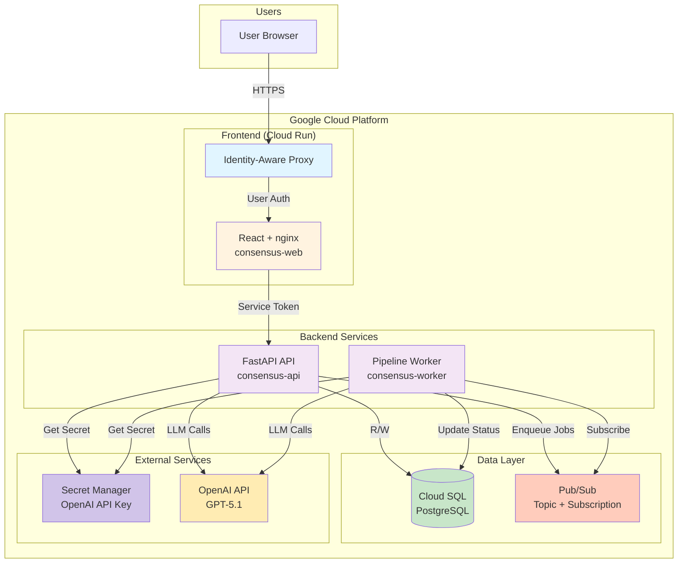
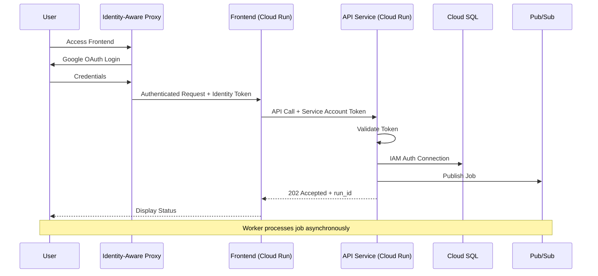
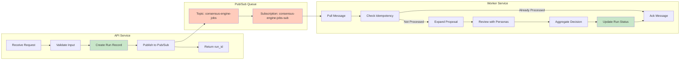
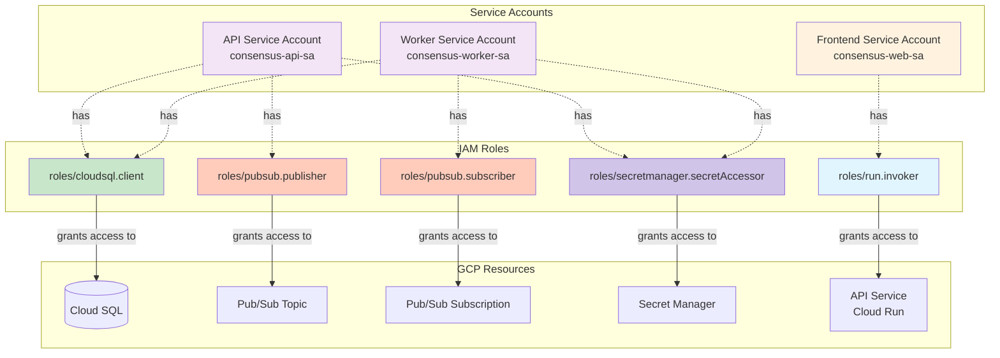
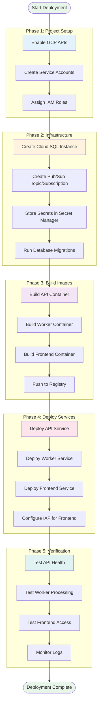

# GCP Deployment Architecture

## Overview

This document provides a comprehensive guide to deploying the Consensus Engine on Google Cloud Platform (GCP). It serves as the single source of truth for deployment requirements, architecture decisions, and operational considerations.

## System Architecture Diagram

### High-Level Architecture



### Authentication and Authorization Flow



### Job Processing Flow



## Deployable Components

The Consensus Engine consists of four main deployable components:

### 1. API Service (Backend)

**Technology**: FastAPI + Python 3.11+  
**Runtime**: Cloud Run  
**Purpose**: REST API for consensus operations  
**Container**: Python application with uvicorn ASGI server

**Key Features**:
- Synchronous endpoints for immediate operations (`/v1/review-idea`, `/v1/expand-idea`)
- Asynchronous job enqueueing endpoints (`/v1/full-review`)
- Run management and status polling (`/v1/runs/*`)
- Health checks and monitoring endpoints

**Scaling**:
- Concurrency: Up to 100 concurrent requests per instance
- Auto-scaling: 0-100 instances (configurable via `maxScale`)
- CPU: 1-2 vCPU per instance
- Memory: 1-2 GiB per instance

### 2. Pipeline Worker (Background Processor)

**Technology**: Python 3.11+ worker process  
**Runtime**: Cloud Run or Kubernetes  
**Purpose**: Asynchronous job processing from Pub/Sub queue  
**Container**: Python application running `consensus_engine.workers.pipeline_worker`

**Key Features**:
- Consumes jobs from Pub/Sub subscription
- Executes full consensus pipeline (expand → review → aggregate)
- Updates database with progress and results
- Handles retries and failures with idempotency

**Scaling**:
- Concurrency: 10 concurrent jobs per instance (configurable via `WORKER_MAX_CONCURRENCY`)
- Auto-scaling: 1-10 instances based on queue depth
- CPU: 1-2 vCPU per instance
- Memory: 2-4 GiB per instance (LLM processing requires more memory)

### 3. Web Frontend (React Application)

**Technology**: React + TypeScript + Vite  
**Runtime**: Cloud Run (nginx serving static files)  
**Purpose**: User interface for consensus operations  
**Container**: nginx serving built static assets

**Key Features**:
- Type-safe API client auto-generated from OpenAPI spec
- Responsive design with Tailwind CSS
- Authentication via Identity-Aware Proxy (IAP)
- Environment-driven configuration for multiple deployments

**Scaling**:
- Concurrency: Up to 1000 concurrent requests per instance (static content)
- Auto-scaling: 1-10 instances
- CPU: 0.5-1 vCPU per instance
- Memory: 512 MiB - 1 GiB per instance

### 4. Optional: Revision Dashboard (Future)

**Technology**: TBD  
**Runtime**: TBD  
**Purpose**: Visual interface for proposal revision workflows  
**Status**: Not yet implemented

**Note**: This component is optional and can be skipped without blocking core API deployment.

## Backing Services

### 1. PostgreSQL Database

**Service**: Cloud SQL for PostgreSQL 16+  
**Purpose**: Persistent storage for runs, proposals, reviews, and decisions

**Requirements**:
- **Instance Tier**: Minimum `db-f1-micro` for development, `db-n1-standard-1` or higher for production
- **Storage**: 10 GB minimum, auto-scaling recommended
- **High Availability**: Multi-zone configuration recommended for production
- **Backups**: Daily automated backups with point-in-time recovery

**Database Schema**:
- `runs` table: Run metadata and status tracking
- `step_progress` table: Fine-grained step execution tracking
- Schema managed via Alembic migrations

**Authentication**:
- **Recommended**: IAM authentication (no passwords)
- **Alternative**: Password-based authentication (less secure)

**Connection Methods**:
- Cloud SQL Python Connector (recommended for Cloud Run)
- Cloud SQL Proxy (for local development and migrations)
- Private IP (for VPC-connected deployments)

**Quotas**:
- Check Cloud SQL quotas in your project
- Request increases if deploying multiple environments

### 2. Google Cloud Pub/Sub

**Purpose**: Message queue for asynchronous job processing

**Resources**:
- **Topic**: `consensus-engine-jobs` (or configurable via `PUBSUB_TOPIC`)
- **Subscription**: `consensus-engine-jobs-sub` (or configurable via `PUBSUB_SUBSCRIPTION`)
- **Dead Letter Queue**: `consensus-engine-jobs-dlq` (recommended for failed jobs)

**Configuration**:
- **Acknowledgement Deadline**: 600 seconds (10 minutes, configurable)
- **Message Retention**: 7 days (default)
- **Max Delivery Attempts**: 5 (before sending to DLQ)
- **Retry Policy**: Exponential backoff

**Message Schema**:
```json
{
  "run_id": "550e8400-e29b-41d4-a716-446655440000",
  "run_type": "initial",
  "priority": "normal",
  "payload": {
    "idea": "...",
    "extra_context": {...}
  }
}
```

**Quotas**:
- Max publish rate: 10,000 messages/second (can request increase)
- Max message size: 10 MB
- Max subscriptions per topic: 10,000

### 3. Google Cloud Storage (Optional)

**Purpose**: Artifact storage for large proposals, logs, or exports  
**Status**: Not currently used, but may be added in future

**Potential Use Cases**:
- Storing full proposal history
- Exporting run results for archival
- Storing large context documents

### 4. OpenAI API

**Provider**: OpenAI  
**Purpose**: LLM inference for expansion, review, and aggregation

**Requirements**:
- **API Key**: Stored in Google Secret Manager
- **Model**: GPT-5.1 or compatible (configurable via `OPENAI_MODEL`)
- **Quota**: Sufficient tokens per minute (TPM) and requests per minute (RPM)

**Cost Considerations**:
- Full review with 5 personas: ~5-10x cost of single review
- Monitor usage via OpenAI dashboard
- Set budget alerts to prevent unexpected costs

**Rate Limits**:
- Check your organization's rate limits
- Request increases if deploying high-traffic applications

## Environment Variables and Secrets

**Note on Placeholder Values**: Throughout this section, example values like `my-project-123`, `us-central1`, and `my-project.iam` are placeholders that must be replaced with your actual GCP project ID, selected region, and project-specific values. These are not default values and will not work as-is.

### API Service Environment Variables

#### Required

| Variable | Type | Description | Example |
|----------|------|-------------|---------|
| `OPENAI_API_KEY` | Secret | OpenAI API key | `sk-...` (from Secret Manager) |
| `PUBSUB_PROJECT_ID` | Plain | GCP project ID | `my-project-123` *(replace with your project ID)* |
| `DB_INSTANCE_CONNECTION_NAME` | Plain | Cloud SQL instance | `my-project:us-central1:consensus-db` *(replace with your instance)* |
| `DB_NAME` | Plain | Database name | `consensus_engine` |
| `DB_USER` | Plain | Database user | `consensus-api-sa@my-project.iam` *(replace with your project)* |
| `USE_CLOUD_SQL_CONNECTOR` | Plain | Use Cloud SQL connector | `true` |
| `DB_IAM_AUTH` | Plain | Use IAM for database auth | `true` |

#### Optional (with Defaults)

| Variable | Type | Default | Description |
|----------|------|---------|-------------|
| `OPENAI_MODEL` | Plain | `gpt-5.1` | Default OpenAI model |
| `TEMPERATURE` | Plain | `0.7` | Default temperature |
| `ENV` | Plain | `development` | Environment mode |
| `CORS_ORIGINS` | Plain | `http://localhost:5173` | Allowed CORS origins |
| `PUBSUB_TOPIC` | Plain | `consensus-engine-jobs` | Pub/Sub topic name |
| `PUBSUB_SUBSCRIPTION` | Plain | `consensus-engine-jobs-sub` | Pub/Sub subscription name |
| `DB_POOL_SIZE` | Plain | `5` | Connection pool size |
| `DB_MAX_OVERFLOW` | Plain | `10` | Max overflow connections |

**Secrets Management**:
- Store `OPENAI_API_KEY` in Google Secret Manager
- Reference secrets in Cloud Run deployment via `--set-secrets` flag
- Never commit secrets to version control

**Per-Service Scoping**:
- API service needs `PUBSUB_TOPIC` (publisher)
- Worker service needs `PUBSUB_SUBSCRIPTION` (subscriber)
- Frontend service needs `VITE_API_BASE_URL` (API endpoint)

### Worker Service Environment Variables

#### Required

| Variable | Type | Description | Example |
|----------|------|-------------|---------|
| `OPENAI_API_KEY` | Secret | OpenAI API key | `sk-...` (from Secret Manager) |
| `PUBSUB_PROJECT_ID` | Plain | GCP project ID | `my-project-123` *(replace with your project ID)* |
| `PUBSUB_SUBSCRIPTION` | Plain | Subscription name | `consensus-engine-jobs-sub` |
| `DB_INSTANCE_CONNECTION_NAME` | Plain | Cloud SQL instance | `my-project:us-central1:consensus-db` *(replace with your instance)* |
| `DB_NAME` | Plain | Database name | `consensus_engine` |
| `DB_USER` | Plain | Database user | `consensus-worker-sa@my-project.iam` *(replace with your project)* |
| `USE_CLOUD_SQL_CONNECTOR` | Plain | Use Cloud SQL connector | `true` |
| `DB_IAM_AUTH` | Plain | Use IAM for database auth | `true` |

#### Optional (with Defaults)

| Variable | Type | Default | Description |
|----------|------|---------|-------------|
| `WORKER_MAX_CONCURRENCY` | Plain | `10` | Max concurrent jobs |
| `WORKER_ACK_DEADLINE_SECONDS` | Plain | `600` | Pub/Sub ack deadline (10-600 seconds) |
| `WORKER_STEP_TIMEOUT_SECONDS` | Plain | `300` | Per-step timeout |
| `WORKER_JOB_TIMEOUT_SECONDS` | Plain | `540` | Overall job timeout (must be ≤ ack deadline) |
| `MAX_RETRIES_PER_PERSONA` | Plain | `3` | Max retries per persona review |
| `RETRY_INITIAL_BACKOFF_SECONDS` | Plain | `1.0` | Initial retry backoff delay |
| `RETRY_BACKOFF_MULTIPLIER` | Plain | `2.0` | Exponential backoff multiplier |
| `ENV` | Plain | `production` | Environment mode |

**Important Configuration Notes**:
- `WORKER_ACK_DEADLINE_SECONDS` has a hard limit of 10-600 seconds in Google Cloud Pub/Sub
- `WORKER_JOB_TIMEOUT_SECONDS` must be less than or equal to `WORKER_ACK_DEADLINE_SECONDS` to prevent message redelivery and duplicate processing
- Workers must extend the ack deadline for jobs exceeding the initial deadline

### Frontend Service Environment Variables

#### Required

| Variable | Type | Description | Example |
|----------|------|-------------|---------|
| `VITE_API_BASE_URL` | Plain | Backend API URL | `https://api-xxx.run.app` |

#### Optional

| Variable | Type | Default | Description |
|----------|------|---------|-------------|
| `VITE_APP_TITLE` | Plain | `Consensus Engine` | Application title |

**Build-Time vs Runtime**:
- Frontend env vars (prefixed with `VITE_`) are baked into the static assets at container build time
- Changes to these variables require rebuilding and redeploying the frontend container
- Cloud Run environment variables are NOT accessible by the client-side React application at runtime
- For dynamic configuration, consider serving a `config.json` file from your web server that the React app can fetch on startup

## IAM and Service Account Requirements

### IAM Architecture Overview



### Service Accounts

Create three service accounts for least-privilege access:

#### 1. API Service Account

**Name**: `consensus-api-sa@PROJECT_ID.iam.gserviceaccount.com`

**Required Roles**:
- `roles/cloudsql.client` - Connect to Cloud SQL
- `roles/pubsub.publisher` - Publish jobs to Pub/Sub topic
- `roles/secretmanager.secretAccessor` - Access OpenAI API key

**Optional Roles**:
- `roles/cloudtrace.agent` - Submit traces to Cloud Trace
- `roles/logging.logWriter` - Write structured logs

**Permissions Scope**:
- Cloud SQL instance: `PROJECT_ID:REGION:consensus-db`
- Pub/Sub topic: `projects/PROJECT_ID/topics/consensus-engine-jobs`
- Secret: `projects/PROJECT_ID/secrets/openai-api-key`

#### 2. Worker Service Account

**Name**: `consensus-worker-sa@PROJECT_ID.iam.gserviceaccount.com`

**Required Roles**:
- `roles/cloudsql.client` - Connect to Cloud SQL
- `roles/pubsub.subscriber` - Subscribe to Pub/Sub subscription
- `roles/secretmanager.secretAccessor` - Access OpenAI API key

**Optional Roles**:
- `roles/cloudtrace.agent` - Submit traces to Cloud Trace
- `roles/logging.logWriter` - Write structured logs

**Permissions Scope**:
- Cloud SQL instance: `PROJECT_ID:REGION:consensus-db`
- Pub/Sub subscription: `projects/PROJECT_ID/subscriptions/consensus-engine-jobs-sub`
- Secret: `projects/PROJECT_ID/secrets/openai-api-key`

#### 3. Frontend Service Account

**Name**: `consensus-web-sa@PROJECT_ID.iam.gserviceaccount.com`

**Required Roles**:
- `roles/run.invoker` - Invoke backend API service

**Optional Roles**:
- `roles/cloudtrace.agent` - Submit traces to Cloud Trace
- `roles/logging.logWriter` - Write structured logs

**Permissions Scope**:
- Backend service: `projects/PROJECT_ID/locations/REGION/services/consensus-api`

### User Roles

For users accessing the frontend via IAP:

**Required Role**:
- `roles/iap.httpsResourceAccessor` - Access IAP-protected frontend

**Grant Command**:
```bash
gcloud iap web add-iam-policy-binding \
  --resource-type=backend-services \
  --service=consensus-web \
  --member=user:alice@example.com \
  --role=roles/iap.httpsResourceAccessor \
  --project=PROJECT_ID
```

### IAM Best Practices

1. **Use IAM authentication** for Cloud SQL instead of passwords
2. **Never use default compute service account** for production services
3. **Apply principle of least privilege** - only grant necessary permissions
4. **Use separate service accounts** for each component
5. **Audit IAM policies regularly** via Cloud Asset Inventory
6. **Enable audit logging** for all IAM changes
7. **Use Workload Identity** if deploying to GKE
8. **Rotate service account keys** if using key-based authentication (not recommended)

## Architecture Assumptions

### Networking

**Assumption**: Public internet access for Cloud Run services  
**Rationale**: Cloud Run services are deployed with public endpoints but protected by IAM/IAP

**Components**:
- **Frontend**: Public endpoint with IAP authentication
- **Backend API**: Public endpoint with IAM authentication (no unauthenticated access)
- **Worker**: No public endpoint (internal only)
- **Cloud SQL**: Private IP recommended for production, public IP acceptable for development

**Network Flow**:
```
User Browser → IAP → Frontend (Cloud Run)
Frontend → IAM Auth → Backend API (Cloud Run)
Backend API → Cloud SQL Private IP
Backend API → Pub/Sub (Google-managed)
Worker → Pub/Sub (Google-managed)
Worker → Cloud SQL Private IP
```

**VPC and Private Networking** (Optional):
- Enable VPC Connector for Cloud Run to access Cloud SQL via private IP
- Configure Serverless VPC Access for private communication
- Not required for basic deployments using Cloud SQL Connector

**Firewall Rules**:
- Not required for Cloud Run (Google-managed networking)
- Only needed if using VPC connectors or hybrid deployments

### Database Architecture

**Assumption**: Managed Cloud SQL, not self-hosted PostgreSQL

**Unsupported Configurations**:
- ❌ Self-hosted PostgreSQL on Compute Engine
- ❌ PostgreSQL on-premises with Cloud VPN
- ❌ Locally emulated PostgreSQL for Cloud deployments
- ❌ PostgreSQL on other cloud providers (AWS RDS, Azure Database)

**Supported Configurations**:
- ✅ Cloud SQL for PostgreSQL (IAM auth recommended)
- ✅ Cloud SQL Proxy for local development
- ✅ High Availability (HA) configuration with standby replicas
- ✅ Read replicas for read-heavy workloads (future)

**Migration Strategy**:
- Use Alembic for schema migrations
- Run migrations via Cloud SQL Proxy before deploying new code
- Test migrations on staging environment first
- Monitor migration duration for large databases

**Connection Pooling**:
- API service: 5 connections per instance (default)
- Worker service: 5 connections per instance (default)
- Total connections: `(API instances × pool_size) + (Worker instances × pool_size)`
- Ensure Cloud SQL instance tier supports total connection count

### Container Registry

**Assumption**: Google Container Registry (GCR) or Artifact Registry

**Supported Registries**:
- ✅ `gcr.io/PROJECT_ID` - Google Container Registry (legacy)
- ✅ `REGION-docker.pkg.dev/PROJECT_ID/REPOSITORY` - Artifact Registry (recommended)
- ✅ Docker Hub (public images only, not recommended for production)

**Unsupported Registries**:
- ❌ Private registries requiring custom authentication
- ❌ Registries behind corporate firewalls

**Image Tagging Strategy**:
- Use semantic versioning for releases: `v1.0.0`, `v1.0.1`
- Use git commit SHA for development: `abc123def`
- Use `latest` tag for rolling deployments (not recommended for production)

**Build Process**:
- Build images locally: `docker build -t gcr.io/PROJECT_ID/consensus-api:v1.0.0 .`
- Push to registry: `docker push gcr.io/PROJECT_ID/consensus-api:v1.0.0`
- Or use Cloud Build: `gcloud builds submit --tag gcr.io/PROJECT_ID/consensus-api:v1.0.0`

### Deployment Artifacts

**Docker Images**:
All services are deployed as Docker containers. Dockerfiles are provided for each component:

1. **API Service**: Python application with FastAPI + uvicorn
   ```dockerfile
   FROM python:3.11-slim
   WORKDIR /app
   COPY pyproject.toml .
   RUN pip install --no-cache-dir -e .
   COPY src/ src/
   CMD ["uvicorn", "consensus_engine.app:app", "--host", "0.0.0.0", "--port", "8080"]
   ```

2. **Worker Service**: Python application running pipeline worker
   ```dockerfile
   FROM python:3.11-slim
   WORKDIR /app
   COPY pyproject.toml .
   RUN pip install --no-cache-dir -e .
   COPY src/ src/
   CMD ["python", "-m", "consensus_engine.workers.pipeline_worker"]
   ```

3. **Frontend Service**: nginx serving static files
   ```dockerfile
   FROM node:18 AS builder
   WORKDIR /app
   COPY package*.json ./
   RUN npm ci
   COPY . .
   RUN npm run build
   
   FROM nginx:alpine
   COPY --from=builder /app/dist /usr/share/nginx/html
   COPY nginx.conf /etc/nginx/conf.d/default.conf
   CMD ["nginx", "-g", "daemon off;"]
   ```

**Infrastructure as Code**:
- Example Cloud Run service definitions provided in `infra/cloudrun/`
- Terraform examples available in `infra/cloudrun/terraform/`
- Manual deployment via `gcloud` commands documented in README

**CI/CD Pipeline** (Recommended):
- Build Docker images on commit to main branch
- Run tests before building images
- Tag images with git commit SHA and semantic version
- Deploy to staging environment automatically
- Promote to production manually or via approval workflow

## Deployment Prerequisites

Before deploying to GCP, ensure the following prerequisites are met:

### Deployment Order

Follow this sequence for successful deployment:



### GCP Project Setup

- [ ] **Active GCP Project** with billing enabled
- [ ] **Project ID** noted and configured in scripts
- [ ] **Default region** selected (e.g., `us-central1`)
- [ ] **gcloud CLI** installed and authenticated (`gcloud auth login`)
- [ ] **Docker** installed for local image builds (optional, can use Cloud Build)

### API Enablement

Enable required GCP APIs:

```bash
gcloud services enable cloudrun.googleapis.com
gcloud services enable cloudbuild.googleapis.com
gcloud services enable sqladmin.googleapis.com
gcloud services enable pubsub.googleapis.com
gcloud services enable secretmanager.googleapis.com
gcloud services enable iap.googleapis.com
gcloud services enable artifactregistry.googleapis.com
```

Checklist:
- [ ] Cloud Run API
- [ ] Cloud Build API
- [ ] Cloud SQL Admin API
- [ ] Pub/Sub API
- [ ] Secret Manager API
- [ ] Identity-Aware Proxy API
- [ ] Artifact Registry API

### Quotas and Limits

Check and request increases for:

- [ ] **Cloud Run**: Max instances per service (default: 100)
- [ ] **Cloud SQL**: Number of instances (default: varies by region)
- [ ] **Pub/Sub**: Publish throughput (default: 10,000 msg/sec)
- [ ] **Artifact Registry**: Storage quota (default: varies)
- [ ] **Secret Manager**: Number of secrets (default: varies)

**How to Check Quotas**:
```bash
gcloud compute project-info describe --project=PROJECT_ID
# Or visit: https://console.cloud.google.com/iam-admin/quotas
```

**Common Quota Issues**:
- Cloud Run instance limit may be too low for high-traffic deployments
- Cloud SQL instances limit may block multi-environment deployments
- Pub/Sub throughput may be insufficient for high job volumes

### External Services

- [ ] **OpenAI Account** with API access
- [ ] **OpenAI API Key** generated and noted
- [ ] **OpenAI Rate Limits** checked (sufficient TPM and RPM)
- [ ] **Budget Alerts** configured in OpenAI dashboard

### IAM Permissions

Deploying user needs:
- [ ] `roles/run.admin` - Deploy Cloud Run services
- [ ] `roles/iam.serviceAccountUser` - Act as service accounts
- [ ] `roles/cloudsql.admin` - Manage Cloud SQL instances
- [ ] `roles/pubsub.admin` - Manage Pub/Sub resources
- [ ] `roles/secretmanager.admin` - Manage secrets
- [ ] `roles/artifactregistry.admin` - Manage container images

**Least Privilege Alternative**:
Create a custom role with only necessary permissions for CI/CD automation.

### Local Development Tools

For testing and development:
- [ ] Python 3.11+ installed
- [ ] Node.js 18+ installed (for frontend)
- [ ] Docker Desktop installed
- [ ] Cloud SQL Proxy installed (`gcloud components install cloud-sql-proxy`)
- [ ] Alembic installed (`pip install alembic`)

## Optional Components

The following components are optional and can be skipped without blocking core API deployment:

### Revision Dashboard

**Status**: Not yet implemented  
**Impact**: No impact on core functionality  
**Skip If**: Only need API-based proposal evaluation

### Identity-Aware Proxy (IAP)

**Status**: Recommended but optional for internal deployments  
**Impact**: Without IAP, frontend has no user authentication  
**Skip If**: Deploying for internal use with network-level security  
**Alternative**: Implement custom authentication in frontend

### Cloud Monitoring and Logging

**Status**: Optional but highly recommended for production  
**Impact**: Without monitoring, troubleshooting is more difficult  
**Skip If**: Proof-of-concept or development deployment  
**Recommendation**: Always enable for production

### VPC and Private Networking

**Status**: Optional, only needed for private Cloud SQL access  
**Impact**: Without VPC, using Cloud SQL Connector with public IP  
**Skip If**: Using Cloud SQL Connector (recommended approach)  
**Use Case**: Highly secure environments requiring private networking

### Read Replicas

**Status**: Optional, only needed for read-heavy workloads  
**Impact**: Without replicas, all reads go to primary instance  
**Skip If**: Traffic is low or write-heavy  
**Use Case**: High-traffic deployments with many status polls

## Cost Estimation

### Monthly Cost Breakdown (Estimated)

Based on moderate usage (1000 API calls/day, 100 full reviews/day):

| Service | Configuration | Estimated Monthly Cost |
|---------|--------------|----------------------|
| Cloud Run (API) | 2 instances, 1 vCPU, 2 GiB | $10-20 |
| Cloud Run (Worker) | 1 instance, 2 vCPU, 4 GiB | $15-30 |
| Cloud Run (Frontend) | 1 instance, 0.5 vCPU, 512 MiB | $5-10 |
| Cloud SQL | db-n1-standard-1, 10 GB SSD | $50-80 |
| Pub/Sub | 100K messages/month | $0-5 |
| Secret Manager | 3 secrets, 1000 accesses | $0-1 |
| OpenAI API | 100 full reviews/day (~1M tokens) | $100-500 |
| **Total** | | **$180-646/month** |

**Cost Variables**:
- OpenAI API usage is the largest variable cost
- Cloud Run scales to zero when not in use (development)
- Cloud SQL is the largest fixed cost (runs 24/7)
- Pub/Sub costs increase with message volume

**Cost Optimization Tips**:
- Use `db-f1-micro` for development ($7/month vs $50/month)
- Set Cloud Run `minScale=0` for non-critical services
- Enable Cloud SQL automatic shutdown for development instances
- Monitor OpenAI usage and set budget alerts
- Use Committed Use Discounts for predictable workloads

### Cost Monitoring

Set up budget alerts:
```bash
# Create budget in Cloud Console or via API
# Alert at 50%, 90%, 100% of monthly budget
```

**Recommended Budgets**:
- Development: $100-200/month
- Staging: $200-500/month
- Production: $500-2000/month (depends on scale)

## Security Considerations

### Authentication and Authorization

**Frontend to User**:
- Identity-Aware Proxy (IAP) for user authentication
- Google OAuth consent screen configured
- Authorized users granted `roles/iap.httpsResourceAccessor`

**Frontend to API**:
- Service account identity token (signed JWT)
- API validates token using Google's public keys
- Frontend service account granted `roles/run.invoker` on API

**API to Database**:
- IAM authentication (recommended)
- Service account granted `roles/cloudsql.client`
- No passwords stored in configuration

**Worker to Database**:
- Same as API (IAM authentication)

**API to OpenAI**:
- API key stored in Secret Manager
- Service account granted `roles/secretmanager.secretAccessor`
- API key never logged or exposed

### Network Security

**Cloud Run Security**:
- Ingress controls: Frontend allows all, API requires IAM auth
- Binary Authorization: Can require signed container images
- HTTPS enforced by default

**Cloud SQL Security**:
- Private IP recommended for production
- SSL/TLS required for all connections
- Automatic backups enabled
- Point-in-time recovery configured

**Pub/Sub Security**:
- IAM-based access control
- Messages encrypted at rest and in transit
- No public endpoints

### Secrets Management

**Best Practices**:
1. **Never commit secrets** to version control
2. **Store all secrets** in Google Secret Manager
3. **Reference secrets** via Cloud Run `--set-secrets` flag
4. **Rotate secrets regularly** (OpenAI API keys)
5. **Audit secret access** via Cloud Audit Logs
6. **Limit secret access** to only services that need them

**Example Secret Storage**:
```bash
# Store OpenAI API key
echo -n "sk-..." | gcloud secrets create openai-api-key \
  --data-file=- \
  --replication-policy="automatic" \
  --project=PROJECT_ID

# Grant access to service accounts
gcloud secrets add-iam-policy-binding openai-api-key \
  --member="serviceAccount:consensus-api-sa@PROJECT_ID.iam.gserviceaccount.com" \
  --role="roles/secretmanager.secretAccessor" \
  --project=PROJECT_ID
```

### Audit Logging

Enable Cloud Audit Logs for:
- [ ] IAM policy changes
- [ ] Data access to Cloud SQL
- [ ] Secret Manager access
- [ ] Cloud Run service invocations

**Configure Data Access Logs**:
```bash
# Enable via Cloud Console → IAM & Admin → Audit Logs
# Or use Terraform/gcloud to configure organization policies
```

### Vulnerability Scanning

**Container Security**:
- Enable Artifact Registry vulnerability scanning
- Review scan results before deploying to production
- Set up alerts for critical vulnerabilities

**Dependency Security**:
- Use `pip-audit` to scan Python dependencies
- Use `npm audit` to scan Node.js dependencies
- Update dependencies regularly

**Example Scans**:
```bash
# Python dependencies
pip install pip-audit
pip-audit

# Node.js dependencies
cd webapp
npm audit
```

## Troubleshooting

Common issues and solutions are documented in:
- [Main README.md](../README.md#troubleshooting)
- [Worker Deployment Guide](./WORKER_DEPLOYMENT.md#troubleshooting)
- [Infrastructure README](../infra/cloudrun/README.md#troubleshooting)

### Quick Diagnostics

**API Not Responding**:
```bash
# Check service status
gcloud run services describe consensus-api --region=REGION

# Check logs
gcloud logging read "resource.type=cloud_run_revision AND resource.labels.service_name=consensus-api" --limit 50

# Test health endpoint
curl https://api-xxx.run.app/health
```

**Worker Not Processing Jobs**:
```bash
# Check subscription backlog
gcloud pubsub subscriptions describe consensus-engine-jobs-sub

# Check worker logs
gcloud logging read "resource.type=cloud_run_revision AND resource.labels.service_name=consensus-worker" --limit 50

# Check worker is running
gcloud run services describe consensus-worker --region=REGION
```

**Database Connection Issues**:
```bash
# Test Cloud SQL connectivity
gcloud sql connect consensus-db --user=postgres

# Check service account permissions
gcloud projects get-iam-policy PROJECT_ID \
  --flatten="bindings[].members" \
  --filter="bindings.members:serviceAccount:consensus-api-sa@PROJECT_ID.iam.gserviceaccount.com"
```

## Next Steps

After reading this document, refer to:

1. **[Infrastructure Setup Guide](../infra/cloudrun/README.md)** - Step-by-step deployment commands
2. **[Worker Deployment Guide](./WORKER_DEPLOYMENT.md)** - Background worker setup
3. **[Web Frontend Documentation](./WEB_FRONTEND.md)** - Frontend deployment with IAP
4. **[Main README](../README.md)** - Local development and testing

## Support and Resources

- **GCP Documentation**: https://cloud.google.com/docs
- **Cloud Run Best Practices**: https://cloud.google.com/run/docs/best-practices
- **Cloud SQL Best Practices**: https://cloud.google.com/sql/docs/postgres/best-practices
- **IAP Documentation**: https://cloud.google.com/iap/docs
- **OpenAI API Reference**: https://platform.openai.com/docs

## Changelog

- **2026-01-08**: Initial version - comprehensive GCP deployment architecture
