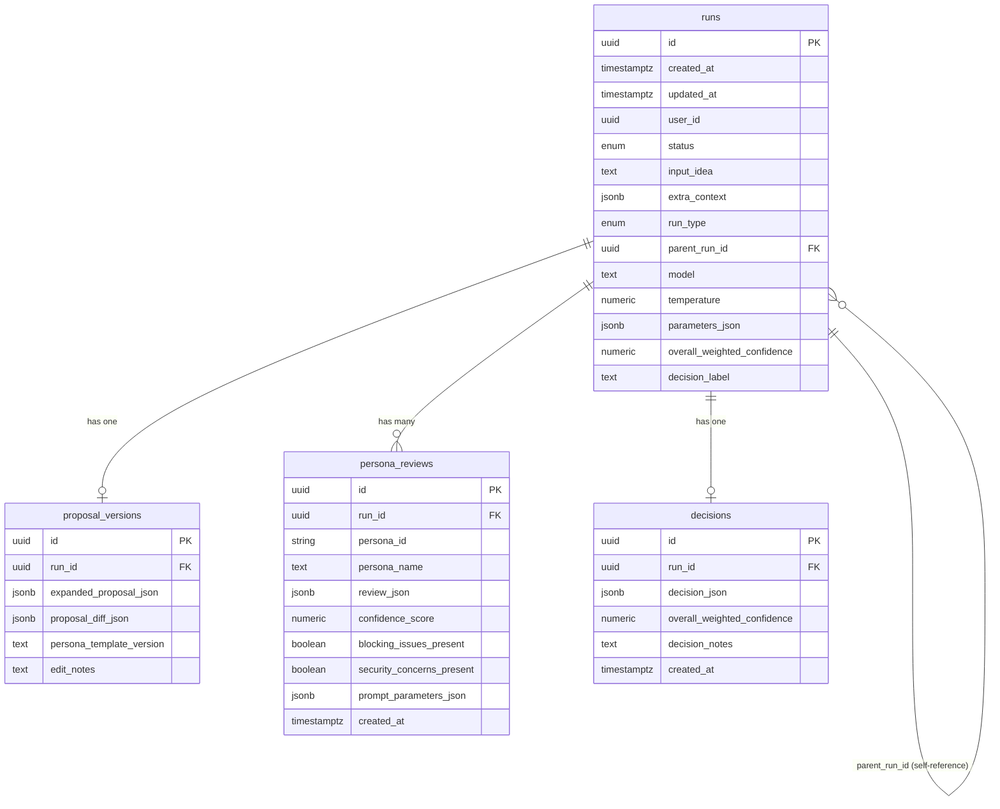

# Multi-Persona Orchestration

This document describes the multi-persona consensus building system in the Consensus Engine.

## Overview

The Consensus Engine uses a multi-persona approach to evaluate proposals from diverse perspectives, ensuring comprehensive analysis and balanced decision-making. The system orchestrates reviews from five specialized personas, aggregates their feedback using weighted confidence scores, and produces a final decision with transparency into the decision-making process.

## Usage Example

```python
from consensus_engine.services import review_with_all_personas, aggregate_persona_reviews
from consensus_engine.schemas.proposal import ExpandedProposal
from consensus_engine.config import get_settings

# Create proposal
proposal = ExpandedProposal(
    problem_statement="Build a scalable API",
    proposed_solution="Use FastAPI with async handlers",
    assumptions=["Python 3.11+"],
    scope_non_goals=["No mobile app"]
)

# Orchestrate reviews from all 5 personas
settings = get_settings()
reviews, metadata = review_with_all_personas(proposal, settings)

# Aggregate into final decision
decision = aggregate_persona_reviews(reviews)

print(f"Decision: {decision.decision.value}")
print(f"Confidence: {decision.weighted_confidence:.2f}")
if decision.minority_reports:
    print(f"Minority Reports: {len(decision.minority_reports)}")
```

## Architecture

The multi-persona system consists of two main components:

1. **Orchestrator** (`orchestrator.py`): Manages sequential review process
2. **Aggregator** (`aggregator.py`): Computes final decision with weighted confidence

## Personas

### 1. Architect (Weight: 0.25)
- Focus: System design, scalability, architecture
- Temperature: 0.2 (deterministic)

### 2. Critic (Weight: 0.25)
- Focus: Risks, edge cases, failures
- Temperature: 0.2 (deterministic)

### 3. Optimist (Weight: 0.15)
- Focus: Strengths, opportunities
- Temperature: 0.2 (deterministic)

### 4. SecurityGuardian (Weight: 0.20)
- Focus: Security, vulnerabilities, auth
- Temperature: 0.2 (deterministic)
- **Veto Power**: Can force REVISE with security_critical flags

### 5. UserAdvocate (Weight: 0.15)
- Focus: Usability, UX, accessibility
- Temperature: 0.2 (deterministic)

## Aggregation

Weighted confidence formula:
```
weighted_confidence = Σ(weight_i × confidence_i) for all personas
```

Decision thresholds:
- **APPROVE**: ≥ 0.80
- **REVISE**: 0.60 to < 0.80
- **REJECT**: < 0.60

## SecurityGuardian Veto

SecurityGuardian can force decision to at least REVISE when:
- A blocking issue has `security_critical: true`
- Weighted confidence would otherwise be APPROVE

## Minority Reports

Generated when:
1. Decision is APPROVE but persona confidence < 0.60
2. Decision is APPROVE/REVISE but persona has blocking issues

## Testing

Run tests:
```bash
pytest tests/unit/test_orchestrator.py
pytest tests/unit/test_aggregator.py
pytest tests/integration/test_multi_persona.py
```

## Persistence

The Consensus Engine uses PostgreSQL to persist run lifecycle data with SQLAlchemy and Alembic migrations.

### Database Infrastructure

- **Engine**: SQLAlchemy 2.0+ with connection pooling
- **Migrations**: Alembic for schema version control
- **Local Development**: Docker Compose with PostgreSQL 16
- **Production**: Cloud SQL for PostgreSQL with IAM authentication

### Database Schema

The versioned run tables capture the complete lifecycle of proposal evaluation:

#### `runs` Table
Tracks each proposal evaluation run (initial or revision):
- **id**: UUID primary key
- **created_at**, **updated_at**: Timestamps with timezone
- **user_id**: Optional UUID of initiating user
- **status**: Enum (`running`, `completed`, `failed`)
- **input_idea**: Original idea text
- **extra_context**: Optional JSONB for additional context
- **run_type**: Enum (`initial`, `revision`)
- **parent_run_id**: Optional FK to parent run for revisions
- **model**: LLM model identifier (e.g., `gpt-5.1`)
- **temperature**: Numeric temperature parameter (0.0-2.0)
- **parameters_json**: JSONB for additional LLM parameters
- **overall_weighted_confidence**: Final confidence score (nullable until decision)
- **decision_label**: Final decision label (nullable until decision)

**Indexes**: `status`, `parent_run_id`, `created_at`

#### `proposal_versions` Table
Stores expanded proposals from the expansion step:
- **id**: UUID primary key
- **run_id**: UUID FK to runs (unique - one proposal per run)
- **expanded_proposal_json**: JSONB containing structured proposal (problem_statement, proposed_solution, assumptions, scope_non_goals)
- **proposal_diff_json**: Optional JSONB diff from parent proposal
- **persona_template_version**: Version identifier for persona templates
- **edit_notes**: Optional notes about manual edits

#### `persona_reviews` Table
Captures individual persona reviews with derived metrics:
- **id**: UUID primary key
- **run_id**: UUID FK to runs
- **persona_id**: Stable persona identifier (e.g., `architect`)
- **persona_name**: Display name
- **review_json**: JSONB containing complete PersonaReview schema
- **confidence_score**: Numeric confidence [0.0, 1.0] (denormalized for queries)
- **blocking_issues_present**: Boolean flag
- **security_concerns_present**: Boolean flag
- **prompt_parameters_json**: JSONB with model, temperature, version, retries
- **created_at**: Timestamp with timezone

**Unique Constraint**: `(run_id, persona_id)` prevents duplicate reviews

#### `decisions` Table
Stores final aggregated decisions:
- **id**: UUID primary key
- **run_id**: UUID FK to runs (unique - one decision per run)
- **decision_json**: JSONB containing complete DecisionAggregation schema
- **overall_weighted_confidence**: Numeric confidence (denormalized for queries)
- **decision_notes**: Optional notes about decision or overrides
- **created_at**: Timestamp with timezone

**Index**: `overall_weighted_confidence`

### Schema Relationships



### Cascade Behavior

Deleting a run cascades to all dependent records (proposal, reviews, decision). This is configured for test cleanup but should be handled carefully in production.

### Connection Modes

**Local Development:**
```python
from consensus_engine.config import get_settings
from consensus_engine.db import create_engine_from_settings

settings = get_settings()
engine = create_engine_from_settings(settings)
```

**Cloud SQL with IAM Authentication:**
```bash
USE_CLOUD_SQL_CONNECTOR=true
DB_INSTANCE_CONNECTION_NAME=project:region:instance
DB_IAM_AUTH=true
```

**Cloud SQL with Password Authentication:**
```bash
USE_CLOUD_SQL_CONNECTOR=true
DB_INSTANCE_CONNECTION_NAME=project:region:instance
DB_IAM_AUTH=false
DB_PASSWORD=your-password
```

### Health Checks

Database connectivity is verified through health checks:

```python
from consensus_engine.db import check_database_health

if not check_database_health(engine):
    logger.error("Database is unreachable")
    # Fail fast with actionable error
```

Health checks:
- Never fall back to IP allowlists
- Emit clear errors when DB is unreachable
- Surface actionable error messages for IAM principal issues

### Connection Pool Management

- **Pool Size**: Configurable via `DB_POOL_SIZE` (default: 5)
- **Max Overflow**: Configurable via `DB_MAX_OVERFLOW` (default: 10)
- **Pool Timeout**: Configurable via `DB_POOL_TIMEOUT` (default: 30s)
- **Pool Recycle**: Configurable via `DB_POOL_RECYCLE` (default: 3600s)
- **Pre-Ping**: Enabled to verify connections before use
- **Retries**: Connection pool exhaustion triggers backoff

### Security Considerations

- **No Passwords in Code**: All credentials from environment variables
- **IAM Authentication**: Recommended for Cloud SQL (no passwords)
- **Masked Logging**: Database passwords masked in logs via `get_safe_dict()`
- **No Ad-Hoc Connections**: All persistence via SQLAlchemy/Alembic

### Migration Workflow

```bash
# Create a new migration after model changes
alembic revision --autogenerate -m "add_new_table"

# Apply migrations
alembic upgrade head

# Rollback last migration
alembic downgrade -1

# Migrations are idempotent and safe to run multiple times
```

### Using the Models

```python
from consensus_engine.db import (
    Run, 
    ProposalVersion, 
    PersonaReview, 
    Decision,
    RunStatus,
    RunType,
    create_session_factory,
    get_session
)
import uuid

# Create a run
for session in get_session(session_factory):
    run = Run(
        status=RunStatus.RUNNING,
        input_idea="Build a scalable API",
        run_type=RunType.INITIAL,
        model="gpt-5.1",
        temperature=0.7,
        parameters_json={"max_tokens": 1000}
    )
    session.add(run)
    session.commit()
    run_id = run.id

# Add proposal version
for session in get_session(session_factory):
    proposal = ProposalVersion(
        run_id=run_id,
        expanded_proposal_json={
            "problem_statement": "...",
            "proposed_solution": "...",
            "assumptions": [...],
            "scope_non_goals": [...]
        },
        persona_template_version="v1.0"
    )
    session.add(proposal)
    session.commit()
```

See full documentation in the repository for complete details.
