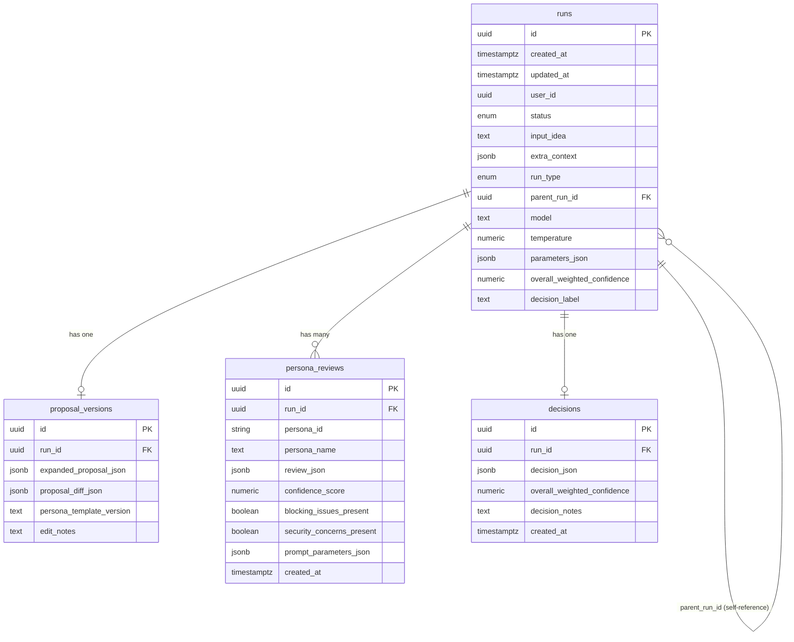

# Multi-Persona Orchestration

This document describes the multi-persona consensus building system in the Consensus Engine.

## Overview

The Consensus Engine uses a multi-persona approach to evaluate proposals from diverse perspectives, ensuring comprehensive analysis and balanced decision-making. The system orchestrates reviews from five specialized personas, aggregates their feedback using weighted confidence scores, and produces a final decision with transparency into the decision-making process.

## Usage Example

```python
from consensus_engine.services import review_with_all_personas, aggregate_persona_reviews
from consensus_engine.schemas.proposal import ExpandedProposal
from consensus_engine.config import get_settings

# Create proposal
proposal = ExpandedProposal(
    problem_statement="Build a scalable API",
    proposed_solution="Use FastAPI with async handlers",
    assumptions=["Python 3.11+"],
    scope_non_goals=["No mobile app"]
)

# Orchestrate reviews from all 5 personas
settings = get_settings()
reviews, metadata = review_with_all_personas(proposal, settings)

# Aggregate into final decision
decision = aggregate_persona_reviews(reviews)

print(f"Decision: {decision.decision.value}")
print(f"Confidence: {decision.weighted_confidence:.2f}")
if decision.minority_reports:
    print(f"Minority Reports: {len(decision.minority_reports)}")
```

## Architecture

The multi-persona system consists of two main components:

1. **Orchestrator** (`orchestrator.py`): Manages sequential review process
2. **Aggregator** (`aggregator.py`): Computes final decision with weighted confidence

## Personas

### 1. Architect (Weight: 0.25)
- Focus: System design, scalability, architecture
- Temperature: 0.2 (deterministic)

### 2. Critic (Weight: 0.25)
- Focus: Risks, edge cases, failures
- Temperature: 0.2 (deterministic)

### 3. Optimist (Weight: 0.15)
- Focus: Strengths, opportunities
- Temperature: 0.2 (deterministic)

### 4. SecurityGuardian (Weight: 0.20)
- Focus: Security, vulnerabilities, auth
- Temperature: 0.2 (deterministic)
- **Veto Power**: Can force REVISE with security_critical flags

### 5. UserAdvocate (Weight: 0.15)
- Focus: Usability, UX, accessibility
- Temperature: 0.2 (deterministic)

## Aggregation

Weighted confidence formula:
```
weighted_confidence = Σ(weight_i × confidence_i) for all personas
```

Decision thresholds:
- **APPROVE**: ≥ 0.80
- **REVISE**: 0.60 to < 0.80
- **REJECT**: < 0.60

## SecurityGuardian Veto

SecurityGuardian can force decision to at least REVISE when:
- A blocking issue has `security_critical: true`
- Weighted confidence would otherwise be APPROVE

## Minority Reports

Generated when:
1. Decision is APPROVE but persona confidence < 0.60
2. Decision is APPROVE/REVISE but persona has blocking issues

## Testing

Run tests:
```bash
pytest tests/unit/test_orchestrator.py
pytest tests/unit/test_aggregator.py
pytest tests/integration/test_multi_persona.py
```

## Persistence

The multi-persona review results are persisted to the database as part of the `full_review_endpoint` transaction. Each run creates:

- A `Run` record with metadata and status
- A `ProposalVersion` record with the expanded proposal
- Multiple `PersonaReview` records (one per persona)
- A `Decision` record with aggregated results

All operations occur in a single atomic transaction that commits only after all steps complete successfully.

## Revision Workflow

The revision workflow allows users to edit proposals and selectively re-run personas based on confidence scores and blocking issues.

### Creating a Revision

POST /v1/runs/{run_id}/revisions

Request body:
```json
{
  "edited_proposal": "Add OAuth2 authentication",
  "edit_notes": "Addressing security concerns from review",
  "model": "gpt-5.1",  // Optional: override parent model
  "temperature": 0.7    // Optional: override parent temperature
}
```

### Persona Re-run Criteria

Personas are selectively re-run based on the following criteria:

1. **Low Confidence**: confidence_score < 0.70
2. **Blocking Issues**: blocking_issues_present is true
3. **Security Guardian Rule**: persona_id is "security_guardian" AND security_concerns_present is true

Personas not meeting these criteria reuse their reviews from the parent run.

### Revision Process

1. **Validate Parent**: Ensure parent run exists and has status 'completed'
2. **Re-expand Proposal**: Merge edits with parent proposal and re-expand via LLM
3. **Compute Diff**: Calculate proposal_diff_json for auditability
4. **Determine Re-runs**: Evaluate parent reviews against rerun criteria
5. **Selective Review**: Re-run selected personas, reuse others
6. **Aggregate Decision**: Combine new and reused reviews into final decision
7. **Persist**: Create new Run with run_type='revision' and parent_run_id

### Example Usage

```python
# Create initial run via full_review endpoint
response = client.post("/v1/full-review", json={
    "idea": "Build a REST API",
    "extra_context": "Must support authentication"
})
parent_run_id = response.json()["run_id"]

# Create revision with edits
revision_response = client.post(
    f"/v1/runs/{parent_run_id}/revisions",
    json={
        "edited_proposal": "Add OAuth2 authentication",
        "edit_notes": "Security Guardian feedback"
    }
)

# Check which personas were re-run
print(f"Re-run: {revision_response.json()['personas_rerun']}")
print(f"Reused: {revision_response.json()['personas_reused']}")
```

### Response Format

```json
{
  "run_id": "uuid-of-new-revision-run",
  "parent_run_id": "uuid-of-parent-run",
  "status": "completed",
  "created_at": "2025-01-07T23:00:00Z",
  "personas_rerun": ["architect", "security_guardian"],
  "personas_reused": ["critic", "optimist", "user_advocate"],
  "message": "Revision created successfully. Re-ran 2 persona(s), reused 3 review(s)."
}
```

### Edge Cases

- **No Edit Inputs**: Returns 400 if neither edited_proposal nor edit_notes provided
- **Parent Not Found**: Returns 404 if parent run_id doesn't exist
- **Parent Failed**: Returns 409 if parent run status is not 'completed'
- **Full Re-run**: If all personas meet rerun criteria, all are re-executed
- **Zero Re-run**: If no personas meet criteria, all reviews are reused

### Configuration

The confidence threshold for re-running personas is defined in `orchestrator.py`:

```python
RERUN_CONFIDENCE_THRESHOLD = 0.70
```

This threshold applies only to new revisions. Historical runs retain their stored confidence scores unaffected.

The Consensus Engine uses PostgreSQL to persist run lifecycle data with SQLAlchemy and Alembic migrations.

### Database Infrastructure

- **Engine**: SQLAlchemy 2.0+ with connection pooling
- **Migrations**: Alembic for schema version control
- **Local Development**: Docker Compose with PostgreSQL 16
- **Production**: Cloud SQL for PostgreSQL with IAM authentication

### Database Schema

The versioned run tables capture the complete lifecycle of proposal evaluation:

#### `runs` Table
Tracks each proposal evaluation run (initial or revision):
- **id**: UUID primary key
- **created_at**, **updated_at**: Timestamps with timezone
- **user_id**: Optional UUID of initiating user
- **status**: Enum (`running`, `completed`, `failed`)
- **input_idea**: Original idea text
- **extra_context**: Optional JSONB for additional context
- **run_type**: Enum (`initial`, `revision`)
- **parent_run_id**: Optional FK to parent run for revisions
- **model**: LLM model identifier (e.g., `gpt-5.1`)
- **temperature**: Numeric temperature parameter (0.0-2.0)
- **parameters_json**: JSONB for additional LLM parameters
- **overall_weighted_confidence**: Final confidence score (nullable until decision)
- **decision_label**: Final decision label (nullable until decision)

**Indexes**: `status`, `parent_run_id`, `created_at`

#### `proposal_versions` Table
Stores expanded proposals from the expansion step:
- **id**: UUID primary key
- **run_id**: UUID FK to runs (unique - one proposal per run)
- **expanded_proposal_json**: JSONB containing structured proposal (problem_statement, proposed_solution, assumptions, scope_non_goals)
- **proposal_diff_json**: Optional JSONB diff from parent proposal
- **persona_template_version**: Version identifier for persona templates
- **edit_notes**: Optional notes about manual edits

#### `persona_reviews` Table
Captures individual persona reviews with derived metrics:
- **id**: UUID primary key
- **run_id**: UUID FK to runs
- **persona_id**: Stable persona identifier (e.g., `architect`)
- **persona_name**: Display name
- **review_json**: JSONB containing complete PersonaReview schema
- **confidence_score**: Numeric confidence [0.0, 1.0] (denormalized for queries)
- **blocking_issues_present**: Boolean flag
- **security_concerns_present**: Boolean flag
- **prompt_parameters_json**: JSONB with model, temperature, version, retries
- **created_at**: Timestamp with timezone

**Unique Constraint**: `(run_id, persona_id)` prevents duplicate reviews

#### `decisions` Table
Stores final aggregated decisions:
- **id**: UUID primary key
- **run_id**: UUID FK to runs (unique - one decision per run)
- **decision_json**: JSONB containing complete DecisionAggregation schema
- **overall_weighted_confidence**: Numeric confidence (denormalized for queries)
- **decision_notes**: Optional notes about decision or overrides
- **created_at**: Timestamp with timezone

**Index**: `overall_weighted_confidence`

### Schema Relationships



### Cascade Behavior

Deleting a run cascades to all dependent records (proposal, reviews, decision). This is configured for test cleanup but should be handled carefully in production.

### Connection Modes

**Local Development:**
```python
from consensus_engine.config import get_settings
from consensus_engine.db import create_engine_from_settings

settings = get_settings()
engine = create_engine_from_settings(settings)
```

**Cloud SQL with IAM Authentication:**
```bash
USE_CLOUD_SQL_CONNECTOR=true
DB_INSTANCE_CONNECTION_NAME=project:region:instance
DB_IAM_AUTH=true
```

**Cloud SQL with Password Authentication:**
```bash
USE_CLOUD_SQL_CONNECTOR=true
DB_INSTANCE_CONNECTION_NAME=project:region:instance
DB_IAM_AUTH=false
DB_PASSWORD=your-password
```

### Health Checks

Database connectivity is verified through health checks:

```python
from consensus_engine.db import check_database_health

if not check_database_health(engine):
    logger.error("Database is unreachable")
    # Fail fast with actionable error
```

Health checks:
- Never fall back to IP allowlists
- Emit clear errors when DB is unreachable
- Surface actionable error messages for IAM principal issues

### Connection Pool Management

- **Pool Size**: Configurable via `DB_POOL_SIZE` (default: 5)
- **Max Overflow**: Configurable via `DB_MAX_OVERFLOW` (default: 10)
- **Pool Timeout**: Configurable via `DB_POOL_TIMEOUT` (default: 30s)
- **Pool Recycle**: Configurable via `DB_POOL_RECYCLE` (default: 3600s)
- **Pre-Ping**: Enabled to verify connections before use
- **Retries**: Connection pool exhaustion triggers backoff

### Security Considerations

- **No Passwords in Code**: All credentials from environment variables
- **IAM Authentication**: Recommended for Cloud SQL (no passwords)
- **Masked Logging**: Database passwords masked in logs via `get_safe_dict()`
- **No Ad-Hoc Connections**: All persistence via SQLAlchemy/Alembic

### Migration Workflow

```bash
# Create a new migration after model changes
alembic revision --autogenerate -m "add_new_table"

# Apply migrations
alembic upgrade head

# Rollback last migration
alembic downgrade -1

# Migrations are idempotent and safe to run multiple times
```

### Using the Models

```python
from consensus_engine.db import (
    Run, 
    ProposalVersion, 
    PersonaReview, 
    Decision,
    RunStatus,
    RunType,
    create_session_factory,
    get_session
)
import uuid

# Create a run
for session in get_session(session_factory):
    run = Run(
        status=RunStatus.RUNNING,
        input_idea="Build a scalable API",
        run_type=RunType.INITIAL,
        model="gpt-5.1",
        temperature=0.7,
        parameters_json={"max_tokens": 1000}
    )
    session.add(run)
    session.commit()
    run_id = run.id

# Add proposal version
for session in get_session(session_factory):
    proposal = ProposalVersion(
        run_id=run_id,
        expanded_proposal_json={
            "problem_statement": "...",
            "proposed_solution": "...",
            "assumptions": [...],
            "scope_non_goals": [...]
        },
        persona_template_version="v1.0"
    )
    session.add(proposal)
    session.commit()
```

See full documentation in the repository for complete details.

## Run Retrieval APIs

The Consensus Engine exposes APIs to query stored runs for audits, debugging, and building on previous work.

### GET /v1/runs

Returns a paginated list of runs with filtering and sorting capabilities.

**Query Parameters:**
- `limit` (optional, 1-100, default: 30): Number of items per page
- `offset` (optional, ≥0, default: 0): Offset for pagination
- `status` (optional): Filter by status (`running`, `completed`, `failed`)
- `run_type` (optional): Filter by type (`initial`, `revision`)
- `parent_run_id` (optional, UUID): Filter revisions by parent run
- `decision` (optional): Filter by decision label (e.g., `approve`, `revise`, `reject`)
- `min_confidence` (optional, 0.0-1.0): Filter by minimum weighted confidence
- `start_date` (optional, ISO 8601): Filter by created_at >= start_date
- `end_date` (optional, ISO 8601): Filter by created_at <= end_date

**Response:**
- Sorted by `created_at` descending (newest first)
- Returns empty list (200) for no matches
- Each item includes truncated proposal metadata (title, summary)

**Example:**
```bash
GET /v1/runs?status=completed&min_confidence=0.8&limit=10
```

### GET /v1/runs/{run_id}

Returns full details for a single run including:
- Run metadata (timestamps, status, type, model, parameters)
- Complete proposal JSON (null if run failed before proposal)
- Persona review summaries with confidence scores
- Decision JSON (null if incomplete)

**Example:**
```bash
GET /v1/runs/550e8400-e29b-41d4-a716-446655440000
```

**Notes:**
- No LLM calls are made during GET requests
- Failed runs return partial data persisted before failure
- Useful for auditing decisions and understanding review history
- Can be used to retrieve parent proposals when creating revisions

See the main README for complete API documentation and response examples.

## Run Comparison and Diffing

The Consensus Engine provides a diff API to compare two runs and compute structured changes.

### GET /v1/runs/{run_id}/diff/{other_run_id}

Computes a comprehensive diff between two runs without re-running models. All diffs are computed from stored JSONB data.

**Response Structure:**
```json
{
  "metadata": {
    "run1_id": "uuid-of-first-run",
    "run2_id": "uuid-of-second-run",
    "run1_created_at": "2026-01-07T10:00:00Z",
    "run2_created_at": "2026-01-07T11:00:00Z",
    "is_parent_child": true,
    "relationship": "run1_is_parent_of_run2"
  },
  "proposal_changes": {
    "title": {"status": "unchanged", "diff": null},
    "problem_statement": {
      "status": "modified",
      "diff": ["--- original", "+++ modified", "@@ -1,3 +1,3 @@", "..."],
      "old_length": 500,
      "new_length": 520
    },
    "proposed_solution": {"status": "modified", "diff": ["..."]},
    "assumptions": {"status": "unchanged", "diff": null},
    "scope_non_goals": {"status": "added", "new_value": ["..."], "diff": null}
  },
  "persona_deltas": [
    {
      "persona_id": "architect",
      "persona_name": "Architect",
      "old_confidence": 0.75,
      "new_confidence": 0.85,
      "confidence_delta": 0.10,
      "old_blocking_issues": false,
      "new_blocking_issues": false,
      "blocking_changed": false,
      "old_security_concerns": false,
      "new_security_concerns": false,
      "security_concerns_changed": false
    },
    {
      "persona_id": "security_guardian",
      "persona_name": "SecurityGuardian",
      "old_confidence": 0.60,
      "new_confidence": 0.90,
      "confidence_delta": 0.30,
      "old_blocking_issues": true,
      "new_blocking_issues": false,
      "blocking_changed": true,
      "old_security_concerns": true,
      "new_security_concerns": false,
      "security_concerns_changed": true
    }
  ],
  "decision_delta": {
    "old_overall_weighted_confidence": 0.72,
    "new_overall_weighted_confidence": 0.84,
    "confidence_delta": 0.12,
    "old_decision_label": "revise",
    "new_decision_label": "approve",
    "decision_changed": true
  }
}
```

**Features:**
- **Proposal Changes**: Per-section unified diffs for text fields (problem_statement, proposed_solution, etc.)
- **Persona Deltas**: Confidence score changes, blocking issue transitions, security concern flags
- **Decision Delta**: Overall weighted confidence change and decision label transitions
- **Parent/Child Detection**: Automatically detects and reports revision relationships
- **Large Proposal Handling**: Diff output is truncated to 50 lines per section to maintain performance

**Edge Cases:**
- Diffing a run against itself returns 400 Bad Request with helpful error message
- Missing runs return 404 without leaking implementation details
- Large proposals limit diff depth to ensure responses remain performant (max 50 lines per section)

**Example Usage:**
```bash
# Compare a revision against its parent
GET /v1/runs/parent-run-uuid/diff/revision-run-uuid

# Compare two unrelated runs
GET /v1/runs/run1-uuid/diff/run2-uuid
```

**Use Cases:**
- **Auditing**: Track exactly what changed between proposal iterations
- **Analytics**: Identify which personas improved/degraded confidence in revisions
- **Debugging**: Understand why a decision changed from REVISE to APPROVE
- **Reporting**: Generate change summaries for stakeholders

## Analytics Support

The database includes a composite index on `(decision_label, created_at)` to accelerate common analytics queries.

### Optimized Index

**Index:** `ix_runs_decision_label_created_at` on `runs(decision_label, created_at)`

**Accelerates:**
- Filtering by decision outcome: `WHERE decision_label = 'approve'`
- Date range queries: `WHERE created_at >= '2024-01-01'`
- Combined filters: `WHERE decision_label = 'approve' AND created_at >= '2024-01-01'`

**Example Queries:**
```sql
-- Count approvals in the last month
SELECT COUNT(*) FROM runs 
WHERE decision_label = 'approve' 
AND created_at >= NOW() - INTERVAL '1 month';

-- Average confidence by decision type in Q1
SELECT decision_label, AVG(overall_weighted_confidence) 
FROM runs 
WHERE created_at BETWEEN '2024-01-01' AND '2024-04-01'
GROUP BY decision_label;
```

**Benefits:**
- Fast dashboard queries filtering by decision outcome
- Efficient time-series analytics on decision trends
- No full table scans for common reporting patterns

**Migration:**
The index is created via Alembic migration `1be7b272f496_add_analytics_index_for_decision_and_date.py` and is automatically applied during `alembic upgrade head`.

**Note:** The existing `ix_runs_created_at` index on `created_at` alone is still present for general time-based queries. The composite index complements it for decision-specific analytics.
