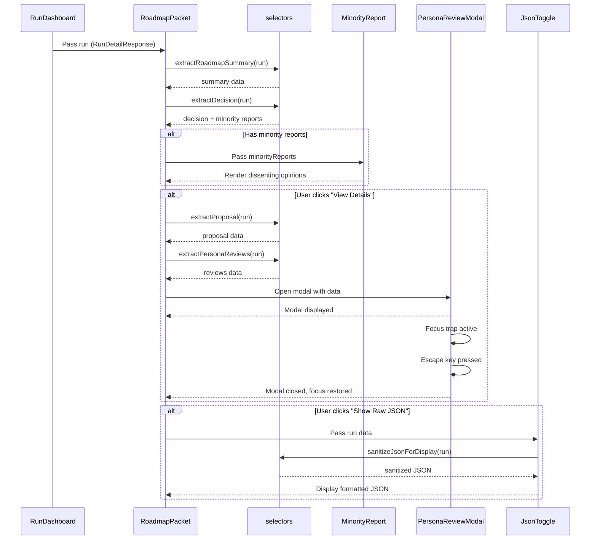
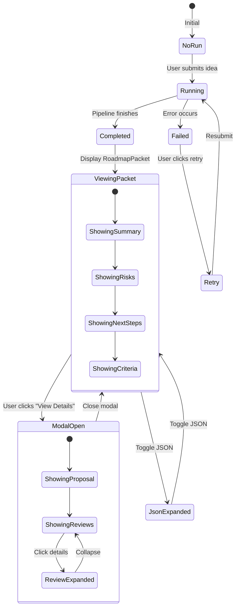
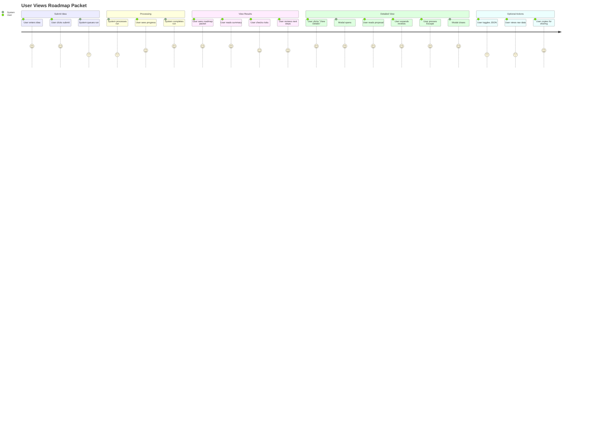
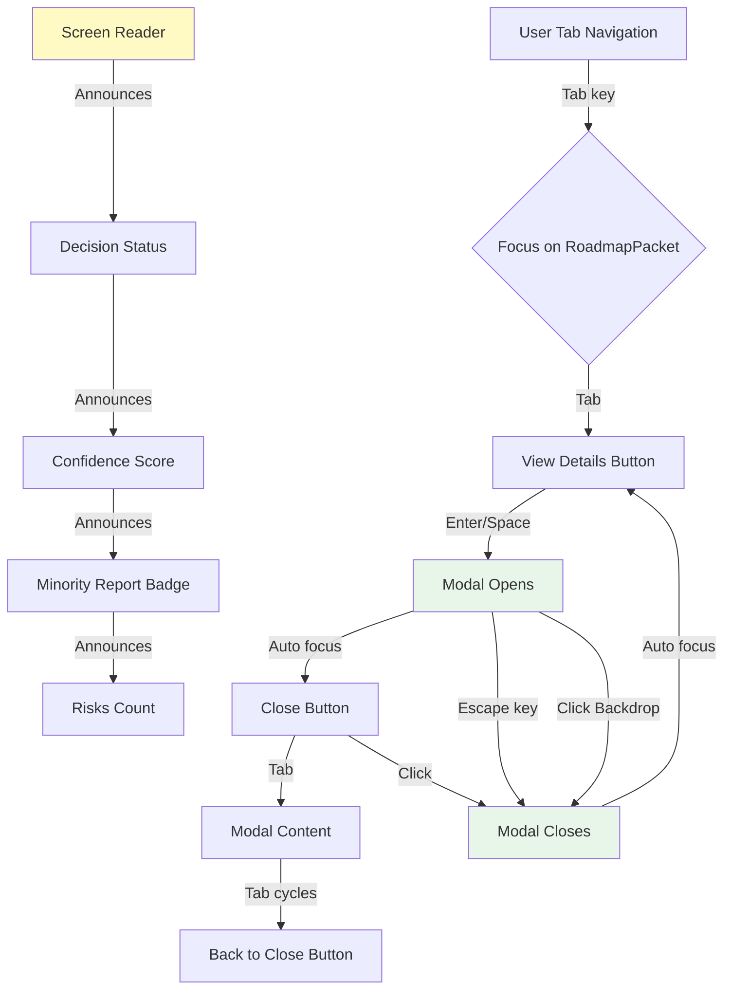
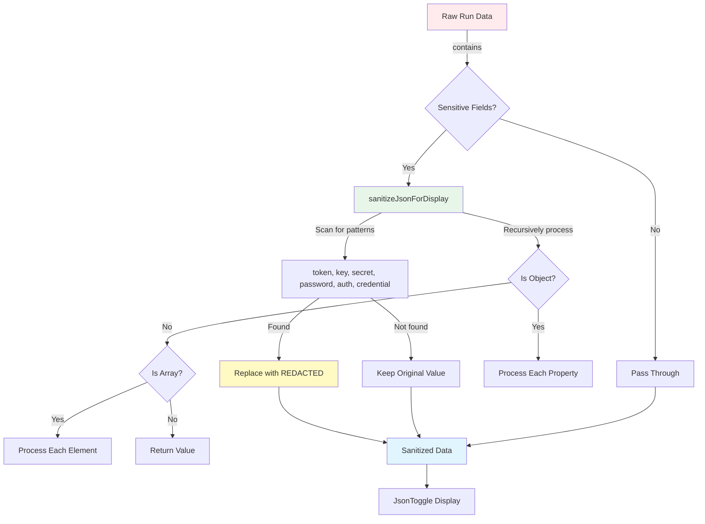

# Roadmap Packet Component Architecture

This diagram shows the component hierarchy and data flow for the roadmap packet feature.

```mermaid
graph TD
    A[RunDashboard] -->|run completed| B[RoadmapPacket]
    B -->|data extraction| C[selectors.ts]
    
    C -->|extractProposal| D[ProposalData]
    C -->|extractDecision| E[DecisionData]
    C -->|extractPersonaReviews| F[PersonaReview[]]
    C -->|extractRisks| G[RiskItem[]]
    C -->|extractNextSteps| H[NextStep[]]
    C -->|extractAcceptanceCriteria| I[string[]]
    
    B -->|has minority reports| J[MinorityReport]
    B -->|user clicks button| K[PersonaReviewModal]
    B -->|optional| L[JsonToggle]
    
    K -->|displays| D
    K -->|displays| F
    
    L -->|sanitizes| C
    
    style B fill:#e1f5ff
    style J fill:#fff4e6
    style K fill:#f0f0f0
    style L fill:#f0f0f0
    style C fill:#e8f5e9
```

## Component Relationships

### Data Flow



## State Management



## Component Props Flow

```mermaid
graph LR
    A[RunDetailResponse] -->|run| B[RoadmapPacket]
    
    B -->|minority reports| C[MinorityReport]
    B -->|isOpen, onClose, proposal, reviews| D[PersonaReviewModal]
    B -->|data, label| E[JsonToggle]
    
    C -->|reports: MinorityReport[]| C1[Render badges & sections]
    
    D -->|proposal: ProposalData| D1[Render proposal sections]
    D -->|reviews: PersonaReview[]| D2[Render persona reviews]
    
    E -->|data: Record<string, unknown>| E1[sanitizeJsonForDisplay]
    E1 -->|sanitized| E2[JSON.stringify]
    E2 -->|formatted| E3[Display in pre/code]
    
    style A fill:#fff9c4
    style B fill:#e1f5ff
    style C fill:#fff4e6
    style D fill:#f0f0f0
    style E fill:#f0f0f0
```

## User Interaction Flow



## Accessibility Flow



## Data Extraction Pipeline

```mermaid
graph LR
    A[RunDetailResponse] -->|proposal JSON| B[extractProposal]
    A -->|decision JSON| C[extractDecision]
    A -->|persona_reviews| D[extractPersonaReviews]
    A -->|all data| E[extractRoadmapSummary]
    
    D -->|reviews| F[extractRisks]
    D -->|reviews| G[extractNextSteps]
    A -->|proposal| H[extractAcceptanceCriteria]
    
    B -->|ProposalData| I[PersonaReviewModal]
    C -->|DecisionData| J[Decision Badge]
    C -->|minorityReports| K[MinorityReport]
    D -->|PersonaReview[]| I
    E -->|RoadmapSummary| L[Packet Header]
    F -->|RiskItem[]| M[Risks Section]
    G -->|NextStep[]| N[Next Steps Section]
    H -->|string[]| O[Criteria Section]
    
    style A fill:#fff9c4
    style B fill:#e8f5e9
    style C fill:#e8f5e9
    style D fill:#e8f5e9
    style E fill:#e8f5e9
    style F fill:#e8f5e9
    style G fill:#e8f5e9
    style H fill:#e8f5e9
```

## Error Handling Strategy

```mermaid
graph TD
    A[Component Receives Data] -->|Check null/undefined| B{Data Valid?}
    B -->|No| C[Return Fallback Component]
    B -->|Yes| D{Check Status}
    
    D -->|Not completed| E[Show Pending Message]
    D -->|Completed| F{Extract Data}
    
    F -->|Try extractProposal| G{Success?}
    G -->|No| H[Use Fallback Values]
    G -->|Yes| I[Render Proposal]
    
    F -->|Try extractDecision| J{Success?}
    J -->|No| K[Use Default Decision]
    J -->|Yes| L[Render Decision]
    
    F -->|Try extractReviews| M{Success?}
    M -->|No| N[Empty Array]
    M -->|Yes| O[Render Reviews]
    
    H --> P[Display "Not provided yet"]
    N --> Q[Display "No reviews available"]
    
    style C fill:#ffebee
    style E fill:#fff9c4
    style H fill:#fff9c4
    style N fill:#fff9c4
    style P fill:#fff9c4
    style Q fill:#fff9c4
```

## Security & Sanitization


