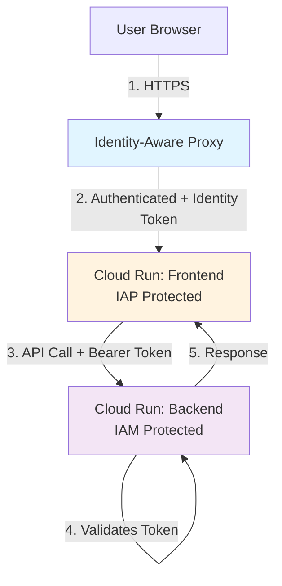
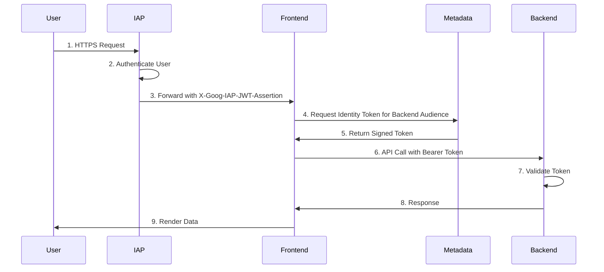

# Web Frontend Documentation

This document provides a comprehensive guide to the Consensus Engine web frontend, including setup, development, deployment, and maintenance.

## Overview

The Consensus Engine web frontend is a modern React application built with:

- **Vite**: Fast build tool and dev server
- **React 19**: Latest React features with TypeScript support
- **TypeScript**: Type-safe development with strict mode enabled
- **Tailwind CSS**: Utility-first CSS framework for consistent styling
- **OpenAPI Client**: Auto-generated TypeScript client from backend API

## Project Structure

```
webapp/
├── src/
│   ├── api/
│   │   ├── generated/        # Auto-generated OpenAPI client (DO NOT EDIT)
│   │   └── client.ts         # API client wrapper with auth configuration
│   ├── components/
│   │   ├── DiffView.tsx      # Component for comparing two runs
│   │   ├── IdeaForm.tsx      # Form for submitting new ideas
│   │   ├── JsonToggle.tsx    # Component for toggling JSON view
│   │   ├── MinorityReport.tsx # Component for displaying minority reports
│   │   ├── PersonaReviewModal.tsx # Modal for viewing persona reviews
│   │   ├── RevisionModal.tsx # Modal for creating revisions
│   │   ├── RoadmapPacket.tsx # Component for displaying completed runs
│   │   ├── RunHistoryList.tsx # Component for displaying run history
│   │   ├── Timeline.tsx      # Component for displaying step progress
│   │   ├── layout/           # Layout components (Header, Container)
│   │   └── ui/               # UI primitives (Button, StatusBadge)
│   ├── config/
│   │   └── index.ts          # Environment configuration
│   ├── hooks/
│   │   ├── useRunHistory.ts  # Hook for fetching run history
│   │   └── useRunPolling.ts  # Hook for polling run status
│   ├── pages/
│   │   └── RunDashboard.tsx  # Main dashboard page
│   ├── state/
│   │   ├── runs.ts           # Zustand store for run management
│   │   └── selectors.ts      # Selectors for extracting run data
│   ├── styles/
│   │   └── roadmap.css       # Custom styles for roadmap components
│   ├── App.tsx               # Main application component
│   ├── main.tsx              # Application entry point
│   └── index.css             # Global styles with Tailwind directives
├── public/                   # Static assets
├── .env.example              # Example environment variables
├── package.json              # Dependencies and scripts
├── tsconfig.json             # TypeScript configuration
├── tailwind.config.js        # Tailwind CSS configuration
├── vite.config.ts            # Vite configuration
└── openapi.json              # OpenAPI specification (regenerated from backend)
```

## Quick Start

### Prerequisites

- Node.js 20.x or later
- npm 10.x or later
- Backend API running (see main README.md)

### Installation

1. Navigate to the webapp directory:

```bash
cd webapp
```

2. Install dependencies:

```bash
npm install
```

3. Copy the example environment file:

```bash
cp .env.example .env
```

4. Update `.env` with your configuration:

```env
VITE_API_BASE_URL=http://localhost:8000
VITE_POLLING_INTERVAL_MS=3000
VITE_ENVIRONMENT=development
```

### Development

Start the development server:

```bash
npm run dev
```

The application will be available at `http://localhost:5173` by default.

#### Hot Module Replacement

Vite provides instant HMR (Hot Module Replacement) for a fast development experience:
- Changes to React components are reflected immediately
- TypeScript type checking runs in watch mode
- CSS changes apply without full page refresh

### Building for Production

Build the optimized production bundle:

```bash
npm run build
```

The build output will be in the `dist/` directory.

Preview the production build locally:

```bash
npm run preview
```

### Code Quality

#### Linting

Run ESLint to check for code issues:

```bash
npm run lint
```

Auto-fix linting issues:

```bash
npm run lint:fix
```

#### Formatting

Format all code with Prettier:

```bash
npm run format
```

Check formatting without making changes:

```bash
npx prettier --check .
```

#### Type Checking

Run TypeScript type checking:

```bash
npm run typecheck
```

## Environment Configuration

### Environment Variables

The frontend uses environment variables prefixed with `VITE_` (Vite convention). These are loaded from `.env` files and available at build time.

| Variable | Required | Default | Description |
|----------|----------|---------|-------------|
| `VITE_API_BASE_URL` | Yes | `http://localhost:8000` | Base URL for the Consensus Engine API |
| `VITE_IAM_TOKEN` | No | - | IAM token for Cloud IAP/IAM authentication (leave empty for local dev) |
| `VITE_POLLING_INTERVAL_MS` | No | `3000` | Interval in milliseconds for polling run status (1000-60000) |
| `VITE_ENVIRONMENT` | No | `development` | Environment name (development, staging, production) |

### Multiple Environments

You can create environment-specific files:

- `.env` - Default environment variables (local development)
- `.env.local` - Local overrides (not committed to git)
- `.env.production` - Production environment variables
- `.env.staging` - Staging environment variables

Vite automatically loads the appropriate file based on the `--mode` flag:

```bash
npm run build -- --mode production
npm run build -- --mode staging
```

### Configuration Validation

The application validates configuration on startup (see `src/config/index.ts`):

- Ensures `VITE_API_BASE_URL` is set
- Warns if polling interval is outside recommended range (1000-60000ms)
- Logs configuration details (without exposing secrets) to console

## OpenAPI Client Generation

The TypeScript client is auto-generated from the backend's OpenAPI specification. This ensures type safety and keeps the frontend in sync with the API.

### Regenerating the Client

When the backend API changes, regenerate the TypeScript client:

```bash
npm run generate:api
```

This script:
1. Exports the OpenAPI spec from the backend (`webapp/openapi.json`)
2. Generates TypeScript types and services (`src/api/generated/`)
3. Preserves the API wrapper configuration (`src/api/client.ts`)

**Important:** Never edit files in `src/api/generated/` manually. They will be overwritten on the next generation.

### Client Usage

The generated client is wrapped in `src/api/client.ts` for centralized configuration:

```typescript
import { configureApiClient, DefaultService } from './api/client';

// Configure on app startup
configureApiClient();

// Use the services
const health = await DefaultService.healthHealthGet();
const runs = await RunsService.getRunsV1RunsGet();
```

### Available Services

The generated client includes services for all API endpoints:

- `ExpandService` - Expand idea endpoint
- `ReviewService` - Review idea endpoint
- `FullReviewService` - Full review with all personas
- `RunsService` - Get runs and run details
- `HealthService` - Health check endpoint
- `RootService` - Root endpoint

Each service includes TypeScript types for request/response payloads.

## Authentication

### Local Development

For local development, authentication is typically not required. The backend runs without IAM/IAP protection.

### Cloud IAP/IAM (Production)

In production, the application is deployed behind Cloud Identity-Aware Proxy (IAP) or uses IAM authentication.

#### IAM Token Flow

1. User authenticates with Google Identity Platform
2. IAP/IAM proxy validates authentication and injects token
3. Frontend extracts token and adds to API requests via `Authorization: Bearer <token>` header

#### Configuration

Set the IAM token in `.env`:

```env
VITE_IAM_TOKEN=<your-iam-token>
```

The API client wrapper (`src/api/client.ts`) automatically adds the token to all requests.

#### Token Management

For production deployments:
- Tokens are typically managed by the IAP proxy
- Frontend doesn't need to handle token refresh
- For service-to-service auth, use service account tokens

## CORS Configuration

The backend must be configured to allow requests from the frontend origin.

### Backend CORS Setup

In the backend `.env`:

```env
CORS_ORIGINS=http://localhost:5173,http://localhost:3000
```

For production, use your actual frontend domain:

```env
CORS_ORIGINS=https://app.example.com,https://staging.example.com
```

**Security:** Never use wildcard (`*`) CORS origins in production.

### Verifying CORS

Check CORS headers in browser DevTools Network tab:

```
Access-Control-Allow-Origin: http://localhost:5173
Access-Control-Allow-Credentials: true
Access-Control-Allow-Methods: *
Access-Control-Allow-Headers: *
```

## Component Library

### Layout Components

#### Header

```tsx
import { Header } from './components/layout';

<Header title="My Custom Title" />
```

Props:
- `title` (optional, string): Header title text (default: "Consensus Engine")

#### Container

```tsx
import { Container } from './components/layout';

<Container className="py-8">
  {/* Your content */}
</Container>
```

Props:
- `children` (ReactNode): Content to render inside the container
- `className` (optional, string): Additional Tailwind classes

### UI Primitives

#### Button

```tsx
import { Button } from './components/ui';

<Button
  variant="primary"
  size="md"
  onClick={handleClick}
  disabled={isLoading}
>
  Click Me
</Button>
```

Props:
- `variant` (optional): `"primary"` | `"secondary"` | `"danger"` (default: "primary")
- `size` (optional): `"sm"` | `"md"` | `"lg"` (default: "md")
- `disabled` (optional, boolean): Disable button
- All standard button HTML attributes

#### StatusBadge

```tsx
import { StatusBadge } from './components/ui';

<StatusBadge status="completed" />
<StatusBadge status="running" />
<StatusBadge status="failed" />
```

Props:
- `status` (string): Status to display - `"queued"`, `"running"`, `"completed"`, `"failed"`, or custom
- `className` (optional, string): Additional Tailwind classes

Automatically applies color-coding:
- **Queued**: Gray
- **Running**: Blue
- **Completed**: Green
- **Failed**: Red

### Accessibility

All components follow accessibility best practices:

- **Semantic HTML**: Uses appropriate HTML elements (`<header>`, `<button>`, `<main>`)
- **ARIA Labels**: Includes `role` and `aria-label` attributes where appropriate
- **Focus States**: Visible focus indicators with `focus:ring` styles
- **Color Contrast**: Meets WCAG AA standards with high-contrast defaults
- **Keyboard Navigation**: All interactive elements are keyboard accessible

## Styling with Tailwind CSS

### Utility Classes

Tailwind provides utility classes for common styles:

```tsx
<div className="flex items-center gap-4 rounded-lg bg-white p-6 shadow">
  <span className="text-sm font-medium text-gray-900">Label</span>
</div>
```

### Responsive Design

Use responsive prefixes for breakpoint-specific styles:

```tsx
<div className="px-4 sm:px-6 lg:px-8">
  {/* 4px padding on mobile, 6px on sm+, 8px on lg+ */}
</div>
```

Breakpoints:
- `sm`: 640px
- `md`: 768px
- `lg`: 1024px
- `xl`: 1280px
- `2xl`: 1536px

### Customization

Extend Tailwind in `tailwind.config.js`:

```js
export default {
  theme: {
    extend: {
      colors: {
        brand: {
          50: '#f0f9ff',
          // ... more shades
        }
      },
    },
  },
}
```

## Deployment

### Cloud Run Deployment

1. **Build the Docker image:**

Create `webapp/Dockerfile`:

```dockerfile
FROM node:20-alpine AS builder
WORKDIR /app
COPY package*.json ./
RUN npm ci
COPY . .
RUN npm run build

FROM nginx:alpine
COPY --from=builder /app/dist /usr/share/nginx/html
COPY nginx.conf /etc/nginx/nginx.conf
EXPOSE 8080
CMD ["nginx", "-g", "daemon off;"]
```

2. **Create nginx configuration (`webapp/nginx.conf`):**

```nginx
events {
  worker_connections 1024;
}

http {
  include /etc/nginx/mime.types;
  default_type application/octet-stream;
  
  server {
    listen 8080;
    root /usr/share/nginx/html;
    index index.html;
    
    location / {
      try_files $uri $uri/ /index.html;
    }
  }
}
```

3. **Build and deploy to Cloud Run:**

```bash
# Build the container
gcloud builds submit --tag gcr.io/PROJECT_ID/consensus-web

# Deploy to Cloud Run
gcloud run deploy consensus-web \
  --image gcr.io/PROJECT_ID/consensus-web \
  --platform managed \
  --region us-central1 \
  --allow-unauthenticated \
  --set-env-vars "VITE_API_BASE_URL=https://api.example.com"
```

### Environment Variables in Cloud Run

Set environment variables at deploy time:

```bash
gcloud run deploy consensus-web \
  --set-env-vars "VITE_API_BASE_URL=https://api.example.com,VITE_ENVIRONMENT=production"
```

Or use a `.env.yaml` file:

```yaml
VITE_API_BASE_URL: "https://api.example.com"
VITE_ENVIRONMENT: "production"
VITE_POLLING_INTERVAL_MS: "5000"
```

Deploy with env file:

```bash
gcloud run deploy consensus-web --env-vars-file .env.yaml
```

### Static Hosting (Alternative)

For simple deployments, use static hosting:

1. **Build the app:**

```bash
npm run build
```

2. **Deploy to Cloud Storage + CDN:**

```bash
gsutil -m rsync -r dist/ gs://my-bucket/
gsutil iam ch allUsers:objectViewer gs://my-bucket
gsutil web set -m index.html -e index.html gs://my-bucket
```

3. **Configure Cloud CDN:**

```bash
gcloud compute backend-buckets create consensus-web-backend \
  --gcs-bucket-name=my-bucket

gcloud compute url-maps create consensus-web-map \
  --default-backend-bucket=consensus-web-backend
```

## Production Deployment with IAP and IAM

This section covers deploying the frontend and backend as separate Cloud Run services with proper security controls.

### Architecture Overview



### Security Model

- **Frontend**: Protected by Identity-Aware Proxy (IAP) for user authentication
- **Backend**: Protected by IAM authentication (no public access without valid token)
- **Communication**: Frontend → Backend uses signed identity tokens

### Prerequisites

1. **GCP Project**: With billing enabled
2. **APIs Enabled**:
   - Cloud Run API
   - Cloud Build API
   - IAM Service Account Credentials API
   - Identity-Aware Proxy API
3. **Service Accounts Created**: See [Infrastructure README](../infra/cloudrun/README.md)

### Step 1: Build and Deploy Backend

#### Create Dockerfile for Backend

Create `Dockerfile` in repository root:

```dockerfile
FROM python:3.11-slim

WORKDIR /app

# Install dependencies
COPY pyproject.toml ./
RUN pip install --no-cache-dir -e .

# Copy application code
COPY src/ ./src/
COPY alembic.ini ./
COPY migrations/ ./migrations/

# Expose port
EXPOSE 8000

# Run application
CMD ["uvicorn", "consensus_engine.app:app", "--host", "0.0.0.0", "--port", "8000"]
```

#### Build and Push Backend Image

```bash
export PROJECT_ID="your-project-id"
export REGION="us-central1"

# Build backend image
gcloud builds submit --tag gcr.io/$PROJECT_ID/consensus-api:latest

# Or use Docker
docker build -t gcr.io/$PROJECT_ID/consensus-api:latest .
docker push gcr.io/$PROJECT_ID/consensus-api:latest
```

#### Deploy Backend with IAM Authentication

```bash
gcloud run deploy consensus-api \
  --image gcr.io/$PROJECT_ID/consensus-api:latest \
  --platform managed \
  --region $REGION \
  --service-account consensus-api-sa@$PROJECT_ID.iam.gserviceaccount.com \
  --no-allow-unauthenticated \
  --min-instances 1 \
  --max-instances 20 \
  --cpu 2 \
  --memory 2Gi \
  --timeout 300 \
  --set-env-vars "$(cat <<EOF
ENV=production,
OPENAI_MODEL=gpt-5.1,
CORS_ORIGINS=https://consensus-web-xxx-uc.a.run.app,
CORS_ALLOW_HEADERS=Content-Type,Authorization,X-Request-ID,X-Schema-Version,X-Prompt-Set-Version,
USE_CLOUD_SQL_CONNECTOR=true,
DB_INSTANCE_CONNECTION_NAME=$PROJECT_ID:$REGION:consensus-db,
DB_NAME=consensus_engine,
DB_USER=consensus-api-sa@$PROJECT_ID.iam,
DB_IAM_AUTH=true,
PUBSUB_PROJECT_ID=$PROJECT_ID,
PUBSUB_TOPIC=consensus-engine-jobs
EOF
)" \
  --add-cloudsql-instances $PROJECT_ID:$REGION:consensus-db \
  --set-secrets OPENAI_API_KEY=openai-api-key:latest
```

**Note**: Replace `consensus-web-xxx-uc.a.run.app` with your actual frontend URL after deployment.

### Step 2: Build and Deploy Frontend

#### Create Dockerfile for Frontend

Create `webapp/Dockerfile`:

```dockerfile
# Stage 1: Build the application
FROM node:20-alpine AS builder

WORKDIR /app

# Copy package files
COPY package*.json ./

# Install dependencies
RUN npm ci

# Copy source code
COPY . .

# Build application (environment variables will be set at runtime)
ARG VITE_API_BASE_URL
ARG VITE_ENVIRONMENT=production
ARG VITE_POLLING_INTERVAL_MS=5000

# Build the app
RUN npm run build

# Stage 2: Serve with nginx
FROM nginx:alpine

# Copy built assets
COPY --from=builder /app/dist /usr/share/nginx/html

# Copy nginx configuration
COPY nginx.conf /etc/nginx/nginx.conf

# Expose port 8080 (Cloud Run default)
EXPOSE 8080

# Health check
HEALTHCHECK --interval=30s --timeout=5s --start-period=10s --retries=3 \
  CMD wget --quiet --tries=1 --spider http://localhost:8080/ || exit 1

# Start nginx
CMD ["nginx", "-g", "daemon off;"]
```

#### Create nginx.conf

Create `webapp/nginx.conf`:

```nginx
events {
  worker_connections 1024;
}

http {
  include /etc/nginx/mime.types;
  default_type application/octet-stream;
  
  # Logging
  access_log /var/log/nginx/access.log;
  error_log /var/log/nginx/error.log warn;
  
  # Performance
  sendfile on;
  tcp_nopush on;
  tcp_nodelay on;
  keepalive_timeout 65;
  types_hash_max_size 2048;
  
  # Security headers
  add_header X-Frame-Options "SAMEORIGIN" always;
  add_header X-Content-Type-Options "nosniff" always;
  add_header X-XSS-Protection "1; mode=block" always;
  add_header Referrer-Policy "no-referrer-when-downgrade" always;
  
  # Gzip compression
  gzip on;
  gzip_vary on;
  gzip_types text/plain text/css text/xml text/javascript 
             application/x-javascript application/xml+rss application/json;
  
  server {
    listen 8080;
    server_name _;
    root /usr/share/nginx/html;
    index index.html;
    
    # SPA routing - serve index.html for all routes
    location / {
      try_files $uri $uri/ /index.html;
    }
    
    # Cache static assets
    location ~* \.(js|css|png|jpg|jpeg|gif|ico|svg|woff|woff2|ttf|eot)$ {
      expires 1y;
      add_header Cache-Control "public, immutable";
    }
    
    # Health check endpoint
    location /health {
      access_log off;
      return 200 "healthy\n";
      add_header Content-Type text/plain;
    }
  }
}
```

#### Build and Push Frontend Image

```bash
cd webapp

# Build with API URL (replace with your backend URL)
export BACKEND_URL="https://consensus-api-xxx-uc.a.run.app"

gcloud builds submit --tag gcr.io/$PROJECT_ID/consensus-web:latest \
  --substitutions=_VITE_API_BASE_URL=$BACKEND_URL

# Or with Docker
docker build \
  --build-arg VITE_API_BASE_URL=$BACKEND_URL \
  --build-arg VITE_ENVIRONMENT=production \
  -t gcr.io/$PROJECT_ID/consensus-web:latest .
docker push gcr.io/$PROJECT_ID/consensus-web:latest
```

#### Deploy Frontend (Initially Without IAP)

```bash
gcloud run deploy consensus-web \
  --image gcr.io/$PROJECT_ID/consensus-web:latest \
  --platform managed \
  --region $REGION \
  --service-account consensus-web-sa@$PROJECT_ID.iam.gserviceaccount.com \
  --allow-unauthenticated \
  --min-instances 0 \
  --max-instances 10 \
  --cpu 1 \
  --memory 512Mi \
  --timeout 300 \
  --set-env-vars "VITE_API_BASE_URL=$BACKEND_URL,VITE_ENVIRONMENT=production"

# Get frontend URL
export FRONTEND_URL=$(gcloud run services describe consensus-web --region $REGION --format 'value(status.url)')
echo "Frontend URL: $FRONTEND_URL"
```

### Step 3: Update Backend CORS Configuration

Now that you have the frontend URL, update backend CORS settings:

```bash
gcloud run services update consensus-api \
  --region $REGION \
  --update-env-vars "CORS_ORIGINS=$FRONTEND_URL"
```

### Step 4: Configure IAM for Service-to-Service Auth

Grant frontend service account permission to invoke backend:

```bash
gcloud run services add-iam-policy-binding consensus-api \
  --member="serviceAccount:consensus-web-sa@$PROJECT_ID.iam.gserviceaccount.com" \
  --role="roles/run.invoker" \
  --region=$REGION
```

### Step 5: Enable Identity-Aware Proxy (IAP) for Frontend

IAP adds user authentication in front of the Cloud Run service.

#### Enable IAP via Console (Recommended)

1. Navigate to [Security > Identity-Aware Proxy](https://console.cloud.google.com/security/iap)
2. Enable IAP API if prompted
3. Click "CONFIGURE CONSENT SCREEN" if needed:
   - Select "Internal" for organization-only access
   - Fill in app name, support email, developer contact
   - Add scopes: email, profile, openid
   - Save
4. Find your Cloud Run service (`consensus-web`)
5. Toggle IAP to **ON**
6. Click "Add Principal" to grant access:
   - Add user emails or groups (e.g., `alice@example.com`)
   - Select role: `IAP-secured Web App User`
   - Save

#### Enable IAP via gcloud

```bash
# Enable IAP (requires OAuth consent screen configured)
gcloud iap web enable \
  --resource-type=backend-services \
  --service=consensus-web

# Grant user access
gcloud iap web add-iam-policy-binding \
  --resource-type=backend-services \
  --service=consensus-web \
  --member=user:alice@example.com \
  --role=roles/iap.httpsResourceAccessor
```

### Step 6: Configure Frontend to Use Identity Tokens

Update `webapp/src/api/client.ts` to extract and use IAP identity tokens:

```typescript
import { OpenAPI } from './generated';

/**
 * Configure the API client with authentication
 */
export function configureApiClient() {
  // Set base URL from environment
  OpenAPI.BASE = import.meta.env.VITE_API_BASE_URL || 'http://localhost:8000';
  
  // Set credentials to include cookies (for IAP)
  OpenAPI.CREDENTIALS = 'include';
  
  // Add token interceptor for authenticated requests
  OpenAPI.TOKEN = async () => {
    // In production with IAP, get identity token from IAP headers
    // Note: This requires backend to forward X-Goog-IAP-JWT-Assertion header
    // or frontend to obtain token from metadata service
    
    if (import.meta.env.VITE_ENVIRONMENT === 'production') {
      try {
        // Get identity token for backend audience
        const metadata = await fetch(
          'http://metadata.google.internal/computeMetadata/v1/instance/service-accounts/default/identity?audience=' + 
          encodeURIComponent(import.meta.env.VITE_API_BASE_URL),
          {
            headers: { 'Metadata-Flavor': 'Google' }
          }
        );
        
        if (metadata.ok) {
          return await metadata.text();
        }
      } catch (error) {
        console.error('Failed to get identity token:', error);
      }
    }
    
    // For local development, no token needed
    return '';
  };
}
```

### Step 7: Verify CORS and Authentication

#### Test CORS Preflight

```bash
curl -X OPTIONS $BACKEND_URL/v1/runs \
  -H "Origin: $FRONTEND_URL" \
  -H "Access-Control-Request-Method: POST" \
  -H "Access-Control-Request-Headers: Content-Type,Authorization" \
  -v
```

**Expected response headers:**
```
HTTP/2 200
access-control-allow-origin: https://consensus-web-xxx-uc.a.run.app
access-control-allow-credentials: true
access-control-allow-methods: *
access-control-allow-headers: Content-Type,Authorization,X-Request-ID,X-Schema-Version,X-Prompt-Set-Version
```

#### Test Backend Authentication

```bash
# Get identity token for backend audience
TOKEN=$(gcloud auth print-identity-token \
  --impersonate-service-account=consensus-web-sa@$PROJECT_ID.iam.gserviceaccount.com \
  --audiences=$BACKEND_URL)

# Test API call
curl -H "Authorization: Bearer $TOKEN" \
  $BACKEND_URL/health

# Test with actual endpoint
curl -H "Authorization: Bearer $TOKEN" \
  -H "Content-Type: application/json" \
  $BACKEND_URL/v1/runs
```

#### Test Frontend Access

```bash
# Should redirect to Google login
curl -I $FRONTEND_URL
```

Access via browser and verify:
1. Redirected to Google login
2. After login, can access frontend
3. Frontend can successfully call backend API
4. Check browser DevTools Network tab for proper CORS headers

## Service-to-Service Authentication Details

### Identity Token Flow



### Token Generation Methods

#### Method 1: Service Account Identity Token (Recommended)

Frontend service account generates token for backend audience:

```typescript
// Get token from metadata service
const metadata = await fetch(
  'http://metadata.google.internal/computeMetadata/v1/instance/service-accounts/default/identity' +
  '?audience=' + encodeURIComponent(BACKEND_URL),
  { headers: { 'Metadata-Flavor': 'Google' } }
);
const token = await metadata.text();
```

#### Method 2: User Identity Token (For User Context)

If backend needs to know user identity, forward IAP JWT:

```typescript
// Backend must validate IAP JWT
// Frontend extracts from X-Goog-IAP-JWT-Assertion header
// (requires special configuration)
```

### Token Validation (Backend)

Backend automatically validates tokens using Cloud Run's built-in authentication. No additional code needed when:
- Service is deployed with `--no-allow-unauthenticated`
- Request includes valid `Authorization: Bearer <token>` header

### Testing Locally

#### Without Cloud Run

```bash
# Get token for your user
export TOKEN=$(gcloud auth print-identity-token)

# Test backend
curl -H "Authorization: Bearer $TOKEN" \
  http://localhost:8000/health
```

#### With Cloud Run Auth Emulation

```bash
# Use service account impersonation
export TOKEN=$(gcloud auth print-identity-token \
  --impersonate-service-account=consensus-web-sa@$PROJECT_ID.iam.gserviceaccount.com \
  --audiences=http://localhost:8000)

curl -H "Authorization: Bearer $TOKEN" \
  http://localhost:8000/v1/runs
```

## CORS Configuration Best Practices

### Environment-Specific Origins

Use different origins for each environment:

```bash
# Development
CORS_ORIGINS=http://localhost:5173,http://localhost:3000

# Staging
CORS_ORIGINS=https://consensus-web-staging-xxx-uc.a.run.app

# Production
CORS_ORIGINS=https://consensus-web-prod-xxx-uc.a.run.app

# Multiple environments
CORS_ORIGINS=https://consensus-web-staging-xxx-uc.a.run.app,https://consensus-web-prod-xxx-uc.a.run.app
```

### Allowed Headers

Restrict headers in production:

```bash
# Development - allow all
CORS_ALLOW_HEADERS=*

# Production - explicit list
CORS_ALLOW_HEADERS=Content-Type,Authorization,X-Request-ID,X-Schema-Version,X-Prompt-Set-Version
```

### Common CORS Issues and Solutions

#### Issue: "CORS policy: No 'Access-Control-Allow-Origin' header"

**Cause**: Backend CORS_ORIGINS doesn't include frontend URL

**Solution**:
```bash
# Check current CORS settings
gcloud run services describe consensus-api --region $REGION --format 'value(spec.template.spec.containers[0].env)'

# Update CORS origins
gcloud run services update consensus-api \
  --region $REGION \
  --update-env-vars "CORS_ORIGINS=$FRONTEND_URL"
```

#### Issue: "CORS policy: Credentials flag is true, but Access-Control-Allow-Credentials is false"

**Cause**: Backend not configured to allow credentials

**Solution**: FastAPI CORSMiddleware automatically sets `allow_credentials=True` in our configuration. Verify middleware is configured correctly in `app.py`.

#### Issue: "CORS policy: Request header field authorization is not allowed"

**Cause**: CORS_ALLOW_HEADERS doesn't include Authorization

**Solution**:
```bash
gcloud run services update consensus-api \
  --region $REGION \
  --update-env-vars "CORS_ALLOW_HEADERS=Content-Type,Authorization,X-Request-ID"
```

### Testing CORS Locally

```bash
# Test preflight
curl -X OPTIONS http://localhost:8000/v1/runs \
  -H "Origin: http://localhost:5173" \
  -H "Access-Control-Request-Method: POST" \
  -H "Access-Control-Request-Headers: Content-Type,Authorization" \
  -v

# Test actual request
curl -X POST http://localhost:8000/v1/expand-idea \
  -H "Origin: http://localhost:5173" \
  -H "Content-Type: application/json" \
  -d '{"idea": "Test idea"}' \
  -v
```

## Monitoring and Logging

### Cloud Logging Queries

#### Frontend Logs

```bash
# View frontend logs
gcloud logging read "resource.type=cloud_run_revision AND resource.labels.service_name=consensus-web" \
  --limit 50 \
  --format json

# Filter by severity
gcloud logging read "resource.type=cloud_run_revision AND resource.labels.service_name=consensus-web AND severity>=ERROR" \
  --limit 20
```

#### Backend API Logs

```bash
# View backend logs
gcloud logging read "resource.type=cloud_run_revision AND resource.labels.service_name=consensus-api" \
  --limit 50

# Find slow requests
gcloud logging read "resource.type=cloud_run_revision AND resource.labels.service_name=consensus-api AND jsonPayload.elapsed_time>5" \
  --limit 20

# CORS-related errors
gcloud logging read "resource.type=cloud_run_revision AND resource.labels.service_name=consensus-api AND textPayload:CORS" \
  --limit 20
```

### Key Metrics to Monitor

1. **Request Latency**: `run.googleapis.com/request_latencies`
2. **Error Rate**: `run.googleapis.com/request_count` with `response_code_class=5xx`
3. **Instance Count**: `run.googleapis.com/container/instance_count`
4. **CPU Utilization**: `run.googleapis.com/container/cpu/utilizations`
5. **Memory Utilization**: `run.googleapis.com/container/memory/utilizations`

### Setting Up Alerts

```bash
# Alert on high error rate
gcloud alpha monitoring policies create \
  --notification-channels=CHANNEL_ID \
  --display-name="High Frontend Error Rate" \
  --condition-threshold-value=0.05 \
  --condition-threshold-duration=300s \
  --condition-threshold-comparison=COMPARISON_GT
```

## Rollback Strategies

### Rolling Back a Service

```bash
# List revisions
gcloud run revisions list \
  --service=consensus-web \
  --region=$REGION

# Rollback to previous revision
gcloud run services update-traffic consensus-web \
  --to-revisions=consensus-web-00042-abc=100 \
  --region=$REGION
```

### Canary Deployment

```bash
# Route 10% traffic to new revision
gcloud run services update-traffic consensus-web \
  --to-revisions=consensus-web-00043-xyz=10,consensus-web-00042-abc=90 \
  --region=$REGION

# Monitor metrics, then increase traffic
gcloud run services update-traffic consensus-web \
  --to-revisions=consensus-web-00043-xyz=50,consensus-web-00042-abc=50 \
  --region=$REGION

# Full cutover
gcloud run services update-traffic consensus-web \
  --to-revisions=consensus-web-00043-xyz=100 \
  --region=$REGION
```

### Coordinated Frontend/Backend Releases

**Best Practices**:

1. **Deploy backend first** with backward-compatible changes
2. **Test backend** with old frontend
3. **Deploy new frontend** using new backend features
4. **Monitor both services** for errors
5. **Rollback backend first if needed**, then frontend

**Example Workflow**:

```bash
# 1. Deploy new backend (backward compatible)
gcloud run deploy consensus-api --image gcr.io/$PROJECT_ID/consensus-api:v2

# 2. Test with old frontend
curl -H "Authorization: Bearer $TOKEN" https://consensus-api-xxx/v1/runs

# 3. Deploy new frontend
gcloud run deploy consensus-web --image gcr.io/$PROJECT_ID/consensus-web:v2

# 4. Monitor logs and metrics
gcloud logging tail "resource.type=cloud_run_revision"

# 5. Rollback if needed (backend first)
gcloud run services update-traffic consensus-api --to-revisions=consensus-api-v1=100
gcloud run services update-traffic consensus-web --to-revisions=consensus-web-v1=100
```

## Security Best Practices

1. **Never use wildcard CORS** (`*`) in production
2. **Always require authentication** on backend API (IAM)
3. **Enable IAP on frontend** for user authentication
4. **Use HTTPS everywhere** (enforced by Cloud Run)
5. **Validate tokens on backend** (automatic with Cloud Run IAM)
6. **Set security headers** in nginx (X-Frame-Options, X-Content-Type-Options, etc.)
7. **Use least-privilege IAM roles** for service accounts
8. **Store secrets in Secret Manager**, not environment variables
9. **Enable audit logging** for security events
10. **Regularly update dependencies** to patch vulnerabilities

## Additional Resources

- [Infrastructure Documentation](../infra/cloudrun/README.md) - Detailed infrastructure setup
- [Cloud Run Documentation](https://cloud.google.com/run/docs)
- [Identity-Aware Proxy](https://cloud.google.com/iap/docs)
- [Service-to-Service Authentication](https://cloud.google.com/run/docs/authenticating/service-to-service)
- [CORS Middleware](https://fastapi.tiangolo.com/tutorial/cors/)

## Troubleshooting

### CORS Errors

**Symptom:** Browser console shows CORS policy errors

**Solutions:**
1. Verify backend `CORS_ORIGINS` includes your frontend URL
2. Restart the backend after changing CORS configuration
3. Check browser DevTools Network tab for CORS headers
4. Ensure credentials are included in requests (set by default in `src/api/client.ts`)

### API Connection Failed

**Symptom:** Health check shows "unhealthy" status

**Solutions:**
1. Verify `VITE_API_BASE_URL` is correct
2. Check backend is running: `curl http://localhost:8000/health`
3. Verify CORS configuration allows frontend origin
4. Check browser DevTools Console for error messages
5. Try accessing API directly in browser to rule out network issues

### Build Errors

**Symptom:** `npm run build` fails with TypeScript errors

**Solutions:**
1. Run `npm run typecheck` to see detailed type errors
2. Regenerate API client if backend types changed: `npm run generate:api`
3. Clear node_modules and reinstall: `rm -rf node_modules && npm install`
4. Check for incompatible dependency versions: `npm audit`

### OpenAPI Client Generation Failed

**Symptom:** `npm run generate:api` fails

**Solutions:**
1. Ensure backend dependencies are installed: `pip install -e .` (in repo root)
2. Verify backend can start: `python -m consensus_engine.app`
3. Check `openapi.json` was created in `webapp/` directory
4. Try generating manually:
   ```bash
   cd webapp
   npx openapi-typescript-codegen --input openapi.json --output src/api/generated --client axios
   ```

### Environment Variables Not Loading

**Symptom:** `config.apiBaseUrl` shows default value

**Solutions:**
1. Ensure `.env` file exists in `webapp/` directory
2. Restart dev server after changing `.env` (HMR doesn't reload env vars)
3. Verify variable names start with `VITE_` prefix
4. Check for syntax errors in `.env` file
5. Use `console.log(import.meta.env)` to debug available variables

## Development Best Practices

### Code Organization

- **Components**: One component per file, co-located styles if needed
- **API Calls**: Use generated services, don't call `fetch()` directly
- **State Management**: Start with React `useState`, add context/library as needed
- **Types**: Prefer imported API types over manual type definitions

### Performance

- **Code Splitting**: Use dynamic imports for large components
  ```tsx
  const HeavyComponent = lazy(() => import('./HeavyComponent'));
  ```
- **Memoization**: Use `React.memo()` and `useMemo()` for expensive renders
- **Image Optimization**: Use WebP format and lazy loading

### Security

- **No Secrets in Code**: Never commit API keys or tokens
- **Environment Variables**: Use `.env.local` for local secrets (gitignored)
- **Input Validation**: Validate user input before API calls
- **XSS Prevention**: React escapes by default, be careful with `dangerouslySetInnerHTML`

## Maintenance

### Updating Dependencies

Check for outdated packages:

```bash
npm outdated
```

Update dependencies:

```bash
npm update
```

Update to latest major versions:

```bash
npm install react@latest react-dom@latest
npm install -D vite@latest typescript@latest
```

### Regenerating API Client

When backend API changes, always regenerate the client:

```bash
npm run generate:api
```

Commit the generated files to version control:

```bash
git add src/api/generated/
git commit -m "Update API client from backend changes"
```

### Monitoring

In production, monitor:
- **Error Rates**: Use error boundaries and logging
- **Performance**: Core Web Vitals (LCP, FID, CLS)
- **API Latency**: Track API call durations
- **User Sessions**: Analytics for usage patterns

## Additional Resources

- [Vite Documentation](https://vitejs.dev/)
- [React Documentation](https://react.dev/)
- [Tailwind CSS Documentation](https://tailwindcss.com/docs)
- [TypeScript Documentation](https://www.typescriptlang.org/docs/)
- [OpenAPI TypeScript Codegen](https://github.com/ferdikoomen/openapi-typescript-codegen)

## Roadmap Packet and Review Views

### Overview

The roadmap packet feature provides a comprehensive view of completed consensus engine runs, displaying:
- High-level summary and decision outcome
- Risks and mitigations with blocking/non-blocking categorization
- Recommended next steps grouped by persona
- Acceptance criteria and implementation notes
- Minority report badges and detailed dissenting opinions
- Interactive modal for detailed proposal and persona reviews
- Optional raw JSON view for power users

### Components

#### RoadmapPacket

Main component that displays the complete roadmap packet for a completed run.

```tsx
import { RoadmapPacket } from './components/RoadmapPacket';

<RoadmapPacket run={activeRunDetails} />
```

**Features:**
- Decision badge with color-coding (approve=green, revise=yellow, reject=red)
- Weighted confidence progress bar
- Blocking issues highlighted in red with mitigation notes
- Non-blocking concerns in orange
- Recommendations grouped by persona
- "View Detailed Proposal & Reviews" button opens modal

**Props:**
- `run` (RunDetailResponse | null): The completed run details
- `className` (optional, string): Additional Tailwind classes

#### MinorityReport

Displays dissenting opinions from personas who disagree with the majority decision.

```tsx
import { MinorityReport } from './components/MinorityReport';

<MinorityReport reports={minorityReports} />
```

**Features:**
- Amber badge indicating dissenting opinion(s)
- Core concerns from dissenting personas
- Recommended mitigations
- Optional strengths and additional concerns
- Supports multiple dissenters

**Props:**
- `reports` (MinorityReport[]): Array of minority report objects
- `className` (optional, string): Additional Tailwind classes

#### PersonaReviewModal

Modal dialog for viewing expanded proposal details and persona reviews.

```tsx
import { PersonaReviewModal } from './components/PersonaReviewModal';

<PersonaReviewModal
  isOpen={isModalOpen}
  onClose={() => setIsModalOpen(false)}
  proposal={proposal}
  reviews={reviews}
/>
```

**Features:**
- Keyboard focus trap (Tab/Shift+Tab navigation)
- Escape key to close
- Restores focus to triggering element on close
- Scrollable content with proper ARIA labels
- Collapsible persona review sections (first open by default)
- Color-coded sections: strengths (green), concerns (orange), blocking issues (red), recommendations (blue)
- Security critical blocking issues highlighted in dark red

**Props:**
- `isOpen` (boolean): Whether modal is visible
- `onClose` (() => void): Callback when modal closes
- `proposal` (ProposalData | null): Extracted proposal data
- `reviews` (PersonaReview[]): Array of persona reviews

**Accessibility:**
- `role="dialog"` with `aria-modal="true"`
- `aria-labelledby` for modal title
- Focus management with `useEffect` hook
- Prevents body scroll when open
- Keyboard navigation support

#### JsonToggle

Toggle component for showing/hiding raw JSON data.

```tsx
import { JsonToggle } from './components/JsonToggle';

<JsonToggle data={runData} label="Raw Run Data" />
```

**Features:**
- Expandable JSON viewer
- Sanitized output (redacts sensitive keys like 'token', 'secret', 'password')
- Scrollable with max-height constraint
- Pretty-printed with indentation

**Props:**
- `data` (Record<string, unknown> | null): Object to display as JSON
- `label` (optional, string): Button label (default: "Show Raw JSON")
- `className` (optional, string): Additional Tailwind classes

### State Selectors

Helper functions in `src/state/selectors.ts` extract structured data from run payloads:

```typescript
import {
  extractProposal,
  extractDecision,
  extractPersonaReviews,
  extractRoadmapSummary,
  extractRisks,
  extractNextSteps,
  extractAcceptanceCriteria,
  sanitizeJsonForDisplay,
} from './state/selectors';

// Extract proposal data
const proposal = extractProposal(run);
// Returns: { title, summary, problemStatement, proposedSolution, assumptions, scopeNonGoals, rawExpandedProposal }

// Extract decision data
const decision = extractDecision(run);
// Returns: { decision, weightedConfidence, hasMinorityReport, minorityReports }

// Extract persona reviews
const reviews = extractPersonaReviews(run);
// Returns: PersonaReview[] with strengths, concerns, recommendations, blocking_issues

// Extract risks with blocking status
const risks = extractRisks(run);
// Returns: RiskItem[] with { personaName, personaId, concern, isBlocking, mitigation }

// Extract next steps
const steps = extractNextSteps(run);
// Returns: NextStep[] with { personaName, personaId, recommendation }

// Sanitize JSON for display
const sanitized = sanitizeJsonForDisplay(runData);
// Returns: Same structure with sensitive fields redacted
```

**Important Note:** The current API only provides `PersonaReviewSummary` objects, not full `PersonaReview` data. The selectors construct basic review structures from available summary fields (persona name, ID, confidence score, blocking issues flag). Full review details (strengths, concerns, recommendations, etc.) are not currently exposed by the API endpoint.

### Styling

Custom styles are defined in `src/styles/roadmap.css`:
- Smooth transitions for interactive elements
- Custom scrollbar styling for modals and JSON views
- Focus ring styles for accessibility
- Pulse animation for minority report badge

Import in `src/index.css`:
```css
@import './styles/roadmap.css';
```

### Integration

The RoadmapPacket is integrated into the RunDashboard page:

```tsx
// In RunDashboard.tsx
{activeRunDetails.status === 'completed' && (
  <div className="mt-6">
    <RoadmapPacket run={activeRunDetails} />
  </div>
)}
```

### Usage Example

```tsx
import { RoadmapPacket } from './components/RoadmapPacket';
import { useRunsStore } from './state/runs';

function MyComponent() {
  const { activeRunDetails } = useRunsStore();

  if (activeRunDetails?.status !== 'completed') {
    return <p>Run not completed yet...</p>;
  }

  return <RoadmapPacket run={activeRunDetails} />;
}
```

### Edge Cases

- **Partial data**: Components gracefully handle missing optional fields with fallback text ("Not provided yet")
- **Many personas**: Scrollable sections prevent viewport overflow
- **No minority report**: MinorityReport component returns null if no reports
- **No risks**: Displays "No risks or concerns identified"
- **No recommendations**: Displays "No recommendations provided"
- **Empty proposal**: Shows "No run data available" or "Not provided yet"

### Future Enhancements

To provide full persona review details in the modal, the backend API would need to expose additional fields in the `PersonaReviewSummary` type or provide a separate endpoint to fetch full `PersonaReview` objects. Current limitations:
- Strengths, concerns, recommendations are not available in API response
- Only blocking issues flag is provided, not detailed blocking issue text
- Estimated effort and dependency risks not included in summary

Consider adding a `/v1/runs/{run_id}/reviews/{persona_id}` endpoint or including full review JSON in the run detail response.

## Revision Workflow

The Consensus Engine frontend supports creating revisions of completed runs, allowing users to iterate on proposals and spawn new runs with edited content.

### Core Features

1. **Revision Modal**: Edit and resubmit proposals from completed runs
2. **Run History List**: View and navigate through run history with parent/child relationships
3. **Run Diff View**: Compare two runs to see changes in proposals, scores, and decisions
4. **Run Linkage**: Track parent-child relationships between original and revision runs

### Components

#### RevisionModal

Located at `src/components/RevisionModal.tsx`, this component allows users to create revisions of existing runs.

**Props:**
- `isOpen`: Whether the modal is visible
- `onClose`: Callback when modal should close
- `parentRun`: The run to revise (RunDetailResponse)
- `onRevisionSubmitted`: Callback when revision is successfully created

**Features:**
- Pre-fills form with parent run's proposal text
- Supports editing proposal text or providing edit notes
- Calls `POST /v1/runs/{run_id}/revisions` endpoint
- Handles loading states and error feedback
- Caches edits locally if submission fails

**Usage:**
```tsx
import { RevisionModal } from './components/RevisionModal';

function MyComponent() {
  const [isOpen, setIsOpen] = useState(false);
  const parentRun = useRunsStore((s) => s.activeRunDetails);

  return (
    <>
      <button onClick={() => setIsOpen(true)}>Revise</button>
      <RevisionModal
        isOpen={isOpen}
        onClose={() => setIsOpen(false)}
        parentRun={parentRun}
        onRevisionSubmitted={(revisionRunId) => {
          console.log('Revision created:', revisionRunId);
        }}
      />
    </>
  );
}
```

#### RunHistoryList

Located at `src/components/RunHistoryList.tsx`, this component displays a list of runs with status badges and revision indicators.

**Props:**
- `runs`: Array of runs to display (RunListItemResponse[])
- `isLoading`: Whether data is loading
- `onSelectRun`: Callback when a run is selected
- `selectedRunId`: Currently selected run ID
- `hasMore`: Whether there are more pages to load
- `onLoadMore`: Callback to load more runs

**Features:**
- Groups runs by parent/child relationships
- Shows revision badges and version numbers
- Displays status and decision badges with color coding
- Supports pagination with "Load More" button
- Highlights selected run

**Usage:**
```tsx
import { RunHistoryList } from './components/RunHistoryList';
import { useRunHistory } from './hooks/useRunHistory';

function MyComponent() {
  const { runs, isLoading, hasMore, loadMore } = useRunHistory();
  const [selectedId, setSelectedId] = useState<string | null>(null);

  return (
    <RunHistoryList
      runs={runs}
      isLoading={isLoading}
      onSelectRun={setSelectedId}
      selectedRunId={selectedId}
      hasMore={hasMore}
      onLoadMore={loadMore}
    />
  );
}
```

#### DiffView

Located at `src/components/DiffView.tsx`, this component compares two runs and displays the differences.

**Props:**
- `runId`: First run ID to compare
- `otherRunId`: Second run ID to compare
- `className`: Optional CSS class name

**Features:**
- Fetches diff data from `GET /v1/runs/{run_id}/diff/{other_run_id}`
- Displays proposal changes with unified diff format
- Shows persona score deltas in a table
- Visualizes decision confidence changes
- Gracefully degrades if diff endpoint is unavailable

**Usage:**
```tsx
import { DiffView } from './components/DiffView';

function MyComponent() {
  const currentRunId = 'uuid-1';
  const parentRunId = 'uuid-2';

  return (
    <DiffView runId={currentRunId} otherRunId={parentRunId} />
  );
}
```

### Hooks

#### useRunHistory

Located at `src/hooks/useRunHistory.ts`, this hook fetches and manages run history from the API.

**Options:**
- `autoFetch`: Whether to fetch on mount (default: true)
- `limit`: Items per page (default: 30)
- `status`: Filter by status ('queued' | 'running' | 'completed' | 'failed')
- `runType`: Filter by type ('initial' | 'revision')
- `parentRunId`: Filter by parent run ID
- `onFetchComplete`: Callback when fetch completes
- `onError`: Callback when error occurs

**Returns:**
- `runs`: Combined list of runs (from API and session)
- `total`: Total count from API
- `isLoading`: Whether data is being fetched
- `error`: Error from last fetch
- `refetch`: Manually trigger a fetch
- `loadMore`: Load next page
- `hasMore`: Whether there are more pages

**Features:**
- Fetches runs from `GET /v1/runs` API endpoint
- Merges with session-only runs from store
- Supports pagination
- Handles loading and error states
- Deduplicates runs by ID

**Usage:**
```tsx
import { useRunHistory } from './hooks/useRunHistory';

function MyComponent() {
  const {
    runs,
    total,
    isLoading,
    error,
    refetch,
    loadMore,
    hasMore
  } = useRunHistory({
    limit: 10,
    status: 'completed',
    runType: 'revision'
  });

  if (isLoading) return <p>Loading...</p>;
  if (error) return <p>Error: {error.message}</p>;

  return (
    <div>
      <p>Showing {runs.length} of {total} runs</p>
      <ul>
        {runs.map((run) => (
          <li key={run.run_id}>{run.proposal_title}</li>
        ))}
      </ul>
      {hasMore && <button onClick={loadMore}>Load More</button>}
    </div>
  );
}
```

### State Management

#### Extended RunsState

The runs store (`src/state/runs.ts`) has been extended to support revision workflow:

**New Fields:**
- `run_type`: 'initial' | 'revision'
- `parent_run_id`: UUID of parent run for revisions

**New Helper Functions:**
- `getChildRuns(parent_run_id)`: Get all child runs of a parent
- `getParentRun(run_id)`: Get parent run of a revision
- `getRunChain(run_id)`: Get full chain from root to current run

**Usage:**
```tsx
import { useRunsStore } from './state/runs';

function MyComponent() {
  const { getChildRuns, getParentRun, getRunChain } = useRunsStore();

  const runId = 'some-uuid';
  const children = getChildRuns(runId); // Get all revisions
  const parent = getParentRun(runId);   // Get parent run
  const chain = getRunChain(runId);     // Get full lineage

  return (
    <div>
      {parent && <p>Parent: {parent.run_id}</p>}
      <p>Revisions: {children.length}</p>
      <p>Chain length: {chain.length}</p>
    </div>
  );
}
```

### Integration

The revision workflow is integrated into the main RunDashboard:

1. **RoadmapPacket**: Shows "Revise & Re-run" button for completed runs
2. **RunDashboard**: Displays run history list with toggle between recent and full history
3. **Polling**: Automatically tracks `run_type` and `parent_run_id` from API responses

### API Endpoints Used

1. **POST /v1/runs/{run_id}/revisions**: Create a revision run
   - Request: `CreateRevisionRequest` with edited proposal and notes
   - Response: `JobEnqueuedResponse` with new run_id

2. **GET /v1/runs**: List runs with filtering
   - Query params: limit, offset, status, run_type, parent_run_id, etc.
   - Response: `RunListResponse` with paginated results

3. **GET /v1/runs/{run_id}/diff/{other_run_id}**: Compare two runs
   - Response: `RunDiffResponse` with proposal changes and score deltas

### Validation Rules

The backend enforces the following limits (from API documentation):

- **edited_proposal**: max 100,000 characters
- **edit_notes**: max 10,000 characters
- **input_idea**: max 10,000 characters
- **extra_context**: max 50,000 characters
- At least one of `edited_proposal` or `edit_notes` must be provided

### Edge Cases

- **Multiple revisions**: Chains are displayed with version numbers (v1, v2, v3, etc.)
- **Failed submission**: Edits are cached in the modal for retry
- **Missing diff endpoint**: DiffView gracefully displays warning message
- **No parent_run_id**: Run is treated as original (root) run
- **Orphaned revisions**: Revisions whose parent isn't in the list are still displayed

### Future Enhancements

- Add side-by-side comparison view when diff endpoint is unavailable
- Support bulk operations on revision chains
- Add visual timeline/graph for complex revision trees
- Cache revision history across page reloads
- Add ability to branch from any revision (not just latest)
