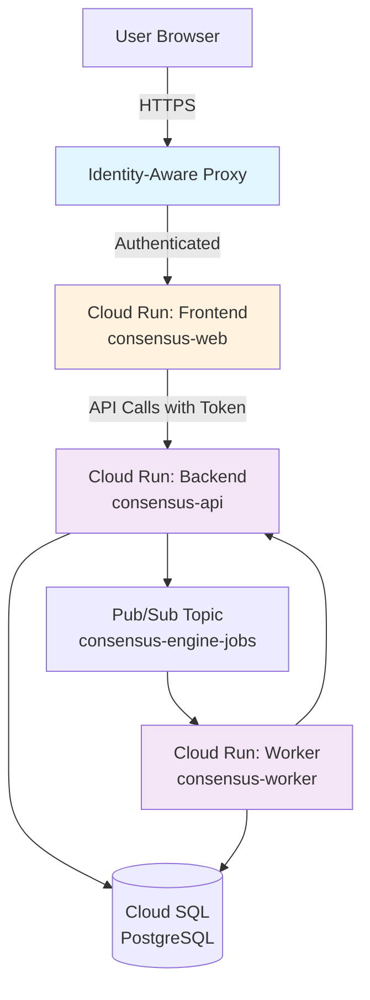

# Infrastructure Configuration

This directory contains example infrastructure configurations for deploying the Consensus Engine to Google Cloud Platform (GCP).

**📖 For comprehensive deployment architecture, requirements, and prerequisites, see [GCP Deployment Architecture](../../docs/GCP_DEPLOYMENT_ARCHITECTURE.md).**

This guide provides step-by-step `gcloud` commands for manual deployment. For architecture decisions, component requirements, environment variables, IAM permissions, and deployment planning, refer to the comprehensive architecture document.

## Directory Structure

```
infra/
├── cloudrun/
│   ├── backend-service.yaml     # Cloud Run service for API backend
│   ├── frontend-service.yaml    # Cloud Run service for web frontend
│   └── terraform/               # Terraform examples (optional)
└── README.md                    # This file
```

## Overview

The Consensus Engine consists of three main components:

1. **Frontend (Web UI)**: React + TypeScript application served via nginx, protected by IAP
2. **Backend (API)**: FastAPI application with IAM-based authentication
3. **Worker**: Background job processor (see [Worker Deployment Guide](../../docs/WORKER_DEPLOYMENT.md))

## Deployment Architecture



## Prerequisites

**For complete prerequisites including quotas, external services, and detailed requirements, see [GCP Deployment Architecture - Prerequisites](../../docs/GCP_DEPLOYMENT_ARCHITECTURE.md#deployment-prerequisites).**

Quick checklist before deploying:

- [ ] GCP Project with billing enabled
- [ ] gcloud CLI installed and authenticated
- [ ] Required APIs enabled (see architecture doc)
- [ ] Deploying user has necessary IAM permissions
- [ ] OpenAI API key obtained and noted
- [ ] Docker installed (if building images locally)

## Quick Start

### 1. Set Environment Variables

```bash
export PROJECT_ID="your-project-id"
export REGION="us-central1"
export FRONTEND_SERVICE="consensus-web"
export BACKEND_SERVICE="consensus-api"
```

### 2. Create Service Accounts

```bash
# Frontend service account
gcloud iam service-accounts create consensus-web-sa \
  --display-name="Consensus Engine Web Frontend" \
  --project=$PROJECT_ID

# Backend service account
gcloud iam service-accounts create consensus-api-sa \
  --display-name="Consensus Engine API Backend" \
  --project=$PROJECT_ID
```

### 3. Create Cloud SQL Instance

```bash
gcloud sql instances create consensus-db \
  --database-version=POSTGRES_16 \
  --tier=db-f1-micro \
  --region=$REGION \
  --project=$PROJECT_ID

# Create database
gcloud sql databases create consensus_engine \
  --instance=consensus-db \
  --project=$PROJECT_ID

# Enable IAM authentication for backend service account
gcloud sql users create consensus-api-sa@$PROJECT_ID.iam \
  --instance=consensus-db \
  --type=CLOUD_IAM_SERVICE_ACCOUNT \
  --project=$PROJECT_ID
```

### 4. Create Pub/Sub Topic and Subscription

```bash
# Create topic
gcloud pubsub topics create consensus-engine-jobs \
  --project=$PROJECT_ID

# Create subscription for worker
gcloud pubsub subscriptions create consensus-engine-jobs-sub \
  --topic=consensus-engine-jobs \
  --ack-deadline=600 \
  --project=$PROJECT_ID
```

### 5. Store Secrets

```bash
# Store OpenAI API key in Secret Manager
echo -n "your-openai-api-key" | gcloud secrets create openai-api-key \
  --data-file=- \
  --replication-policy="automatic" \
  --project=$PROJECT_ID

# Grant backend service account access to secret
gcloud secrets add-iam-policy-binding openai-api-key \
  --member="serviceAccount:consensus-api-sa@$PROJECT_ID.iam.gserviceaccount.com" \
  --role="roles/secretmanager.secretAccessor" \
  --project=$PROJECT_ID
```

### 6. Grant IAM Permissions

```bash
# Backend service account needs:
# - Cloud SQL Client
gcloud projects add-iam-policy-binding $PROJECT_ID \
  --member="serviceAccount:consensus-api-sa@$PROJECT_ID.iam.gserviceaccount.com" \
  --role="roles/cloudsql.client"

# - Pub/Sub Publisher
gcloud pubsub topics add-iam-policy-binding consensus-engine-jobs \
  --member="serviceAccount:consensus-api-sa@$PROJECT_ID.iam.gserviceaccount.com" \
  --role="roles/pubsub.publisher" \
  --project=$PROJECT_ID

# Frontend service account needs:
# - Cloud Run Invoker (to call backend)
gcloud run services add-iam-policy-binding $BACKEND_SERVICE \
  --member="serviceAccount:consensus-web-sa@$PROJECT_ID.iam.gserviceaccount.com" \
  --role="roles/run.invoker" \
  --region=$REGION \
  --project=$PROJECT_ID
```

### 7. Build and Push Container Images

#### Backend

```bash
cd /path/to/consensus-engine

# Build backend image
gcloud builds submit --tag gcr.io/$PROJECT_ID/consensus-api:latest \
  --project=$PROJECT_ID

# Or use Docker directly
docker build -t gcr.io/$PROJECT_ID/consensus-api:latest .
docker push gcr.io/$PROJECT_ID/consensus-api:latest
```

#### Frontend

```bash
cd webapp

# Build frontend image
gcloud builds submit --tag gcr.io/$PROJECT_ID/consensus-web:latest \
  --project=$PROJECT_ID

# Or use Docker directly (see webapp/Dockerfile)
docker build -t gcr.io/$PROJECT_ID/consensus-web:latest .
docker push gcr.io/$PROJECT_ID/consensus-web:latest
```

### 8. Deploy Services

#### Deploy Backend

```bash
# Update placeholders in backend-service.yaml first, then:
gcloud run services replace infra/cloudrun/backend-service.yaml \
  --region=$REGION \
  --project=$PROJECT_ID

# Or deploy with gcloud command:
gcloud run deploy consensus-api \
  --image=gcr.io/$PROJECT_ID/consensus-api:latest \
  --platform=managed \
  --region=$REGION \
  --service-account=consensus-api-sa@$PROJECT_ID.iam.gserviceaccount.com \
  --no-allow-unauthenticated \
  --add-cloudsql-instances=$PROJECT_ID:$REGION:consensus-db \
  --set-env-vars="$(cat backend.env)" \
  --project=$PROJECT_ID
```

#### Deploy Frontend

```bash
# Update placeholders in frontend-service.yaml first, then:
gcloud run services replace infra/cloudrun/frontend-service.yaml \
  --region=$REGION \
  --project=$PROJECT_ID

# Or deploy with gcloud command:
gcloud run deploy consensus-web \
  --image=gcr.io/$PROJECT_ID/consensus-web:latest \
  --platform=managed \
  --region=$REGION \
  --service-account=consensus-web-sa@$PROJECT_ID.iam.gserviceaccount.com \
  --allow-unauthenticated \
  --set-env-vars="VITE_API_BASE_URL=https://consensus-api-xxx-uc.a.run.app" \
  --project=$PROJECT_ID
```

### 9. Enable Identity-Aware Proxy (IAP) for Frontend

IAP provides user authentication for the frontend application.

```bash
# Enable IAP via Console (recommended):
# 1. Navigate to Security > Identity-Aware Proxy
# 2. Enable IAP API if not already enabled
# 3. Select your Cloud Run service (consensus-web)
# 4. Toggle IAP to "On"
# 5. Add authorized users/groups under "Add Principal"

# Grant users access to IAP-secured app
gcloud iap web add-iam-policy-binding \
  --resource-type=backend-services \
  --service=consensus-web \
  --member=user:alice@example.com \
  --role=roles/iap.httpsResourceAccessor \
  --project=$PROJECT_ID
```

### 10. Run Database Migrations

```bash
# Connect to Cloud SQL via Cloud SQL Proxy
cloud_sql_proxy -instances=$PROJECT_ID:$REGION:consensus-db=tcp:5432 &

# Run Alembic migrations
export DATABASE_URL="postgresql://consensus-api-sa@$PROJECT_ID.iam:@localhost:5432/consensus_engine"
alembic upgrade head

# Stop proxy
pkill cloud_sql_proxy
```

## Service-to-Service Authentication

### Frontend → Backend

The frontend needs to call the backend API with valid credentials. There are two approaches:

#### Option 1: User Identity Token (Recommended)

When a user accesses the frontend through IAP, the IAP proxy sets identity headers. The frontend can:

1. Extract the user's identity token from headers
2. Pass it as `Authorization: Bearer <token>` when calling the backend API
3. Backend validates the token using Google's token verification

#### Option 2: Service Account Token

The frontend service account can generate its own identity token:

```typescript
// In frontend code (not recommended for user-initiated requests)
const metadata = await fetch('http://metadata.google.internal/computeMetadata/v1/instance/service-accounts/default/identity?audience=BACKEND_URL', {
  headers: { 'Metadata-Flavor': 'Google' }
});
const token = await metadata.text();

// Use token in API calls
fetch(API_URL, {
  headers: { 'Authorization': `Bearer ${token}` }
});
```

### Testing Authentication Locally

```bash
# Get identity token for your user
gcloud auth print-identity-token

# Test backend API call
curl -H "Authorization: Bearer $(gcloud auth print-identity-token)" \
  https://consensus-api-xxx-uc.a.run.app/health

# Test with specific service account
gcloud auth print-identity-token \
  --impersonate-service-account=consensus-web-sa@$PROJECT_ID.iam.gserviceaccount.com \
  --audiences=https://consensus-api-xxx-uc.a.run.app

curl -H "Authorization: Bearer $(gcloud auth print-identity-token --impersonate-service-account=consensus-web-sa@$PROJECT_ID.iam.gserviceaccount.com --audiences=https://consensus-api-xxx-uc.a.run.app)" \
  https://consensus-api-xxx-uc.a.run.app/v1/runs
```

## CORS Configuration

CORS is configured in the backend via environment variables:

```bash
# Single origin
CORS_ORIGINS=https://consensus-web-xxx-uc.a.run.app

# Multiple origins (staging + production)
CORS_ORIGINS=https://consensus-web-staging-xxx-uc.a.run.app,https://consensus-web-prod-xxx-uc.a.run.app

# Allowed headers (restrict in production)
CORS_ALLOW_HEADERS=Content-Type,Authorization,X-Request-ID,X-Schema-Version,X-Prompt-Set-Version
```

### Verifying CORS

```bash
# Test preflight OPTIONS request
curl -X OPTIONS https://consensus-api-xxx-uc.a.run.app/v1/runs \
  -H "Origin: https://consensus-web-xxx-uc.a.run.app" \
  -H "Access-Control-Request-Method: POST" \
  -H "Access-Control-Request-Headers: Content-Type,Authorization" \
  -v

# Expected response headers:
# Access-Control-Allow-Origin: https://consensus-web-xxx-uc.a.run.app
# Access-Control-Allow-Credentials: true
# Access-Control-Allow-Methods: *
# Access-Control-Allow-Headers: Content-Type,Authorization,...
```

## Monitoring and Logging

### Cloud Logging Queries

```bash
# View backend API logs
gcloud logging read "resource.type=cloud_run_revision AND resource.labels.service_name=consensus-api" \
  --limit 50 \
  --format json

# View frontend logs
gcloud logging read "resource.type=cloud_run_revision AND resource.labels.service_name=consensus-web" \
  --limit 50 \
  --format json

# Filter by error severity
gcloud logging read "resource.type=cloud_run_revision AND resource.labels.service_name=consensus-api AND severity>=ERROR" \
  --limit 50

# Find slow requests (>5 seconds)
gcloud logging read "resource.type=cloud_run_revision AND jsonPayload.elapsed_time>5" \
  --limit 20
```

### Cloud Monitoring Metrics

Key metrics to monitor:

- **Request latency**: `run.googleapis.com/request_latencies`
- **Request count**: `run.googleapis.com/request_count`
- **Container CPU utilization**: `run.googleapis.com/container/cpu/utilizations`
- **Container memory utilization**: `run.googleapis.com/container/memory/utilizations`
- **Instance count**: `run.googleapis.com/container/instance_count`

### Setting Up Alerts

```bash
# Example: Alert on high error rate
gcloud alpha monitoring policies create \
  --notification-channels=CHANNEL_ID \
  --display-name="High API Error Rate" \
  --condition-display-name="Error rate > 5%" \
  --condition-threshold-value=0.05 \
  --condition-threshold-duration=300s \
  --condition-threshold-comparison=COMPARISON_GT \
  --condition-threshold-filter='resource.type="cloud_run_revision" AND resource.labels.service_name="consensus-api" AND metric.type="run.googleapis.com/request_count" AND metric.labels.response_code_class="5xx"'
```

## Rollback Strategies

### Rolling Back a Deployment

```bash
# List revisions
gcloud run revisions list \
  --service=consensus-api \
  --region=$REGION \
  --project=$PROJECT_ID

# Rollback to previous revision
gcloud run services update-traffic consensus-api \
  --to-revisions=consensus-api-00042-abc=100 \
  --region=$REGION \
  --project=$PROJECT_ID

# Gradual rollout (canary deployment)
gcloud run services update-traffic consensus-api \
  --to-revisions=consensus-api-00043-xyz=10,consensus-api-00042-abc=90 \
  --region=$REGION \
  --project=$PROJECT_ID
```

### Coordinated Frontend/Backend Releases

When deploying changes that affect both frontend and backend:

1. **Deploy backend first** with backward-compatible changes
2. **Test backend** with old frontend to ensure compatibility
3. **Deploy new frontend** that uses new backend features
4. **Monitor both services** for errors or performance issues
5. **Rollback if needed** (backend first, then frontend)

**Best Practices:**
- Use feature flags to enable new features gradually
- Version your API endpoints (`/v1`, `/v2`) for breaking changes
- Maintain schema compatibility (see docs/PROMPT_CONTRACTS.md)
- Test rollback procedures in staging environment

## Rate Limits and Quotas

### Cloud Run Limits

- **Concurrent requests per container**: 100 (configurable, default: 80)
- **Max instances**: 100 (configurable via maxScale annotation)
- **Request timeout**: 300 seconds (5 minutes, configurable)
- **Container memory**: Up to 32 GiB
- **Container CPU**: Up to 8 vCPU

### Cloud SQL Limits

- **Max connections**: Varies by tier (db-f1-micro: 25, db-n1-standard-1: 100)
- **Storage**: Up to 64 TB
- **IOPS**: Varies by disk size

### Pub/Sub Limits

- **Max message size**: 10 MB
- **Max publish requests/second**: 10,000 (can request increase)
- **Max subscriptions per topic**: 10,000

### IAP Limits

- **Requests per second**: No explicit limit, but consider quota usage
- **Token validation**: Cached for performance

**Recommendations:**
- Set `DB_POOL_SIZE` conservatively (5-10 connections per instance)
- Use `maxScale` to prevent runaway costs
- Monitor quota usage in GCP Console

## Security Best Practices

1. **Use IAM authentication** for Cloud SQL (no passwords)
2. **Enable IAP** for frontend to control user access
3. **Never allow unauthenticated** access to backend API
4. **Store secrets** in Secret Manager, not environment variables
5. **Use HTTPS everywhere** (enforced by Cloud Run)
6. **Specify explicit CORS origins** (never use wildcard in production)
7. **Enable audit logging** for IAM and data access
8. **Use least privilege** for service account permissions
9. **Regularly rotate** service account keys (if using key-based auth)
10. **Monitor for security** anomalies in Cloud Security Command Center

## Cost Optimization

1. **Use minScale=0** for non-critical services to scale to zero
2. **Set appropriate maxScale** to prevent unexpected costs
3. **Enable CPU throttling** for services with bursty traffic
4. **Use committed use discounts** for predictable workloads
5. **Monitor usage** with Cloud Billing reports and budgets
6. **Set up budget alerts** to avoid surprises

## Troubleshooting

### Common Issues

#### Backend returns 500 errors

**Check:**
- Cloud SQL connectivity (`add-cloudsql-instances`)
- Database migrations are current
- Environment variables are set correctly
- Service account has `roles/cloudsql.client`

**Debug:**
```bash
gcloud logging read "resource.type=cloud_run_revision AND resource.labels.service_name=consensus-api AND severity>=ERROR" --limit 10
```

#### Frontend can't reach backend

**Check:**
- CORS_ORIGINS includes frontend URL
- Frontend service account has `roles/run.invoker` on backend
- Backend is not allowing unauthenticated access
- Frontend is sending proper `Authorization` header

**Debug:**
```bash
# Test from frontend service
gcloud run services proxy consensus-web --region=$REGION --project=$PROJECT_ID
# Inside container:
curl -H "Authorization: Bearer $(curl -H 'Metadata-Flavor: Google' http://metadata.google.internal/computeMetadata/v1/instance/service-accounts/default/identity?audience=BACKEND_URL)" \
  https://consensus-api-xxx-uc.a.run.app/health
```

#### IAP not working

**Check:**
- IAP API is enabled
- OAuth consent screen is configured
- User has `roles/iap.httpsResourceAccessor`
- Service is configured to use IAP

**Debug:**
- Check IAP logs in Cloud Console
- Verify user email in allowlist
- Test with incognito window to rule out cached credentials

## Additional Resources

### Consensus Engine Documentation

- **[GCP Deployment Architecture](../../docs/GCP_DEPLOYMENT_ARCHITECTURE.md)** - Complete deployment requirements and architecture
- [Main README](../../README.md) - Project overview and local development
- [Worker Deployment Guide](../../docs/WORKER_DEPLOYMENT.md) - Background worker deployment
- [Web Frontend Documentation](../../docs/WEB_FRONTEND.md) - Frontend deployment with IAP

### Google Cloud Documentation

- [Cloud Run Documentation](https://cloud.google.com/run/docs)
- [Cloud SQL for PostgreSQL](https://cloud.google.com/sql/docs/postgres)
- [Identity-Aware Proxy](https://cloud.google.com/iap/docs)
- [Secret Manager](https://cloud.google.com/secret-manager/docs)
- [Cloud Pub/Sub](https://cloud.google.com/pubsub/docs)
- [Service-to-Service Authentication](https://cloud.google.com/run/docs/authenticating/service-to-service)

## Support

For deployment planning and architecture questions, see:
- **[GCP Deployment Architecture](../../docs/GCP_DEPLOYMENT_ARCHITECTURE.md)** - Single source of truth for deployment

For implementation and troubleshooting:
- [Main README](../../README.md) - Local development and testing
- [Worker Deployment Guide](../../docs/WORKER_DEPLOYMENT.md) - Worker-specific issues
- [Web Frontend Documentation](../../docs/WEB_FRONTEND.md) - Frontend-specific issues
