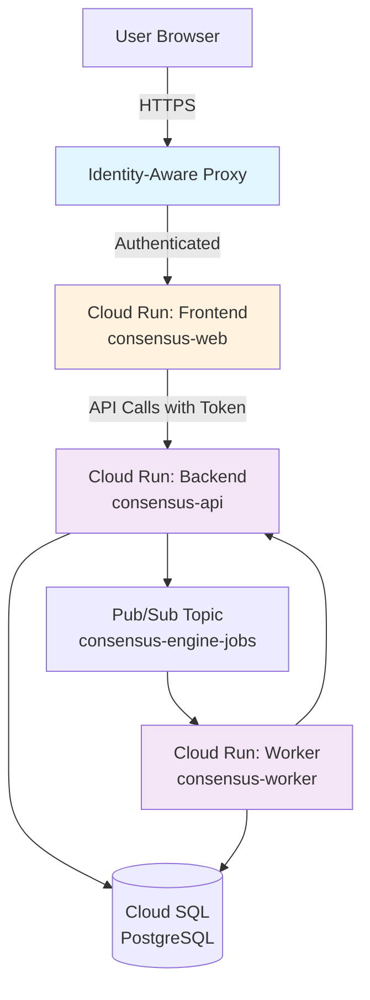

# Infrastructure Configuration

This directory contains example infrastructure configurations for deploying the Consensus Engine to Google Cloud Platform (GCP).

**📖 For comprehensive deployment architecture, requirements, and prerequisites, see [GCP Deployment Architecture](../../docs/GCP_DEPLOYMENT_ARCHITECTURE.md).**

This guide provides step-by-step `gcloud` commands for manual deployment. For architecture decisions, component requirements, environment variables, IAM permissions, and deployment planning, refer to the comprehensive architecture document.

## Directory Structure

```
infra/
├── cloudrun/
│   ├── backend-service.yaml     # Cloud Run service for API backend
│   ├── frontend-service.yaml    # Cloud Run service for web frontend
│   └── terraform/               # Terraform examples (optional)
└── README.md                    # This file
```

## Overview

The Consensus Engine consists of three main components:

1. **Frontend (Web UI)**: React + TypeScript application served via nginx, protected by IAP
2. **Backend (API)**: FastAPI application with IAM-based authentication
3. **Worker**: Background job processor (see [Worker Deployment Guide](../../docs/WORKER_DEPLOYMENT.md))

## Deployment Architecture



## Prerequisites

**For complete prerequisites including quotas, external services, and detailed requirements, see [GCP Deployment Architecture - Prerequisites](../../docs/GCP_DEPLOYMENT_ARCHITECTURE.md#deployment-prerequisites).**

**Security and Model Configuration Notes:**
- Default model is `gpt-5.1` as specified in [LLMs.md](../../LLMs.md). This is a target model. For current deployments, use available models like `gpt-4` or `gpt-4-turbo` by overriding `OPENAI_MODEL`, `EXPAND_MODEL`, and `REVIEW_MODEL` environment variables.
- Always download binaries from official sources and verify checksums when possible.
- Store all sensitive values (API keys, database passwords) in Secret Manager, not in environment variables.
- Use IAM authentication for Cloud SQL instead of password-based authentication.

### Required Tools

- [ ] **gcloud CLI** (latest version)
  ```bash
  # Install gcloud CLI
  curl https://sdk.cloud.google.com | bash
  exec -l $SHELL
  
  # Initialize and authenticate
  gcloud init
  gcloud auth login
  gcloud auth application-default login  # For local development
  ```

- [ ] **Docker** (20.10+ for multi-platform builds)
  ```bash
  # Verify Docker installation
  docker --version
  docker info
  ```

- [ ] **git** (for repository cloning)

### GCP Project Setup

1. **Create or select a GCP project:**
   ```bash
   # Create new project
   export PROJECT_ID="consensus-engine-prod"
   gcloud projects create $PROJECT_ID --name="Consensus Engine"
   
   # Or use existing project
   export PROJECT_ID="your-existing-project"
   
   # Set as default
   gcloud config set project $PROJECT_ID
   ```

2. **Enable billing:**
   ```bash
   # Link billing account via Console
   # Navigate to: https://console.cloud.google.com/billing/linkedaccount?project=$PROJECT_ID
   ```

3. **Enable required APIs:**
   ```bash
   gcloud services enable \
     run.googleapis.com \
     cloudbuild.googleapis.com \
     artifactregistry.googleapis.com \
     sql-component.googleapis.com \
     sqladmin.googleapis.com \
     pubsub.googleapis.com \
     secretmanager.googleapis.com \
     iap.googleapis.com \
     compute.googleapis.com \
     cloudresourcemanager.googleapis.com
   ```

### IAM Permissions

Your deploying user account needs:
- `roles/run.admin` - Deploy Cloud Run services
- `roles/iam.serviceAccountAdmin` - Create service accounts
- `roles/iam.serviceAccountUser` - Assign service accounts
- `roles/cloudsql.admin` - Manage Cloud SQL
- `roles/pubsub.admin` - Manage Pub/Sub
- `roles/secretmanager.admin` - Manage secrets
- `roles/storage.admin` - Manage GCS buckets (for Cloud Build)

```bash
# Grant permissions (requires org admin or project owner)
export USER_EMAIL="your-email@example.com"

gcloud projects add-iam-policy-binding $PROJECT_ID \
  --member="user:$USER_EMAIL" \
  --role="roles/run.admin"

# Repeat for other roles as needed
```

### External Services

- [ ] **OpenAI API key**
  ```bash
  # Obtain from: https://platform.openai.com/api-keys
  export OPENAI_API_KEY="sk-..."
  ```

### Quick checklist before deploying:

- [ ] GCP Project with billing enabled
- [ ] gcloud CLI installed and authenticated
- [ ] Required APIs enabled (see above)
- [ ] Deploying user has necessary IAM permissions
- [ ] OpenAI API key obtained and noted
- [ ] Docker installed (if building images locally)

## Quick Start

### 1. Set Environment Variables

```bash
export PROJECT_ID="your-project-id"
export REGION="us-central1"
export FRONTEND_SERVICE="consensus-web"
export BACKEND_SERVICE="consensus-api"
```

### 2. Create Service Accounts

```bash
# Frontend service account
gcloud iam service-accounts create consensus-web-sa \
  --display-name="Consensus Engine Web Frontend" \
  --project=$PROJECT_ID

# Backend service account
gcloud iam service-accounts create consensus-api-sa \
  --display-name="Consensus Engine API Backend" \
  --project=$PROJECT_ID
```

### 3. Create Cloud SQL Instance

```bash
gcloud sql instances create consensus-db \
  --database-version=POSTGRES_16 \
  --tier=db-f1-micro \
  --region=$REGION \
  --project=$PROJECT_ID

# Create database
gcloud sql databases create consensus_engine \
  --instance=consensus-db \
  --project=$PROJECT_ID

# Enable IAM authentication for backend service account
gcloud sql users create consensus-api-sa@$PROJECT_ID.iam \
  --instance=consensus-db \
  --type=CLOUD_IAM_SERVICE_ACCOUNT \
  --project=$PROJECT_ID
```

### 4. Create Pub/Sub Topic and Subscription

The Consensus Engine uses **pull subscriptions** for worker deployments. The worker actively pulls messages from the subscription.

```bash
# Create topic
gcloud pubsub topics create consensus-engine-jobs \
  --project=$PROJECT_ID

# Create pull subscription for worker (recommended for Cloud Run services)
gcloud pubsub subscriptions create consensus-engine-jobs-sub \
  --topic=consensus-engine-jobs \
  --ack-deadline=600 \
  --project=$PROJECT_ID

# Optional: Create dead-letter topic for failed messages
gcloud pubsub topics create consensus-engine-jobs-dlq \
  --project=$PROJECT_ID

# Update subscription with dead-letter policy
gcloud pubsub subscriptions update consensus-engine-jobs-sub \
  --dead-letter-topic=consensus-engine-jobs-dlq \
  --max-delivery-attempts=5 \
  --project=$PROJECT_ID
```

**Note on Subscription Types:**

- **Pull Subscription (used here)**: Worker actively pulls messages. Best for Cloud Run services that need to control concurrency and processing rate.
- **Push Subscription (alternative)**: Pub/Sub pushes messages to an HTTP endpoint. If using push subscriptions with Cloud Run:
  ```bash
  # Create push subscription pointing to worker service
  gcloud pubsub subscriptions create consensus-engine-jobs-push \
    --topic=consensus-engine-jobs \
    --push-endpoint=https://consensus-worker-HASH-uc.a.run.app/push-handler \
    --push-auth-service-account=consensus-worker-sa@${PROJECT_ID}.iam.gserviceaccount.com \
    --ack-deadline=600 \
    --project=$PROJECT_ID
  
  # Grant Pub/Sub permission to invoke worker service
  gcloud run services add-iam-policy-binding consensus-worker \
    --member="serviceAccount:service-${PROJECT_NUMBER}@gcp-sa-pubsub.iam.gserviceaccount.com" \
    --role="roles/run.invoker" \
    --region=$REGION \
    --project=$PROJECT_ID
  ```
  **Note**: Push subscriptions require implementing an HTTP endpoint in the worker to receive pushed messages. The current implementation uses pull subscriptions.

### 5. Store Secrets

**Security Best Practice**: Never expose API keys in command history, scripts, or environment variables. Use Secret Manager for all sensitive values.

```bash
# Store OpenAI API key in Secret Manager
# Option 1: Read from stdin (recommended - prompts for input without history exposure)
gcloud secrets create openai-api-key \
  --replication-policy="automatic" \
  --project=$PROJECT_ID
# Then paste your API key when prompted and press Ctrl+D

# Option 2: Read from secure file with restricted permissions
umask 077  # Ensure file is only readable by current user
echo -n "your-openai-api-key" > /tmp/api-key.txt
gcloud secrets create openai-api-key \
  --data-file=/tmp/api-key.txt \
  --replication-policy="automatic" \
  --project=$PROJECT_ID
shred -u /tmp/api-key.txt  # Securely delete the file

# Grant backend service account access to secret
gcloud secrets add-iam-policy-binding openai-api-key \
  --member="serviceAccount:consensus-api-sa@$PROJECT_ID.iam.gserviceaccount.com" \
  --role="roles/secretmanager.secretAccessor" \
  --project=$PROJECT_ID

# Grant worker service account access to secret
gcloud secrets add-iam-policy-binding openai-api-key \
  --member="serviceAccount:consensus-worker-sa@$PROJECT_ID.iam.gserviceaccount.com" \
  --role="roles/secretmanager.secretAccessor" \
  --project=$PROJECT_ID
```

### 6. Grant IAM Permissions

```bash
# Backend service account needs:
# - Cloud SQL Client
gcloud projects add-iam-policy-binding $PROJECT_ID \
  --member="serviceAccount:consensus-api-sa@$PROJECT_ID.iam.gserviceaccount.com" \
  --role="roles/cloudsql.client"

# - Pub/Sub Publisher
gcloud pubsub topics add-iam-policy-binding consensus-engine-jobs \
  --member="serviceAccount:consensus-api-sa@$PROJECT_ID.iam.gserviceaccount.com" \
  --role="roles/pubsub.publisher" \
  --project=$PROJECT_ID

# Frontend service account needs:
# - Cloud Run Invoker (to call backend)
gcloud run services add-iam-policy-binding $BACKEND_SERVICE \
  --member="serviceAccount:consensus-web-sa@$PROJECT_ID.iam.gserviceaccount.com" \
  --role="roles/run.invoker" \
  --region=$REGION \
  --project=$PROJECT_ID
```

### 7. Create Artifact Registry Repository (Recommended over GCR)

Artifact Registry provides better security and features compared to Google Container Registry (GCR).

```bash
# Set region
export REGION="us-central1"

# Create Docker repository
gcloud artifacts repositories create consensus-engine \
  --repository-format=docker \
  --location=$REGION \
  --description="Consensus Engine container images" \
  --project=$PROJECT_ID

# Configure Docker authentication
gcloud auth configure-docker ${REGION}-docker.pkg.dev

# Verify repository creation
gcloud artifacts repositories describe consensus-engine \
  --location=$REGION \
  --project=$PROJECT_ID
```

**Image naming convention:**
- Backend: `${REGION}-docker.pkg.dev/${PROJECT_ID}/consensus-engine/consensus-api:${TAG}`
- Frontend: `${REGION}-docker.pkg.dev/${PROJECT_ID}/consensus-engine/consensus-web:${TAG}`
- Worker: `${REGION}-docker.pkg.dev/${PROJECT_ID}/consensus-engine/consensus-worker:${TAG}`

**Note on regional vs. multi-regional repositories:**
- **Regional** (recommended for Cloud Run): Same region as your services for lower latency
- **Multi-regional**: For cross-region deployments, but requires additional configuration

### 8. Build and Push Container Images

#### Option A: Using Cloud Build (Recommended for Production)

Cloud Build provides reproducible builds and integrates with GCP security scanning.

**Backend:**
```bash
cd /path/to/consensus-engine

# Build and push backend image with Cloud Build
gcloud builds submit \
  --tag ${REGION}-docker.pkg.dev/${PROJECT_ID}/consensus-engine/consensus-api:latest \
  --project=$PROJECT_ID \
  --timeout=20m

# Or build with specific tag
export IMAGE_TAG="v1.0.0"
gcloud builds submit \
  --tag ${REGION}-docker.pkg.dev/${PROJECT_ID}/consensus-engine/consensus-api:${IMAGE_TAG} \
  --project=$PROJECT_ID
```

**Frontend:**
```bash
cd webapp

# Build frontend with API URL
export BACKEND_URL="https://consensus-api-${PROJECT_ID}.a.run.app"

gcloud builds submit \
  --tag ${REGION}-docker.pkg.dev/${PROJECT_ID}/consensus-engine/consensus-web:latest \
  --substitutions=_VITE_API_BASE_URL=${BACKEND_URL} \
  --project=$PROJECT_ID \
  --timeout=15m
```

**Worker:**
```bash
cd /path/to/consensus-engine

# Build worker image
gcloud builds submit \
  --tag ${REGION}-docker.pkg.dev/${PROJECT_ID}/consensus-engine/consensus-worker:latest \
  --file Dockerfile.worker \
  --project=$PROJECT_ID \
  --timeout=20m
```

#### Option B: Using Docker Locally

For local development or when you need more control over the build process.

**Backend:**
```bash
cd /path/to/consensus-engine

# Build for your platform
docker build -t ${REGION}-docker.pkg.dev/${PROJECT_ID}/consensus-engine/consensus-api:latest .

# Or build for multiple platforms (if deploying to different architectures)
docker buildx build \
  --platform linux/amd64,linux/arm64 \
  -t ${REGION}-docker.pkg.dev/${PROJECT_ID}/consensus-engine/consensus-api:latest \
  --push .
```

**Frontend:**
```bash
cd webapp

# Build with build args
docker build \
  --build-arg VITE_API_BASE_URL=${BACKEND_URL} \
  --build-arg VITE_ENVIRONMENT=production \
  -t ${REGION}-docker.pkg.dev/${PROJECT_ID}/consensus-engine/consensus-web:latest .

# Push to registry
docker push ${REGION}-docker.pkg.dev/${PROJECT_ID}/consensus-engine/consensus-web:latest
```

**Worker:**
```bash
cd /path/to/consensus-engine

# Build worker
docker build \
  -f Dockerfile.worker \
  -t ${REGION}-docker.pkg.dev/${PROJECT_ID}/consensus-engine/consensus-worker:latest .

# Push to registry
docker push ${REGION}-docker.pkg.dev/${PROJECT_ID}/consensus-engine/consensus-worker:latest
```

**Note on GCR vs Artifact Registry:**
```bash
# GCR format (legacy, still supported):
# gcr.io/$PROJECT_ID/consensus-api:latest

# Artifact Registry format (recommended):
# ${REGION}-docker.pkg.dev/${PROJECT_ID}/consensus-engine/consensus-api:latest
```

### 9. Deploy Services

#### Deployment Order

Deploy services in this order to ensure dependencies are available:
1. Backend API (needs database but not frontend)
2. Worker (needs database and Pub/Sub)
3. Frontend (needs backend API URL)

#### Deploy Backend

**Option A: Using gcloud command (Quick start):**

```bash
# Set image reference
export BACKEND_IMAGE="${REGION}-docker.pkg.dev/${PROJECT_ID}/consensus-engine/consensus-api:latest"

# Deploy backend
gcloud run deploy consensus-api \
  --image=${BACKEND_IMAGE} \
  --platform=managed \
  --region=$REGION \
  --service-account=consensus-api-sa@${PROJECT_ID}.iam.gserviceaccount.com \
  --no-allow-unauthenticated \
  --min-instances=1 \
  --max-instances=20 \
  --cpu=2 \
  --memory=2Gi \
  --timeout=300s \
  --concurrency=100 \
  --cpu-boost \
  --execution-environment=gen2 \
  --add-cloudsql-instances=${PROJECT_ID}:${REGION}:consensus-db \
  --set-env-vars="^@^ENV=production@OPENAI_MODEL=gpt-5.1@TEMPERATURE=0.7@EXPAND_MODEL=gpt-5.1@EXPAND_TEMPERATURE=0.7@REVIEW_MODEL=gpt-5.1@REVIEW_TEMPERATURE=0.2@USE_CLOUD_SQL_CONNECTOR=true@DB_INSTANCE_CONNECTION_NAME=${PROJECT_ID}:${REGION}:consensus-db@DB_NAME=consensus_engine@DB_USER=consensus-api-sa@${PROJECT_ID}.iam@DB_IAM_AUTH=true@PUBSUB_PROJECT_ID=${PROJECT_ID}@PUBSUB_TOPIC=consensus-engine-jobs@CORS_ALLOW_HEADERS=Content-Type,Authorization,X-Request-ID,X-Schema-Version,X-Prompt-Set-Version" \
  --set-secrets=OPENAI_API_KEY=openai-api-key:latest \
  --project=$PROJECT_ID

# Get backend URL
export BACKEND_URL=$(gcloud run services describe consensus-api \
  --region=$REGION \
  --format='value(status.url)' \
  --project=$PROJECT_ID)

echo "Backend URL: $BACKEND_URL"

# Update CORS_ORIGINS (do this after frontend is deployed)
# We'll update this in step "Deploy Frontend"
```

**Option B: Using YAML configuration file (Production recommended):**

```bash
# Update backend-service.yaml with your values
# Replace all instances of PROJECT_ID, REGION, INSTANCE_NAME

# Deploy using YAML
gcloud run services replace infra/cloudrun/backend-service.yaml \
  --region=$REGION \
  --project=$PROJECT_ID
```

**Verification:**
```bash
# Test health endpoint (requires authentication)
curl -H "Authorization: Bearer $(gcloud auth print-identity-token)" \
  ${BACKEND_URL}/health

# Expected output:
# {"status":"healthy","environment":"production",...}
```

#### Deploy Worker

**Option A: Using gcloud command:**

```bash
# Set image reference
export WORKER_IMAGE="${REGION}-docker.pkg.dev/${PROJECT_ID}/consensus-engine/consensus-worker:latest"

# Deploy worker service
gcloud run deploy consensus-worker \
  --image=${WORKER_IMAGE} \
  --platform=managed \
  --region=$REGION \
  --service-account=consensus-worker-sa@${PROJECT_ID}.iam.gserviceaccount.com \
  --no-allow-unauthenticated \
  --min-instances=1 \
  --max-instances=3 \
  --cpu=2 \
  --memory=4Gi \
  --timeout=3600s \
  --concurrency=1 \
  --no-cpu-throttling \
  --execution-environment=gen2 \
  --add-cloudsql-instances=${PROJECT_ID}:${REGION}:consensus-db \
  --set-env-vars="^@^ENV=production@OPENAI_MODEL=gpt-5.1@EXPAND_MODEL=gpt-5.1@EXPAND_TEMPERATURE=0.7@REVIEW_MODEL=gpt-5.1@REVIEW_TEMPERATURE=0.2@USE_CLOUD_SQL_CONNECTOR=true@DB_INSTANCE_CONNECTION_NAME=${PROJECT_ID}:${REGION}:consensus-db@DB_NAME=consensus_engine@DB_USER=consensus-worker-sa@${PROJECT_ID}.iam@DB_IAM_AUTH=true@PUBSUB_PROJECT_ID=${PROJECT_ID}@PUBSUB_SUBSCRIPTION=consensus-engine-jobs-sub@WORKER_MAX_CONCURRENCY=10@WORKER_ACK_DEADLINE_SECONDS=600@WORKER_STEP_TIMEOUT_SECONDS=300@WORKER_JOB_TIMEOUT_SECONDS=1800" \
  --set-secrets=OPENAI_API_KEY=openai-api-key:latest \
  --project=$PROJECT_ID

# Alternatively, deploy as Cloud Run Job (for batch processing)
gcloud run jobs create consensus-worker-job \
  --image=${WORKER_IMAGE} \
  --region=$REGION \
  --service-account=consensus-worker-sa@${PROJECT_ID}.iam.gserviceaccount.com \
  --max-retries=3 \
  --task-timeout=3600s \
  --parallelism=1 \
  --add-cloudsql-instances=${PROJECT_ID}:${REGION}:consensus-db \
  --set-env-vars="ENV=production,OPENAI_MODEL=gpt-5.1,..." \
  --set-secrets=OPENAI_API_KEY=openai-api-key:latest \
  --project=$PROJECT_ID
```

**Option B: Using YAML configuration file:**

```bash
# Update worker-service.yaml with your values
gcloud run services replace infra/cloudrun/worker-service.yaml \
  --region=$REGION \
  --project=$PROJECT_ID
```

**Worker Verification:**
```bash
# Check worker logs
gcloud logging read \
  "resource.type=cloud_run_revision AND resource.labels.service_name=consensus-worker" \
  --limit=50 \
  --format=json \
  --project=$PROJECT_ID

# Look for "worker.started" log entries
```

#### Deploy Frontend

**Option A: Using gcloud command:**

```bash
# Set image reference (use URL from backend deployment)
export FRONTEND_IMAGE="${REGION}-docker.pkg.dev/${PROJECT_ID}/consensus-engine/consensus-web:latest"

# Deploy frontend
gcloud run deploy consensus-web \
  --image=${FRONTEND_IMAGE} \
  --platform=managed \
  --region=$REGION \
  --service-account=consensus-web-sa@${PROJECT_ID}.iam.gserviceaccount.com \
  --allow-unauthenticated \
  --min-instances=0 \
  --max-instances=10 \
  --cpu=1 \
  --memory=512Mi \
  --timeout=300s \
  --concurrency=80 \
  --cpu-throttling \
  --execution-environment=gen2 \
  --set-env-vars="VITE_API_BASE_URL=${BACKEND_URL},VITE_ENVIRONMENT=production,VITE_POLLING_INTERVAL_MS=5000" \
  --project=$PROJECT_ID

# Get frontend URL
export FRONTEND_URL=$(gcloud run services describe consensus-web \
  --region=$REGION \
  --format='value(status.url)' \
  --project=$PROJECT_ID)

echo "Frontend URL: $FRONTEND_URL"

# Now update backend CORS settings with frontend URL
gcloud run services update consensus-api \
  --region=$REGION \
  --update-env-vars="CORS_ORIGINS=${FRONTEND_URL}" \
  --project=$PROJECT_ID
```

**Option B: Using YAML configuration file:**

```bash
# Update frontend-service.yaml with backend URL and your values
gcloud run services replace infra/cloudrun/frontend-service.yaml \
  --region=$REGION \
  --project=$PROJECT_ID
```

**Frontend Verification:**
```bash
# Test frontend accessibility
curl -I $FRONTEND_URL

# Expected: HTTP/2 200 (or 302 redirect to IAP if enabled)

# Test frontend can load
curl $FRONTEND_URL | grep -i "Consensus Engine"
```

#### Post-Deployment: Grant IAM Permissions

```bash
# Frontend service account needs to invoke backend
gcloud run services add-iam-policy-binding consensus-api \
  --member="serviceAccount:consensus-web-sa@${PROJECT_ID}.iam.gserviceaccount.com" \
  --role="roles/run.invoker" \
  --region=$REGION \
  --project=$PROJECT_ID

# If you want to test backend directly, grant your user access
gcloud run services add-iam-policy-binding consensus-api \
  --member="user:${USER_EMAIL}" \
  --role="roles/run.invoker" \
  --region=$REGION \
  --project=$PROJECT_ID
```

### 10. Run Database Migrations

After deploying services, run migrations to set up the database schema.

**Option A: Using Cloud SQL Proxy (Local machine):**

```bash
# Download and start Cloud SQL Proxy
curl -o cloud-sql-proxy https://storage.googleapis.com/cloud-sql-connectors/cloud-sql-proxy/v2.8.0/cloud-sql-proxy.linux.amd64
chmod +x cloud-sql-proxy

# Start proxy (leave running in terminal)
./cloud-sql-proxy ${PROJECT_ID}:${REGION}:consensus-db --port 5432 &
export PROXY_PID=$!

# Set database URL for migrations
export DATABASE_URL="postgresql://consensus-api-sa@${PROJECT_ID}.iam:@localhost:5432/consensus_engine"

# Run migrations (from repository root)
cd /path/to/consensus-engine
alembic upgrade head

# Stop proxy
kill $PROXY_PID
```

**Option B: From Cloud Shell or GCE instance with Cloud SQL Auth:**

```bash
# Install dependencies
python3 -m venv venv
source venv/bin/activate
pip install -e .

# Set connection via Unix socket (Cloud SQL Proxy auto-configured)
export DB_INSTANCE_CONNECTION_NAME="${PROJECT_ID}:${REGION}:consensus-db"
export USE_CLOUD_SQL_CONNECTOR=true
export DB_NAME=consensus_engine
export DB_USER="consensus-api-sa@${PROJECT_ID}.iam"
export DB_IAM_AUTH=true

# Run migrations
alembic upgrade head
```

**Option C: Run migrations from backend Cloud Run service:**

```bash
# Execute migrations as a one-off job
gcloud run jobs create db-migrate \
  --image=${REGION}-docker.pkg.dev/${PROJECT_ID}/consensus-engine/consensus-api:latest \
  --region=$REGION \
  --service-account=consensus-api-sa@${PROJECT_ID}.iam.gserviceaccount.com \
  --add-cloudsql-instances=${PROJECT_ID}:${REGION}:consensus-db \
  --set-env-vars="USE_CLOUD_SQL_CONNECTOR=true,DB_INSTANCE_CONNECTION_NAME=${PROJECT_ID}:${REGION}:consensus-db,DB_NAME=consensus_engine,DB_USER=consensus-api-sa@${PROJECT_ID}.iam,DB_IAM_AUTH=true" \
  --task-timeout=600s \
  --command=alembic \
  --args="upgrade,head" \
  --project=$PROJECT_ID

# Execute the job
gcloud run jobs execute db-migrate \
  --region=$REGION \
  --project=$PROJECT_ID \
  --wait

# Check execution logs
gcloud run jobs executions logs read \
  --region=$REGION \
  --job=db-migrate \
  --project=$PROJECT_ID
```

**Verification:**
```bash
# Verify tables were created using the same IAM service account
./cloud-sql-proxy ${PROJECT_ID}:${REGION}:consensus-db --port 5432 --impersonate-service-account="consensus-api-sa@${PROJECT_ID}.iam.gserviceaccount.com" &

# Connect with IAM authentication (no password needed)
psql -h localhost -p 5432 -U "consensus-api-sa@${PROJECT_ID}.iam.gserviceaccount.com" -d consensus_engine -c "\dt"

# Should show: runs, step_progress, alembic_version tables
kill %1  # Stop proxy
```

### 11. Enable Identity-Aware Proxy (IAP) for Frontend

IAP provides user authentication for the frontend application.

**Option A: Enable via Console (Recommended):**

1. Navigate to [Security > Identity-Aware Proxy](https://console.cloud.google.com/security/iap)
2. Enable IAP API if not already enabled
3. Configure OAuth consent screen:
   - Select "Internal" for organization-only access
   - Fill in app name: "Consensus Engine"
   - Add support email and developer contact
   - Add scopes: email, profile, openid
   - Save
4. Find Cloud Run service `consensus-web` in the list
5. Toggle IAP to **ON**
6. Click "Add Principal" to grant access:
   - Add user emails or groups (e.g., `alice@example.com` or `developers@example.com`)
   - Select role: **IAP-secured Web App User**
   - Save

**Option B: Enable via gcloud:**

```bash
# Enable IAP (requires OAuth consent screen configured first)
gcloud iap web enable \
  --resource-type=backend-services \
  --service=consensus-web \
  --project=$PROJECT_ID

# Grant user access
gcloud iap web add-iam-policy-binding \
  --resource-type=backend-services \
  --service=consensus-web \
  --member=user:alice@example.com \
  --role=roles/iap.httpsResourceAccessor \
  --project=$PROJECT_ID

# Grant group access
gcloud iap web add-iam-policy-binding \
  --resource-type=backend-services \
  --service=consensus-web \
  --member=group:engineering@example.com \
  --role=roles/iap.httpsResourceAccessor \
  --project=$PROJECT_ID
```

**Verification:**
```bash
# Test IAP is working
curl -I $FRONTEND_URL

# Should get 302 redirect to Google login if not authenticated
# Access via browser and verify login prompt appears
```

### 12. Verification Steps

#### Backend Health Check

```bash
# Test with your user credentials
curl -H "Authorization: Bearer $(gcloud auth print-identity-token)" \
  ${BACKEND_URL}/health

# Expected output:
{
  "status": "healthy",
  "environment": "production",
  "debug": false,
  "model": "gpt-5.1",
  "temperature": 0.7,
  "uptime_seconds": 123.45,
  "config_status": "ok"
}
```

#### Frontend Accessibility

```bash
# Via browser - should show login page if IAP enabled
# Or homepage if IAP not enabled yet
open $FRONTEND_URL

# Via curl
curl -I $FRONTEND_URL
# Should return 200 or 302 (redirect to login)
```

#### Worker Job Test

Test the full pipeline by submitting a job:

```bash
# Submit test job via API
curl -X POST ${BACKEND_URL}/v1/full-review \
  -H "Authorization: Bearer $(gcloud auth print-identity-token)" \
  -H "Content-Type: application/json" \
  -d '{
    "idea": "Build a simple REST API for user management with authentication and CRUD operations.",
    "extra_context": {
      "language": "Python",
      "framework": "FastAPI"
    }
  }'

# Response will include run_id
# {"run_id":"550e8400-e29b-41d4-a716-446655440000","status":"queued",...}

# Poll for results (replace RUN_ID with actual value)
export RUN_ID="550e8400-e29b-41d4-a716-446655440000"

curl -H "Authorization: Bearer $(gcloud auth print-identity-token)" \
  ${BACKEND_URL}/v1/runs/${RUN_ID}

# Status will change: queued -> running -> completed
# Check worker logs for processing
gcloud logging read \
  "resource.type=cloud_run_revision AND resource.labels.service_name=consensus-worker AND jsonPayload.run_id=\"${RUN_ID}\"" \
  --limit=20 \
  --format=json \
  --project=$PROJECT_ID
```

#### Database Connectivity

```bash
# Check backend can connect to database
curl -H "Authorization: Bearer $(gcloud auth print-identity-token)" \
  ${BACKEND_URL}/v1/runs?limit=10

# Should return runs list (may be empty initially)
# {"runs":[],"total":0,"limit":10,"offset":0}
```

#### Pub/Sub Message Flow

```bash
# Check Pub/Sub subscription
gcloud pubsub subscriptions describe consensus-engine-jobs-sub \
  --project=$PROJECT_ID

# Check for undelivered messages (should be 0 if worker is processing)
gcloud pubsub subscriptions describe consensus-engine-jobs-sub \
  --format='value(numUndeliveredMessages)' \
  --project=$PROJECT_ID

# Publish test message manually (for debugging)
gcloud pubsub topics publish consensus-engine-jobs \
  --message='{"run_id":"test-123","run_type":"initial","priority":"normal"}' \
  --project=$PROJECT_ID

# Watch worker logs to see if it processes the message
```

#### CORS Configuration

```bash
# Test CORS preflight from frontend origin
curl -X OPTIONS ${BACKEND_URL}/v1/runs \
  -H "Origin: ${FRONTEND_URL}" \
  -H "Access-Control-Request-Method: POST" \
  -H "Access-Control-Request-Headers: Content-Type,Authorization" \
  -v

# Should return CORS headers:
# Access-Control-Allow-Origin: <frontend-url>
# Access-Control-Allow-Credentials: true
# Access-Control-Allow-Methods: *
# Access-Control-Allow-Headers: Content-Type,Authorization,...
```

## Service-to-Service Authentication

### Frontend → Backend

The frontend needs to call the backend API with valid credentials. There are two approaches:

#### Option 1: User Identity Token (Recommended)

When a user accesses the frontend through IAP, the IAP proxy sets identity headers. The frontend can:

1. Extract the user's identity token from headers
2. Pass it as `Authorization: Bearer <token>` when calling the backend API
3. Backend validates the token using Google's token verification

#### Option 2: Service Account Token

The frontend service account can generate its own identity token:

```typescript
// In frontend code (not recommended for user-initiated requests)
const metadata = await fetch('http://metadata.google.internal/computeMetadata/v1/instance/service-accounts/default/identity?audience=BACKEND_URL', {
  headers: { 'Metadata-Flavor': 'Google' }
});
const token = await metadata.text();

// Use token in API calls
fetch(API_URL, {
  headers: { 'Authorization': `Bearer ${token}` }
});
```

### Testing Authentication Locally

```bash
# Get identity token for your user
gcloud auth print-identity-token

# Test backend API call
curl -H "Authorization: Bearer $(gcloud auth print-identity-token)" \
  https://consensus-api-xxx-uc.a.run.app/health

# Test with specific service account
gcloud auth print-identity-token \
  --impersonate-service-account=consensus-web-sa@$PROJECT_ID.iam.gserviceaccount.com \
  --audiences=https://consensus-api-xxx-uc.a.run.app

curl -H "Authorization: Bearer $(gcloud auth print-identity-token --impersonate-service-account=consensus-web-sa@$PROJECT_ID.iam.gserviceaccount.com --audiences=https://consensus-api-xxx-uc.a.run.app)" \
  https://consensus-api-xxx-uc.a.run.app/v1/runs
```

## CORS Configuration

CORS is configured in the backend via environment variables:

```bash
# Single origin
CORS_ORIGINS=https://consensus-web-xxx-uc.a.run.app

# Multiple origins (staging + production)
CORS_ORIGINS=https://consensus-web-staging-xxx-uc.a.run.app,https://consensus-web-prod-xxx-uc.a.run.app

# Allowed headers (restrict in production)
CORS_ALLOW_HEADERS=Content-Type,Authorization,X-Request-ID,X-Schema-Version,X-Prompt-Set-Version
```

### Verifying CORS

```bash
# Test preflight OPTIONS request
curl -X OPTIONS https://consensus-api-xxx-uc.a.run.app/v1/runs \
  -H "Origin: https://consensus-web-xxx-uc.a.run.app" \
  -H "Access-Control-Request-Method: POST" \
  -H "Access-Control-Request-Headers: Content-Type,Authorization" \
  -v

# Expected response headers:
# Access-Control-Allow-Origin: https://consensus-web-xxx-uc.a.run.app
# Access-Control-Allow-Credentials: true
# Access-Control-Allow-Methods: *
# Access-Control-Allow-Headers: Content-Type,Authorization,...
```

## Monitoring and Logging

### Cloud Logging Queries

```bash
# View backend API logs
gcloud logging read "resource.type=cloud_run_revision AND resource.labels.service_name=consensus-api" \
  --limit 50 \
  --format json

# View frontend logs
gcloud logging read "resource.type=cloud_run_revision AND resource.labels.service_name=consensus-web" \
  --limit 50 \
  --format json

# Filter by error severity
gcloud logging read "resource.type=cloud_run_revision AND resource.labels.service_name=consensus-api AND severity>=ERROR" \
  --limit 50

# Find slow requests (>5 seconds)
gcloud logging read "resource.type=cloud_run_revision AND jsonPayload.elapsed_time>5" \
  --limit 20
```

### Cloud Monitoring Metrics

Key metrics to monitor:

- **Request latency**: `run.googleapis.com/request_latencies`
- **Request count**: `run.googleapis.com/request_count`
- **Container CPU utilization**: `run.googleapis.com/container/cpu/utilizations`
- **Container memory utilization**: `run.googleapis.com/container/memory/utilizations`
- **Instance count**: `run.googleapis.com/container/instance_count`

### Setting Up Alerts

```bash
# Example: Alert on high error rate
gcloud alpha monitoring policies create \
  --notification-channels=CHANNEL_ID \
  --display-name="High API Error Rate" \
  --condition-display-name="Error rate > 5%" \
  --condition-threshold-value=0.05 \
  --condition-threshold-duration=300s \
  --condition-threshold-comparison=COMPARISON_GT \
  --condition-threshold-filter='resource.type="cloud_run_revision" AND resource.labels.service_name="consensus-api" AND metric.type="run.googleapis.com/request_count" AND metric.labels.response_code_class="5xx"'
```

## Rollback and Update Procedures

### Deploying New Revisions

When deploying updates to any service, Cloud Run creates a new revision while keeping old revisions available for rollback.

#### Standard Update Workflow

```bash
# 1. Build and push new image with version tag
export NEW_VERSION="v1.2.0"
export BACKEND_IMAGE="${REGION}-docker.pkg.dev/${PROJECT_ID}/consensus-engine/consensus-api:${NEW_VERSION}"

gcloud builds submit \
  --tag ${BACKEND_IMAGE} \
  --project=$PROJECT_ID

# 2. Deploy new revision (Cloud Run automatically creates new revision)
gcloud run deploy consensus-api \
  --image=${BACKEND_IMAGE} \
  --region=$REGION \
  --project=$PROJECT_ID

# 3. Monitor new revision
gcloud logging tail \
  "resource.type=cloud_run_revision AND resource.labels.service_name=consensus-api" \
  --format=json \
  --project=$PROJECT_ID

# 4. Test new revision
curl -H "Authorization: Bearer $(gcloud auth print-identity-token)" \
  ${BACKEND_URL}/health

# 5. If successful, 100% traffic is automatically routed to new revision
# If there are issues, follow rollback procedures below
```

#### Gradual Rollout (Canary Deployment)

For high-risk changes, gradually shift traffic to the new revision:

```bash
# Deploy new revision with tag (doesn't receive traffic yet)
gcloud run deploy consensus-api \
  --image=${BACKEND_IMAGE} \
  --tag=canary \
  --region=$REGION \
  --no-traffic \
  --project=$PROJECT_ID

# Get canary URL
export CANARY_URL=$(gcloud run services describe consensus-api \
  --region=$REGION \
  --format='value(status.traffic[].url)' \
  --project=$PROJECT_ID | grep canary)

# Test canary deployment
curl -H "Authorization: Bearer $(gcloud auth print-identity-token)" \
  ${CANARY_URL}/health

# Gradually shift traffic to canary
# Start with 10%
gcloud run services update-traffic consensus-api \
  --to-tags=canary=10 \
  --region=$REGION \
  --project=$PROJECT_ID

# Monitor metrics for 10-15 minutes
# Check error rates, latency, etc.

# If metrics look good, increase to 50%
gcloud run services update-traffic consensus-api \
  --to-tags=canary=50 \
  --region=$REGION \
  --project=$PROJECT_ID

# Monitor again, then go to 100%
gcloud run services update-traffic consensus-api \
  --to-latest \
  --region=$REGION \
  --project=$PROJECT_ID

# Remove canary tag once fully rolled out
gcloud run services update-traffic consensus-api \
  --remove-tags=canary \
  --region=$REGION \
  --project=$PROJECT_ID
```

### Rolling Back a Deployment

If a new revision has issues, you can immediately rollback to a previous revision.

#### Immediate Rollback

```bash
# List recent revisions
gcloud run revisions list \
  --service=consensus-api \
  --region=$REGION \
  --limit=5 \
  --format='table(metadata.name,status.conditions.status,metadata.creationTimestamp)' \
  --project=$PROJECT_ID

# Identify the previous stable revision (e.g., consensus-api-00042-abc)
export STABLE_REVISION="consensus-api-00042-abc"

# Rollback by routing 100% traffic to stable revision
gcloud run services update-traffic consensus-api \
  --to-revisions=${STABLE_REVISION}=100 \
  --region=$REGION \
  --project=$PROJECT_ID

# Verify rollback
curl -H "Authorization: Bearer $(gcloud auth print-identity-token)" \
  ${BACKEND_URL}/health

# Check traffic split
gcloud run services describe consensus-api \
  --region=$REGION \
  --format='value(status.traffic)' \
  --project=$PROJECT_ID
```

#### Rollback with Revision Comparison

```bash
# Compare two revisions to see what changed
gcloud run revisions describe ${NEW_REVISION} \
  --region=$REGION \
  --format=json \
  --project=$PROJECT_ID > new-revision.json

gcloud run revisions describe ${STABLE_REVISION} \
  --region=$REGION \
  --format=json \
  --project=$PROJECT_ID > stable-revision.json

# Compare environment variables
diff <(jq -S '.spec.template.spec.containers[0].env' stable-revision.json) \
     <(jq -S '.spec.template.spec.containers[0].env' new-revision.json)

# Compare image tags
jq '.spec.template.spec.containers[0].image' stable-revision.json
jq '.spec.template.spec.containers[0].image' new-revision.json
```

### Coordinated Frontend/Backend Releases

When deploying changes that affect both frontend and backend, follow this sequence to minimize downtime and errors:

#### Backward-Compatible Backend Changes (Recommended)

1. **Deploy backend with new + old features:**
   ```bash
   # Backend v1.2 supports both old and new API behavior
   gcloud run deploy consensus-api \
     --image=${REGION}-docker.pkg.dev/${PROJECT_ID}/consensus-engine/consensus-api:v1.2.0 \
     --region=$REGION \
     --project=$PROJECT_ID
   ```

2. **Test backend with old frontend:**
   ```bash
   # Verify old frontend still works with new backend
   # Access frontend in browser and test all features
   ```

3. **Deploy new frontend:**
   ```bash
   # Frontend v1.2 uses new API features
   export FRONTEND_IMAGE="${REGION}-docker.pkg.dev/${PROJECT_ID}/consensus-engine/consensus-web:v1.2.0"
   
   gcloud run deploy consensus-web \
     --image=${FRONTEND_IMAGE} \
     --region=$REGION \
     --project=$PROJECT_ID
   ```

4. **Monitor both services:**
   ```bash
   # Check for errors in both services
   gcloud logging tail \
     "resource.type=cloud_run_revision AND (resource.labels.service_name=consensus-api OR resource.labels.service_name=consensus-web)" \
     --format=json \
     --project=$PROJECT_ID
   ```

5. **Remove old API features (optional cleanup):**
   ```bash
   # After confirming all clients are on new version
   # Deploy backend v1.3 that removes old compatibility layer
   ```

#### Breaking Changes (Requires Downtime or Versioned APIs)

For breaking changes that cannot maintain backward compatibility:

**Option A: Versioned API Paths**
```bash
# Deploy backend with /v2 endpoints alongside /v1
gcloud run deploy consensus-api \
  --image=${BACKEND_IMAGE_V2} \
  --region=$REGION \
  --project=$PROJECT_ID

# Frontend continues using /v1 during migration
# Gradually migrate frontend to /v2 endpoints
# Eventually deprecate /v1
```

**Option B: Maintenance Window**
```bash
# 1. Announce maintenance window to users
# 2. Set frontend to show "Maintenance in Progress" page
# 3. Deploy backend breaking changes
# 4. Deploy frontend with compatible changes
# 5. Run smoke tests
# 6. Remove maintenance page
```

### Rollback Decision Tree

```
Is the issue critical (data loss, security, total outage)?
├─ YES: Immediate rollback (see "Immediate Rollback" above)
└─ NO: Is the issue affecting > 10% of users?
   ├─ YES: Rollback and investigate offline
   └─ NO: Can you hotfix in < 15 minutes?
      ├─ YES: Deploy hotfix
      └─ NO: Rollback and fix properly
```

### Revision Management Best Practices

**1. Always tag production revisions:**
```bash
# Tag stable revision
gcloud run services update-traffic consensus-api \
  --tag=stable \
  --region=$REGION \
  --project=$PROJECT_ID
```

**2. Keep recent revisions for quick rollback:**
```bash
# Cloud Run keeps revisions automatically, but you can delete old ones
gcloud run revisions delete consensus-api-00001-abc \
  --region=$REGION \
  --project=$PROJECT_ID

# Delete all revisions not receiving traffic (older than 30 days)
gcloud run revisions list \
  --service=consensus-api \
  --region=$REGION \
  --filter="status.traffic.percent=0 AND metadata.creationTimestamp<'2025-12-01'" \
  --format='value(metadata.name)' \
  --project=$PROJECT_ID | xargs -I {} gcloud run revisions delete {} --region=$REGION --project=$PROJECT_ID --quiet
```

**3. Document each deployment:**
```bash
# Add labels to revisions for tracking
gcloud run services update consensus-api \
  --update-labels="version=v1.2.0,release-date=2025-01-08,jira-ticket=CONS-123" \
  --region=$REGION \
  --project=$PROJECT_ID
```

**4. Test rollback procedures regularly:**
```bash
# Quarterly disaster recovery drill:
# 1. Deploy a test revision
# 2. Practice rolling back to previous stable
# 3. Measure time to recover
# 4. Document any issues encountered
```

## Rate Limits and Quotas

### Cloud Run Limits

- **Concurrent requests per container**: 100 (configurable, default: 80)
- **Max instances**: 100 (configurable via maxScale annotation)
- **Request timeout**: 300 seconds (5 minutes, configurable)
- **Container memory**: Up to 32 GiB
- **Container CPU**: Up to 8 vCPU

### Cloud SQL Limits

- **Max connections**: Varies by tier (db-f1-micro: 25, db-n1-standard-1: 100)
- **Storage**: Up to 64 TB
- **IOPS**: Varies by disk size

### Pub/Sub Limits

- **Max message size**: 10 MB
- **Max publish requests/second**: 10,000 (can request increase)
- **Max subscriptions per topic**: 10,000

### IAP Limits

- **Requests per second**: No explicit limit, but consider quota usage
- **Token validation**: Cached for performance

**Recommendations:**
- Set `DB_POOL_SIZE` conservatively (5-10 connections per instance)
- Use `maxScale` to prevent runaway costs
- Monitor quota usage in GCP Console

## Security Best Practices

1. **Use IAM authentication** for Cloud SQL (no passwords)
2. **Enable IAP** for frontend to control user access
3. **Never allow unauthenticated** access to backend API
4. **Store secrets** in Secret Manager, not environment variables
5. **Use HTTPS everywhere** (enforced by Cloud Run)
6. **Specify explicit CORS origins** (never use wildcard in production)
7. **Enable audit logging** for IAM and data access
8. **Use least privilege** for service account permissions
9. **Regularly rotate** service account keys (if using key-based auth)
10. **Monitor for security** anomalies in Cloud Security Command Center

## Cost Optimization

1. **Use minScale=0** for non-critical services to scale to zero
2. **Set appropriate maxScale** to prevent unexpected costs
3. **Enable CPU throttling** for services with bursty traffic
4. **Use committed use discounts** for predictable workloads
5. **Monitor usage** with Cloud Billing reports and budgets
6. **Set up budget alerts** to avoid surprises

## Troubleshooting

### Common Issues

#### Backend returns 500 errors

**Check:**
- Cloud SQL connectivity (`add-cloudsql-instances` correctly configured)
- Database migrations are current (`alembic current` should match `alembic heads`)
- Environment variables are set correctly
- Service account has `roles/cloudsql.client`
- OpenAI API key is valid and accessible

**Debug:**
```bash
# Check backend logs
gcloud logging read \
  "resource.type=cloud_run_revision AND resource.labels.service_name=consensus-api AND severity>=ERROR" \
  --limit=20 \
  --format=json \
  --project=$PROJECT_ID

# Check specific error patterns
gcloud logging read \
  "resource.type=cloud_run_revision AND resource.labels.service_name=consensus-api AND textPayload:\"database\"" \
  --limit=10 \
  --project=$PROJECT_ID

# Test database connection from Cloud Shell
gcloud sql connect consensus-db --user=postgres --database=consensus_engine --project=$PROJECT_ID

# Verify secrets are accessible
gcloud secrets versions access latest --secret=openai-api-key --project=$PROJECT_ID
```

**Solutions:**
- Ensure Cloud SQL instance is running: `gcloud sql instances describe consensus-db --project=$PROJECT_ID`
- Check service account IAM permissions: `gcloud projects get-iam-policy $PROJECT_ID --flatten="bindings[].members" --filter="bindings.members:consensus-api-sa@${PROJECT_ID}.iam.gserviceaccount.com"`
- Re-run migrations if database schema is outdated
- Verify secret manager permissions for service account

#### Frontend can't reach backend

**Check:**
- CORS_ORIGINS includes exact frontend URL (including protocol: https://)
- Frontend service account has `roles/run.invoker` on backend
- Backend is not allowing unauthenticated access (should be `--no-allow-unauthenticated`)
- Frontend is sending proper `Authorization` header with identity token

**Debug:**
```bash
# Check CORS configuration on backend
gcloud run services describe consensus-api \
  --region=$REGION \
  --format='value(spec.template.spec.containers[0].env)' \
  --project=$PROJECT_ID | grep CORS

# Test backend from frontend service account
TOKEN=$(gcloud auth print-identity-token \
  --impersonate-service-account=consensus-web-sa@${PROJECT_ID}.iam.gserviceaccount.com \
  --audiences=${BACKEND_URL})

curl -H "Authorization: Bearer $TOKEN" \
  ${BACKEND_URL}/health

# Check frontend logs for CORS errors
gcloud logging read \
  "resource.type=cloud_run_revision AND resource.labels.service_name=consensus-web AND textPayload:\"CORS\"" \
  --limit=10 \
  --project=$PROJECT_ID

# Test CORS preflight
curl -X OPTIONS ${BACKEND_URL}/v1/runs \
  -H "Origin: ${FRONTEND_URL}" \
  -H "Access-Control-Request-Method: POST" \
  -H "Access-Control-Request-Headers: Content-Type,Authorization" \
  -v 2>&1 | grep -i "access-control"
```

**Solutions:**
- Update CORS_ORIGINS: `gcloud run services update consensus-api --update-env-vars="CORS_ORIGINS=${FRONTEND_URL}" --region=$REGION --project=$PROJECT_ID`
- Grant invoker role: `gcloud run services add-iam-policy-binding consensus-api --member="serviceAccount:consensus-web-sa@${PROJECT_ID}.iam.gserviceaccount.com" --role="roles/run.invoker" --region=$REGION --project=$PROJECT_ID`
- Restart backend service to pick up new environment variables
- Verify frontend is using correct API URL

#### IAP not working

**Check:**
- IAP API is enabled: `gcloud services list --enabled --filter="name:iap.googleapis.com" --project=$PROJECT_ID`
- OAuth consent screen is configured (check Console > APIs & Services > OAuth consent screen)
- User has `roles/iap.httpsResourceAccessor` on the service
- Service is configured to use IAP (check Console > Security > Identity-Aware Proxy)
- Frontend Cloud Run service allows unauthenticated (IAP needs this)

**Debug:**
```bash
# Check IAP status
gcloud iap web get-iam-policy \
  --resource-type=backend-services \
  --service=consensus-web \
  --project=$PROJECT_ID

# List IAP policies
gcloud iap web get-iam-policy \
  --resource-type=backend-services \
  --service=consensus-web \
  --format=json \
  --project=$PROJECT_ID

# Check if user has access
gcloud iap web get-iam-policy \
  --resource-type=backend-services \
  --service=consensus-web \
  --flatten="bindings[].members" \
  --filter="bindings.members:user:${USER_EMAIL}" \
  --project=$PROJECT_ID
```

**Solutions:**
- Enable IAP API: `gcloud services enable iap.googleapis.com --project=$PROJECT_ID`
- Add user to IAP: `gcloud iap web add-iam-policy-binding --resource-type=backend-services --service=consensus-web --member=user:${USER_EMAIL} --role=roles/iap.httpsResourceAccessor --project=$PROJECT_ID`
- Verify OAuth consent screen is configured in Console
- Test with incognito window to rule out cached credentials
- Check IAP logs in Console > Security > Identity-Aware Proxy > consensus-web > View Logs

#### Worker not processing jobs (runs stuck in "queued")

**Check:**
- Worker service is running: `gcloud run services describe consensus-worker --region=$REGION --project=$PROJECT_ID`
- Worker has correct subscription configured
- Service account has `roles/pubsub.subscriber`
- Pub/Sub subscription exists and has messages

**Debug:**
```bash
# Check worker status
gcloud run services describe consensus-worker \
  --region=$REGION \
  --format='value(status.conditions)' \
  --project=$PROJECT_ID

# Check worker logs
gcloud logging read \
  "resource.type=cloud_run_revision AND resource.labels.service_name=consensus-worker" \
  --limit=50 \
  --format=json \
  --project=$PROJECT_ID | grep -A5 "worker.started"

# Check subscription metrics
gcloud pubsub subscriptions describe consensus-engine-jobs-sub \
  --format="table(name,numUndeliveredMessages,oldestUnackedMessageAge)" \
  --project=$PROJECT_ID

# Check for Pub/Sub pull errors
gcloud logging read \
  "resource.type=cloud_run_revision AND resource.labels.service_name=consensus-worker AND textPayload:\"pubsub\"" \
  --limit=20 \
  --project=$PROJECT_ID

# Manually pull message to test subscription
gcloud pubsub subscriptions pull consensus-engine-jobs-sub \
  --limit=1 \
  --auto-ack \
  --project=$PROJECT_ID
```

**Solutions:**
- Restart worker: `gcloud run services update consensus-worker --region=$REGION --project=$PROJECT_ID`
- Verify subscription configuration: Check ack deadline (should be 600s), delivery attempts
- Grant subscriber role: `gcloud pubsub subscriptions add-iam-policy-binding consensus-engine-jobs-sub --member="serviceAccount:consensus-worker-sa@${PROJECT_ID}.iam.gserviceaccount.com" --role="roles/pubsub.subscriber" --project=$PROJECT_ID`
- Check worker is actually running: Worker should have `min-instances=1` to avoid cold starts
- Verify worker environment variables are correct (PUBSUB_SUBSCRIPTION, PUBSUB_PROJECT_ID)

#### Missing secrets or environment variables

**Check:**
- Secret exists in Secret Manager
- Service account has `roles/secretmanager.secretAccessor`
- Secret is referenced correctly in service configuration
- Environment variable names match what the application expects

**Debug:**
```bash
# List all secrets
gcloud secrets list --project=$PROJECT_ID

# Check specific secret
gcloud secrets describe openai-api-key --project=$PROJECT_ID

# Check secret access
gcloud secrets get-iam-policy openai-api-key \
  --flatten="bindings[].members" \
  --filter="bindings.members:consensus-api-sa@${PROJECT_ID}.iam.gserviceaccount.com" \
  --project=$PROJECT_ID

# View service environment variables (secrets won't show values)
gcloud run services describe consensus-api \
  --region=$REGION \
  --format='value(spec.template.spec.containers[0].env)' \
  --project=$PROJECT_ID

# Check for missing environment variables in logs
gcloud logging read \
  "resource.type=cloud_run_revision AND resource.labels.service_name=consensus-api AND textPayload:\"environment variable\"" \
  --limit=10 \
  --project=$PROJECT_ID
```

**Solutions:**
- Create missing secret: `echo -n "your-secret-value" | gcloud secrets create secret-name --data-file=- --project=$PROJECT_ID`
- Grant access: `gcloud secrets add-iam-policy-binding secret-name --member="serviceAccount:SERVICE_ACCOUNT" --role="roles/secretmanager.secretAccessor" --project=$PROJECT_ID`
- Update service with correct secret reference: `gcloud run services update SERVICE_NAME --set-secrets=ENV_VAR_NAME=secret-name:latest --region=$REGION --project=$PROJECT_ID`
- Verify `.env.example` for required variables

#### Pub/Sub permission errors

**Check:**
- API service account has `roles/pubsub.publisher` on topic
- Worker service account has `roles/pubsub.subscriber` on subscription
- Pub/Sub API is enabled
- Topic and subscription exist

**Debug:**
```bash
# Check topic permissions
gcloud pubsub topics get-iam-policy consensus-engine-jobs \
  --project=$PROJECT_ID

# Check subscription permissions
gcloud pubsub subscriptions get-iam-policy consensus-engine-jobs-sub \
  --project=$PROJECT_ID

# Test publish (as API service account)
gcloud pubsub topics publish consensus-engine-jobs \
  --message='{"test":"message"}' \
  --project=$PROJECT_ID

# Check API logs for publish errors
gcloud logging read \
  "resource.type=cloud_run_revision AND resource.labels.service_name=consensus-api AND textPayload:\"pubsub\"" \
  --limit=20 \
  --project=$PROJECT_ID
```

**Solutions:**
- Grant publisher role: `gcloud pubsub topics add-iam-policy-binding consensus-engine-jobs --member="serviceAccount:consensus-api-sa@${PROJECT_ID}.iam.gserviceaccount.com" --role="roles/pubsub.publisher" --project=$PROJECT_ID`
- Grant subscriber role: `gcloud pubsub subscriptions add-iam-policy-binding consensus-engine-jobs-sub --member="serviceAccount:consensus-worker-sa@${PROJECT_ID}.iam.gserviceaccount.com" --role="roles/pubsub.subscriber" --project=$PROJECT_ID`
- Verify topic exists: `gcloud pubsub topics describe consensus-engine-jobs --project=$PROJECT_ID`
- Create missing topic/subscription (see Quick Start section)

#### Failed health checks

**Symptoms:**
- Service shows as "unhealthy" in Cloud Run console
- Requests time out or return 503 errors
- Service restarts frequently

**Check:**
- Application is listening on correct port (Cloud Run uses PORT env var)
- Health check endpoint is accessible
- Application starts within timeout period (startupProbe allows 60s)
- No critical errors in application logs during startup

**Debug:**
```bash
# Check service health status
gcloud run services describe consensus-api \
  --region=$REGION \
  --format='value(status.conditions)' \
  --project=$PROJECT_ID

# Check recent revisions
gcloud run revisions list \
  --service=consensus-api \
  --region=$REGION \
  --limit=5 \
  --project=$PROJECT_ID

# Check startup logs
gcloud logging read \
  "resource.type=cloud_run_revision AND resource.labels.service_name=consensus-api" \
  --limit=20 \
  --format=json \
  --project=$PROJECT_ID | grep -A10 "startup"

# Test health endpoint locally
docker run -p 8000:8000 \
  -e OPENAI_API_KEY=test \
  -e DB_HOST=host.docker.internal \
  ${REGION}-docker.pkg.dev/${PROJECT_ID}/consensus-engine/consensus-api:latest

curl http://localhost:8000/health
```

**Solutions:**
- Increase startup probe timeout in service YAML: `failureThreshold: 12` (allows 60s)
- Check application logs for startup errors
- Verify all required environment variables are set
- Test Docker image locally to isolate Cloud Run-specific issues
- Reduce startup time: Use lighter base images, optimize dependency loading

## Additional Resources

### Consensus Engine Documentation

- **[GCP Deployment Architecture](../../docs/GCP_DEPLOYMENT_ARCHITECTURE.md)** - Complete deployment requirements and architecture
- [Main README](../../README.md) - Project overview and local development
- [Worker Deployment Guide](../../docs/WORKER_DEPLOYMENT.md) - Background worker deployment
- [Web Frontend Documentation](../../docs/WEB_FRONTEND.md) - Frontend deployment with IAP

### Google Cloud Documentation

- [Cloud Run Documentation](https://cloud.google.com/run/docs)
- [Cloud SQL for PostgreSQL](https://cloud.google.com/sql/docs/postgres)
- [Identity-Aware Proxy](https://cloud.google.com/iap/docs)
- [Secret Manager](https://cloud.google.com/secret-manager/docs)
- [Cloud Pub/Sub](https://cloud.google.com/pubsub/docs)
- [Service-to-Service Authentication](https://cloud.google.com/run/docs/authenticating/service-to-service)

## Support

For deployment planning and architecture questions, see:
- **[GCP Deployment Architecture](../../docs/GCP_DEPLOYMENT_ARCHITECTURE.md)** - Single source of truth for deployment

For implementation and troubleshooting:
- [Main README](../../README.md) - Local development and testing
- [Worker Deployment Guide](../../docs/WORKER_DEPLOYMENT.md) - Worker-specific issues
- [Web Frontend Documentation](../../docs/WEB_FRONTEND.md) - Frontend-specific issues
